# All Rows Recommendation

This feature simplifies the process by providing step-by-step guidance based on expert
recommendations, ensuring faster calculation times and improved performance. You can access
documents and automate configuration changes to streamline your workflow. The system will
automatically check in changes and mark issues as resolved.

Navigate to **TBM Studio** > **Recommendations** tab, and then select **Troubleshoot All
Identified Problems**.

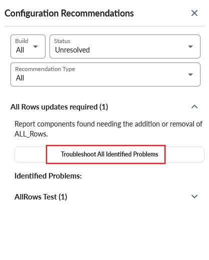

Switch to **Development** workspace and select **Next**.

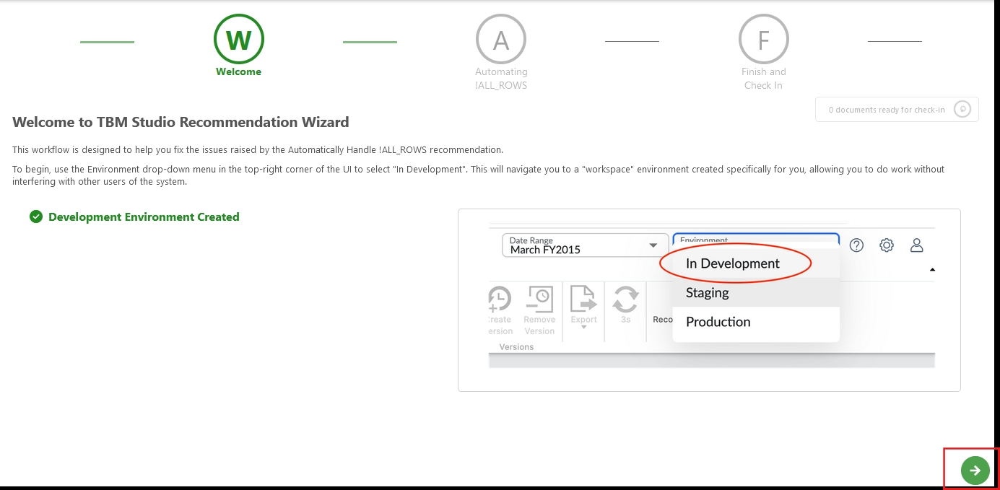

Click **Next** icon.

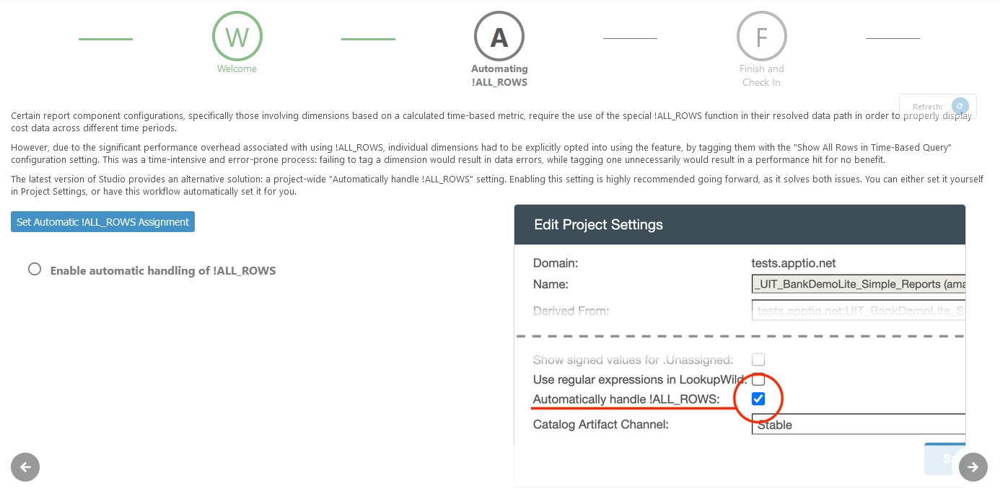

Select **Set Automatic !ALL\_ROWS\_Assignment** button.

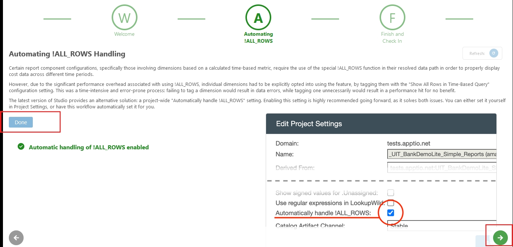

Select **Next**, and then select **Checkin** in the last page.

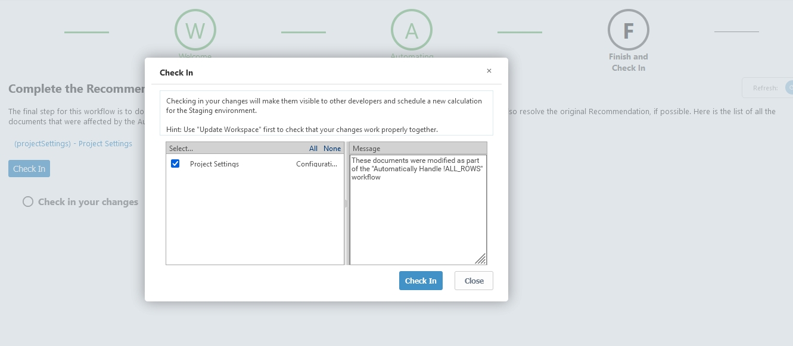

Enable the 'Automatically handle !ALL\_ROWS' option in [project setting](../admin/edit-project-settings.html "Applies to: TBM Studio 12.0 and later. Some settings are available in later versions of TBM Studio, as noted below."). With
this setting enabled the TBMA no longer needs to create perspectives to handle ALL\_ROWS. It adds and
removes allows where needed and hence it removes the need to check the all rows box on
perspectives.

## Old Method: Retrieving all rows in time based query

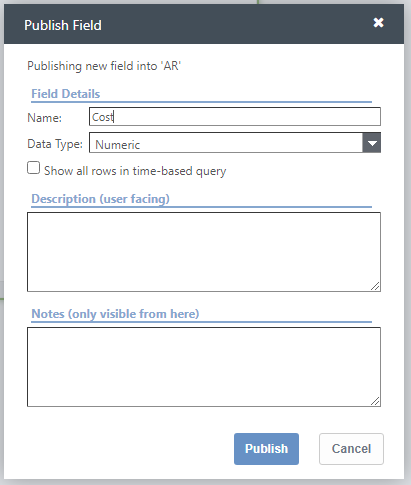

This option can be configured when publishing a column to a perspective. It will add an ALL\_ROWS!
Item to a datapath, which will ensure when using a time aggregate such as =YearToDate() or Annual(),
that all the rows in the table are included in the computation. In data that varies over time you
will need to use ALL\_ROWS to ensure the correct information is being calculated. This is not always
included for performance reasons.

Assuming you have data that is structured like this.

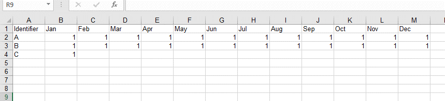

The =Annual() amount for A and B is 12, and C is 1. However if you ran this function in months
Feb-December, you would only have Identifiers A and B in your table, see example below.

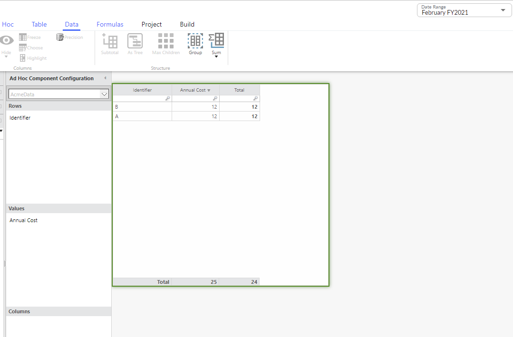

Since identifier C is not present in Feb-December data, those rows are not present in the current
month table, which results in the Annual Calculation showing the incorrect overall total. To remedy
this issue you would create a perspective of the column and check the “Show all rows in time-based
query”

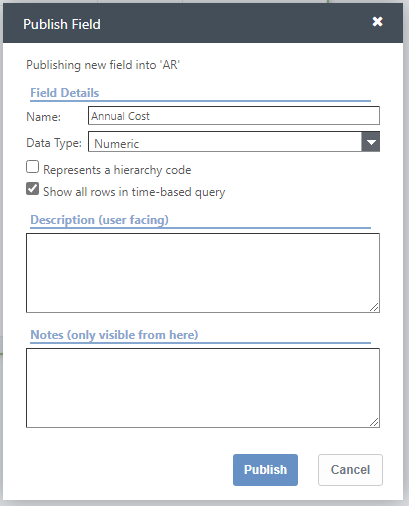

Placing this new perspective into the configuration results in row C being shown, and taking into
account for the total.

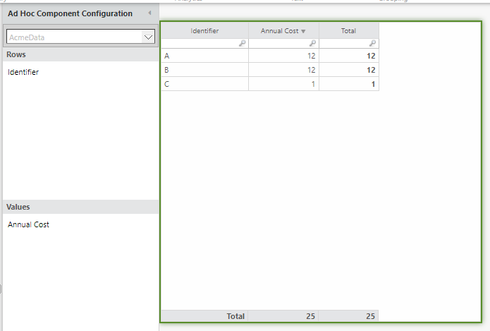

When using “Time” in Columns, ALL\_ROWS is not needed, this is because the time buckets build a
different data structure called a TREND\_APPEND, that grabs the data from each month and appends it
together. One is not necessarily better than the other, it comes down to which specific reporting
view is trying to be achieved. Below you can see the 2 tables, which show the same data, but have
different datapaths, and slightly different naming/formatting.

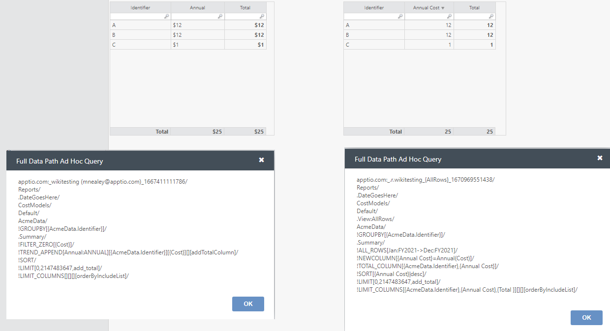

## Conclusion

- ALL\_ROWS is not needed and won’t be added to datapaths that are using the time buckets
  (TREND\_APPEND)
- ALL\_ROWS is not needed if time aggregates are not being used.
- ALL\_ROWS is needed if the underlying data varies over time, and time aggregates are being
  used.
