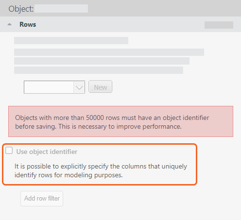

# No identifier on large model object

To improve performance, model objects with a large number of rows should have an
identifier.

[Create a custom table identifier](../model_studio/create-custom-table-identifier.html "Applies to: TBM Studio 12.0 and later. The Apptio modeling environment provides a flexible framework to manipulate data into groupings that form the basis for allocations and reporting. Below, the best practices for choosing the right identifier for a given model table will be explained.")

## Configuration recommendation for the No identifier on large model object error

To resolve this error:

1. Check out the affected object.
2. In the Rows drop-down, select Use object identifier, and then select the columns required for
   the identifier.

   

Tip: The following columns are typically needed in the identifier:

- Trending By
- Allocating By
- Slicing By
- Pivoting On
- Grouping By
- Reporting On

Unless used for the above columns, identifiers do not have to be unique.
