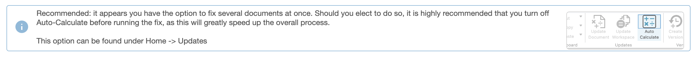
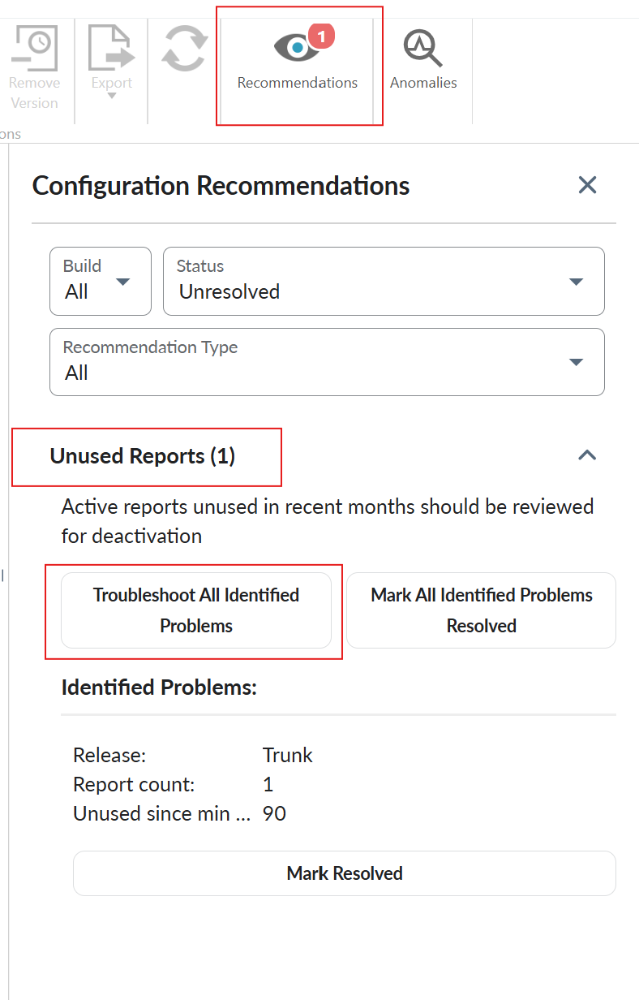
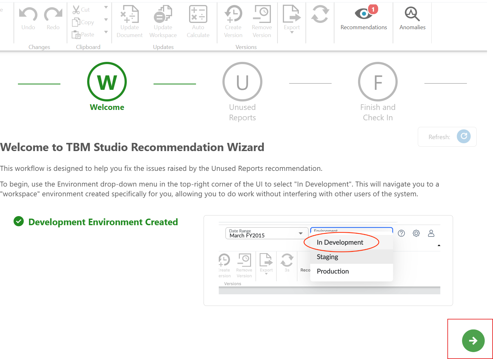
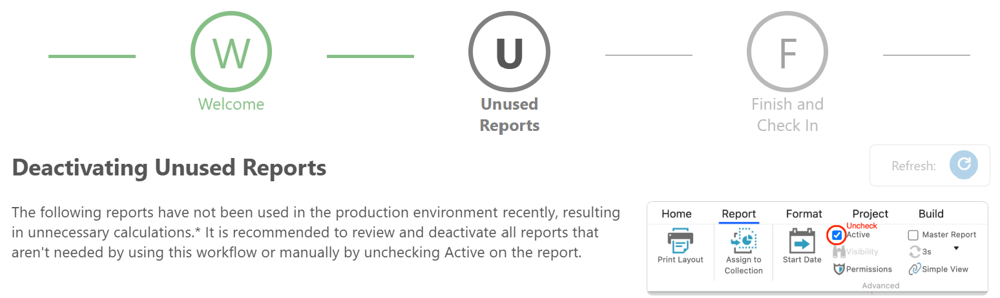
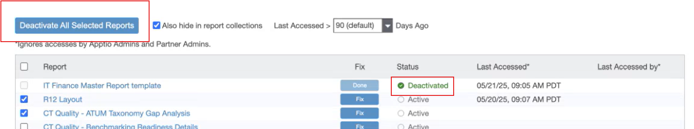
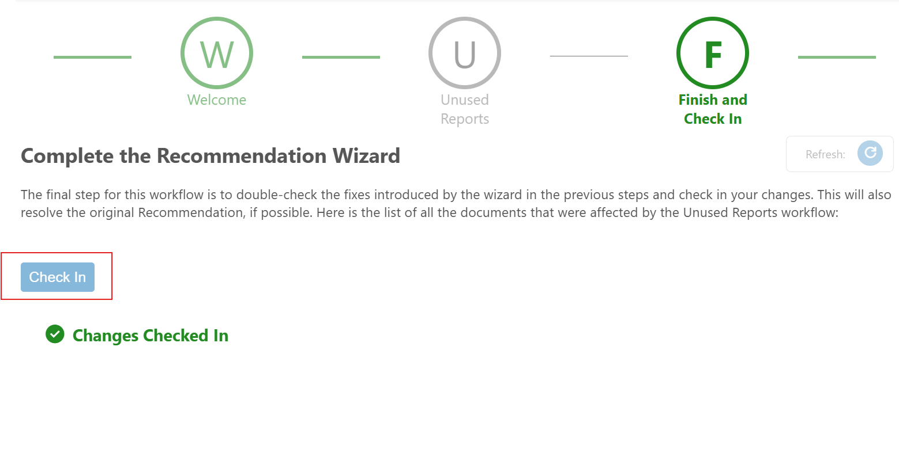

# Unused Reports (BETA)

Note:

It is required to **turn off** the Auto Calculate feature before using this
workflow to deactivate multiple reports at once.

.

If you receive an Unused Reports Recommendation, navigate to  **TBM Studio**  > **Recommendations**  tab >  **Unused Reports**  , and then select  **Troubleshoot All
Identified Problems**  .

Switch to  **Development**  workspace and select  .

You can see the issue description and what actions will be taken to resolve it. You can view the
list of reports that have been unused recently. It is recommended to review and deactivate reports
that are no longer needed by this workflow to avoid unnecessary calculations.

1. Select the  **Fix**  button to deactivate individually.
2. To deactivate multiple reports simultaneously, select the desired reports and then select
   **Deactivate All Selected Reports**.
3. Select **Also hide in report collections** option to hide the deactivated reports from the
   report collections view.

   
4. Select  , and then select  **Checkin** .

