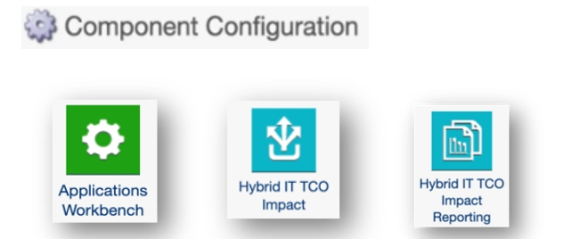
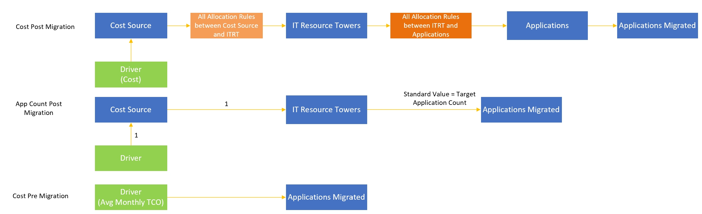
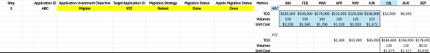
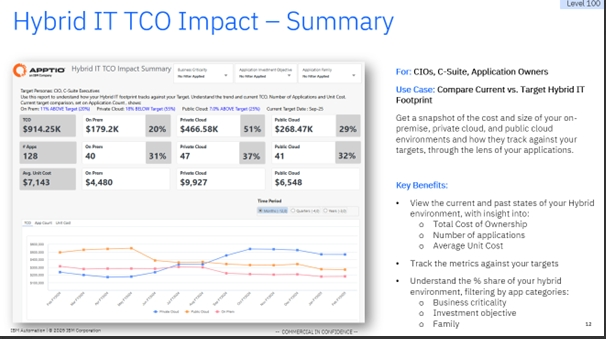
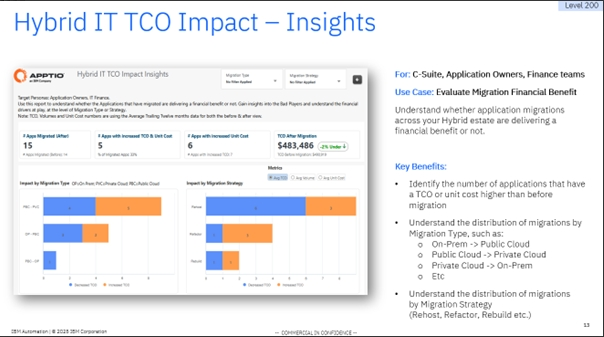
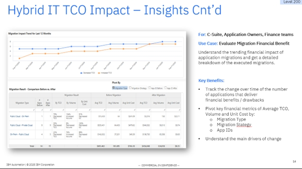
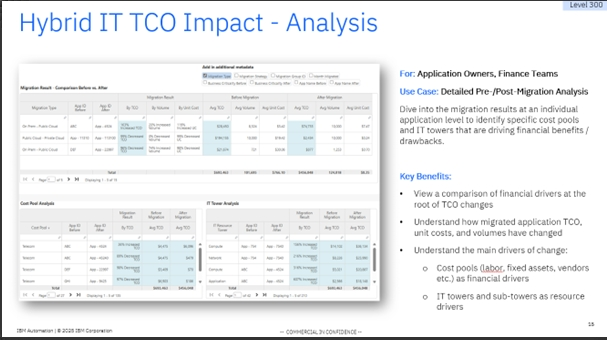

# Solución de impacto en el coste total de propiedad de TI híbrida

## Visión general

Antes de poner en marcha la solución Hybrid IT TCO Impact, asegurémonos de saber por qué lo hacemos y de comprender las razones y los objetivos que nos han llevado hasta este punto. Esto garantizará que el proceso de configuración sea claro y centrado, lo que le facilitará la comprensión y el uso eficaz de la solución.

Los siguientes problemas específicos pueden resolverse con esta solución.

La siguiente pantalla ofrece una visión general de los pasos de configuración. Los requisitos de configuración detallados para cada paso, se describen más adelante en el documento.

## Instalación de componentes

El primer paso consiste en instalar los tres nuevos componentes que se han creado para la solución Hybrid IT TCO Impact.

Nota: Asegúrese de que la versión de los componentes en la configuración del proyecto se ha establecido en la versión 120. Una vez instalado, puede volver a cambiar la Versión del componente a la plantilla deseada/(anterior).

**Componente del Workbench de aplicaciones**

El primer componente que hay que instalar es *el componenteApplications Workbench*.

Este componente no hace referencia al Impacto del TCO de TI híbrido en el nombre, pero es esencial para los informes de Impacto del TCO de TI híbrido, ya que permite a los usuarios añadir metadatos esenciales de la aplicación. El campo (nuevo) más importante de este Workbench es la columna de " **Hosted On** ". Debe rellenarse para todas las aplicaciones con el valor *: On Prem, Private Cloud o Public Cloud* . Además de este nuevo campo, permite a los usuarios enriquecer sus metadatos de Aplicaciones existentes. Otro campo importante para esta solución es " **Objetivo de inversión de la aplicación** ". Asegúrese de que el valor está establecido en "Migrar" para las aplicaciones sujetas a migración.

**Componente de impacto del coste total de propiedad de TI híbrida**

El segundo componente es *el de Impacto del TCO de TI* híbrida.

Esto crea el marco y, por tanto, instala todas las tablas necesarias (tanto editables como normales), métricas y modelos asociados a la solución Hybrid IT TCO Impact. Presenta el banco de trabajo de migración de aplicaciones.

Nota: También despliega tres informes. No están pensadas para los usuarios finales, sino para facilitar el paso en el que el TCO medio, el coste unitario y los volúmenes de uso del conjunto actual de aplicaciones se capturan y "congelan" como una instantánea en el tiempo (según el paso 3 del proceso anterior). Para más detalles sobre el contenido de este componente, consulte la descripción cuando navegue hasta el componente.

**Componente de informes sobre el impacto del coste total de propiedad de TI híbrida**

El tercer y último componente es *el Informe sobre el impacto del coste total de propiedad de TI* híbrido.

Esto instala tres informes de usuario final. Va desde un informe de alto nivel, del tipo "nivel 100", dirigido a ejecutivos de alto nivel, hasta el "nivel 300", en el que pueden analizarse las aplicaciones individuales en función de sus ventajas e inconvenientes económicos.

Para más detalles sobre el contenido de este componente, consulte la descripción cuando navegue hasta el componente.

## Arquitectura

**IBM Apptio Marco**

El diagrama anterior ofrece una visión general del marco IBM Apptio en relación con la arquitectura que sustenta la solución Hybrid IT TCO Impact. Se pueden ver los distintos flujos desde la fuente bruta hasta los informes del usuario final. Los principales puntos a destacar son los siguientes:

1. Introducción de Application Workbench y Application Migration Workbench: Conjunto de tablas editables que permiten editar los datos existentes y algunas columnas nuevas. El Mapeo de Aplicación requiere la des-aplicación (manual) de los datos Maestros de Aplicación para permitir que la Transformación Editable (Transformación ET) se convierta en la nueva alimentación (editada) de los datos Maestros de Aplicación.
2. Cambios mínimos en los datos maestros de las aplicaciones: Aparte del intercambio de la alimentación, esta arquitectura pretende minimizar cualquier impacto directo en los Datos Maestros de las Aplicaciones. Algunas columnas nuevas (e. g.: Hosted On, Migration Strategy etc.) se introducen, indirectamente, a través del paso Columnas mapeadas de la Transformación ET de Aplicaciones en datos maestros de aplicaciones.
3. Informes de no usuario final críticos para "congelar" los datos migrados: Como se muestra en la arquitectura, hay tres informes en el lado izquierdo (posición inicial); frente al lado derecho (posición final). Esto es intencionado, ya que capturan los datos de la migración y se crean de tal forma que es necesario volver a introducir esos datos en Apptio, en tablas para facilitar en última instancia la comparación Antes frente a Después.
4. Tras la migración de las aplicaciones, la nueva tabla clave actúa como fuente principal para la mayoría de la configuración, los modelos y los informes.

**IBM Apptio Modelo de asignaciones**

El marco IBM Apptio ofrece una visión general de las nuevas tablas, conjuntos de datos maestros, etc. que se introducen, mientras que el diagrama anterior se centra en las nuevas métricas y asignaciones del modelo.

- **Coste Post Migración** : Métrica modelada que se crea como métrica modelada "paralela" al modelo principal de Costes, con el fin de:
  - No "perturbar" el modelo de costes existente
  - Permitir que se establezca un vínculo entre el objeto Aplicaciones (que contiene los datos de la aplicación nueva, Destino) y el objeto Aplicaciones migradas (que contiene los datos de la aplicación antigua, migrada)
  - Permite que el cliente (que desea ampliar esta métrica modelizada) establezca los controladores adicionales (relacionados específicamente con los costes de migración) en función de sus necesidades

    Nota: Si usted es un cliente existente tendrá que asegurarse (manualmente) de que esta métrica modelada tiene todas las líneas de asignación necesarias etiquetadas, según su Modelo de Costes existente:
  - De fuente de costes a torres de recursos informáticos
  - De las torres de recursos informáticos a las aplicaciones
  - De aplicaciones a aplicaciones migradas
    - Ponderación por: Ponderación del objetivo
    - Relación de datos: ID de aplicación = ID de aplicación de destino
- **Recuento de aplicaciones tras la migración** : Métrica modelada que se necesita para capturar el recuento de aplicaciones de las nuevas aplicaciones de destino. Esto es necesario para garantizar que el cálculo de la Trailing 12months Average tenga en cuenta los meses en que las solicitudes están "en existencia". I.e. en algunos casos, la solicitud podría existir sólo durante, por ejemplo, 8 meses. Si ese es el caso, tenemos que asegurarnos de que los Costes se dividen por 8 y no un recuento "hardcoded" de 12.

El recuento de las aplicaciones antiguas/migradas ya se recoge cuando se crean los informes "intermedios". Esta métrica modelada se aprovecha más adelante en algunas de las otras métricas e informes calculados para garantizar que el nuevo recuento de aplicaciones objetivo se represente correctamente.

Nota: Si usted es un cliente existente tendrá que asegurarse (manualmente) de que esta métrica modelada tiene todas las líneas de asignación necesarias en su lugar, según el diagrama anterior, esto significa:

- Cree un controlador "falso" fijado en 1 en la Fuente de Costes
- Crear una imputación de Fuente de Coste a Torres TI.
  - No es necesario ponderar ni relacionar los datos
- Crear una asignación de Torres de TI en Aplicaciones migradas
  - Utilización del método "Valor estándar
  - Valor establecido en la columna Recuento de aplicaciones de destino
- **Coste antes de la migración** : Métrica modelizada que expone el valor principal del "Trailing 12months” Avg Monthly TCO tomado de los datos "congelados" para las aplicaciones migradas.

Este modelo está precreado, es decir, no requiere configuración manual.

## Configuraciones

Esta sección describe todas las actividades de configuración asociadas con la iluminación de los informes de Impacto del TCO de TI híbrida.

Los pasos 1-4 requieren cierta configuración (resaltados en amarillo ), mientras que los pasos 5-6 son el resultado final, centrado en los beneficios y la información que ofrecen los informes.

1. **Paso 1: Aplicaciones actuales de TCO**
   - Para elaborar los 3 informes de impacto del coste total de propiedad de TI híbrida (orientados al usuario final), el primer paso es asegurarse de que el coste total de propiedad (TCO), los volúmenes de uso y los costes unitarios se han establecido y calculado para el conjunto actual de aplicaciones. Utilizando el modelo y las asignaciones normales y recomendadas de ATUM.
   - Incluso antes de migrar ninguna aplicación, aproveche el nuevo banco de trabajo de aplicaciones para asegurarse de que se introducen valores para, al menos:

   Alojado en: On Prem, Nube Privada o Public Cloud

   Objetivo de inversión de la aplicación: Mantener, Retirar, Migrar, Invertir

   Ambos deben configurarse directamente en la aplicación.

   Nota: Para empezar a utilizar la funcionalidad de la mesa de trabajo de Aplicaciones, uno tendrá que desasignar manualmente los datos de la Aplicación en bruto/Fuente de los Datos Maestros de Aplicaciones y reasignarlos a la tabla de alimentación Fuente de Aplicaciones. Como se destaca en la vista de arquitectura anterior, este paso desbloquea los datos de la Aplicación para que estén disponibles para su edición.

   Ejemplo:

   

   *El ejemplo anterior muestra el ABC de la aplicación actual, viviendo su "vida normal" con el TCO, los volúmenes y el coste unitario establecidos como punto de partida fundacional*.
2. **Paso 2: Capturar los datos de las aplicaciones objetivo**

   Una vez que la aplicación actual está configurada para Migrar, es esencial empezar a capturar los metadatos relacionados con la migración de aplicaciones, a medida que estén disponibles. Aquí es donde entra en juego el nuevo Application Migration Workbench, con 3 áreas de configuración de la información. Nota: Las tablas siguientes sólo muestran las aplicaciones cuyo objetivo de inversión es "Migrar"

   **Migración de aplicaciones** : Esta tabla editable contiene los siguientes campos:
   - *Estrategia de migración* (Rehost, Replatform, Repurchase, Refactor)

     Campo de texto libre, pero lo ideal es que se establezca con uno de los valores anteriores

     Se utiliza en los informes como opción de pivote y/o filtro.
   - *Estado de la migración* (Planificación, En curso, Revisando, Realizada)

     Indica sobre todo el estado operativo de la migración.

     Campo de texto libre, pero lo ideal es que se establezca con uno de los valores anteriores

     El valor "Hecho" se utiliza para indicar que los datos de la aplicación están listos para ser "congelados" y, por lo tanto, se utiliza como filtro crítico en los informes "intermedios". Nota: se utiliza junto con el campo Apptio Estado de migración establecido en "Hecho".
   - *Apptio Estado de la migración* (Planificación, En curso, Revisando, Realizada)

     Indica sobre todo el estado de asignación Apptio de la migración.

     Campo de texto libre, pero lo ideal es que se establezca con uno de los valores anteriores

     El valor "Hecho" se utiliza para indicar que los datos de la aplicación están listos para ser "congelados" y, por lo tanto, se utiliza como filtro crítico en los informes "intermedios". Nota: se utiliza junto con el campo Estado de migración establecido en "Hecho".
   - *Mes Año de migración*

     Indica cuándo se migró oficialmente la aplicación.

     Campo de texto libre, pero lo ideal es establecerlo como e. g.: Oct 2025.

   **Relación de migración de aplicaciones** : Esta tabla editable contiene los siguientes campos:
   - *ID de la aplicación de destino* : ID de aplicación de la nueva aplicación de destino. Se espera que se incorporen y existan en los datos maestros de las aplicaciones (como es habitual). Nota: Puede ser más de 1, es decir, admite escenarios en los que 1 aplicación actual se migra a 1,2,3, n número de aplicaciones nuevas.
   - *Ponderación del objetivo* : En caso de un escenario 1-m, permite establecer una ponderación y asociarla a las m(cualesquiera) nuevas solicitudes. Si no se aplica o se deja en blanco, se establecerá en 1.
   - **ID del grupo de migración de aplicaciones** : A crear y establecer manualmente. En el caso de un escenario 1-m, esto permitiría al usuario ver los datos financieros comparados antes y después a través de la lente de un grupo agregado en lugar de aplicaciones individuales (donde algunos de los datos financieros podrían no tener sentido para ser vistos)

   E.g:

   Aplicación actual/antigua| Aplicación nueva/destino |ID de grupo de migración de aplicaciones

   Aplicación ABC 123 Grupo A

   ABC 456 App Grupo A

   **Configuración de la migración de aplicaciones** :

   Tabla editable que permite al usuario establecer ciertos parámetros con respecto al seguimiento de objetivos y personalizar el texto HTML de los informes. La columna Descripción proporciona los detalles necesarios sobre cada uno de los ajustes.

   

   *En el Paso 2, la Aplicación ABC ha sido marcada para Migrar, el proceso de migración ha comenzado y está en curso. Se ha identificado la aplicación XYZ como ID de la aplicación de destino.*
3. **Paso 3: "Congelar" las métricas actuales de la aplicación**

   En algún momento la aplicación actual se considerará migrada. Apptio lo reconocerá cuando AMBAS columnas, Estado de la migración y Apptio Estado de la migración, se hayan actualizado y establecido en "Hecho".

   

   *En el paso 3, la aplicación ABC se ha migrado por completo. De ahí el momento de "congelar" y capturar los datos medios de 12months (en azul) con respecto al TCO, los volúmenes y el coste unitario*.

   Ese se considera el punto de activación para cuando se produce la "congelación" de los datos de la aplicación actual. Esta congelación se producirá del siguiente modo:El conjunto de los 3 informes siguientes recogerá todas las aplicaciones de los Datos maestros de aplicaciones en las que las columnas Estado de migración y Apptio Estado de migración sean iguales a Hecho. Estos informes calcularán la media de los últimos doce meses para los parámetros clave de coste total de propiedad (TCO), volúmenes y coste unitario. Las dos últimas métricas sólo se calcularán a nivel de Resumen y, por tanto, no se aplicarán a los informes de Pool de costes y Torre de TI.

   Nota: La fórmula que calcula la media se asegura de comprobar el tiempo de existencia de la aplicación comprobando el recuento de aplicaciones (ya que no todas las aplicaciones pueden haber existido durante 12months ).

   Mientras que la parte a se realiza automáticamente, esta parte b requiere que el usuario configure un conector de enlace de datos Apptio -a- Apptio. Este conector es necesario para tomar la salida del informe, "congelarla" en ese periodo de tiempo y soltarla de nuevo en la tabla asociada.

   Apptio Datalink Conector: Muestra abajo. Para más detalles, consulte el Centro de ayuda.

   

   Tablas "Receptor" asociadas

   Aplicaciones migradas en bruto

   Aplicaciones Migradas CP Raw

   Aplicaciones migradas IT Raw

   Nota: Este conector está pensado para introducir TODAS las aplicaciones migradas correspondientes a un mes determinado. En ese sentido, será una visión acumulativa a lo largo del tiempo. El mes 1 puede tener 10 solicitudes. El mes 2 podría tener 15 solicitudes.
4. **Paso 4: Modelar lo viejo y lo nuevo**

   Una vez completado el paso 3, todos los datos necesarios de "Antes de la migración" ya están en su sitio y disponibles en las 3 tablas, como se ha indicado anteriormente.

   El conjunto de datos principal de Aplicaciones Migradas se utiliza y se expone automáticamente a la (nueva) métrica modelada de Coste Previo a la Migración. No se requiere ninguna acción aquí, ya que el Driver para esta métrica modelada se crea automáticamente para utilizar la columna TCO mensual medio. Los otros dos conjuntos de datos no se exponen a ninguna métrica modelada, ya que sólo se utilizan en el informe Análisis del impacto del coste total de propiedad de TI híbrida (nivel 300). Se les ha añadido un paso modelado para que se pueda informar sobre ellos cuando sea necesario.

   La actividad de configuración clave en este paso está relacionada con la (nueva) métrica modelada de Coste Post Migración. El componente introduce una asignación de Aplicaciones a Aplicaciones Migradas, aprovechando el modelo de Costes existente como Driver. Esto basta para alumbrar el informe Hybrid IT TCO Impact Insights (nivel 200). Sin embargo, con el fin de iluminar el informe de Análisis del Impacto del TCO de TI Híbrida (nivel 300), el modelo de Post Migración de Costes necesita replicar todas las líneas de asignación desde la Fuente de Costes hasta las Aplicaciones y en las Aplicaciones Migradas. Por lo tanto, es necesario etiquetar (manualmente) todas estas líneas de asignación de costes existentes con la nueva métrica modelada de coste posterior a la migración, para que los desgloses de análisis de grupos de costes y torres de TI funcionen en el informe de análisis de impacto del coste total de propiedad de TI híbrida (nivel 300).

   La tercera y última nueva métrica modelada de Recuento de aplicaciones tras la migración es necesaria para capturar el Recuento de aplicaciones de las nuevas aplicaciones objetivo. Esto es necesario para garantizar que el cálculo de la Trailing 12months Average tenga en cuenta los meses en que las solicitudes están "en existencia".

   Nota: Si usted es un cliente existente, tendrá que asegurarse de que esta métrica modelada tiene todas las líneas de asignación necesarias en su lugar, según el diagrama anterior, esto significa:
   - Cree un controlador "falso" fijado en 1 en la Fuente de Costes
   - Crear una imputación de Fuente de Coste a Torres TI.
   - No es necesario ponderar ni relacionar los datos
   - Crear una asignación de Torres de TI en Aplicaciones migradas
   - Utilización del método "Valor estándar
   - Valor establecido en la columna Recuento de aplicaciones de destino

Gracias a las tres métricas modelizadas anteriores, se ha establecido el marco que permite calcular y exponer en los informes los resultados de la migración antes y después.

Existen varias métricas calculadas para facilitar esto, las más notables son las que empiezan por "TTM..." en el nombre. Estas medidas se aplican para garantizar que los datos de coste total de propiedad, coste unitario y volumen de la aplicación tras la migración se calculan por igual utilizando los métodos de la media de los últimos doce meses (TTM) para garantizar una comparación equitativa entre los resultados de antes y los de después.

*En el paso 4, la nueva aplicación XYZ ya está lista y se compara continuamente con los datos "congelados" de la aplicación ABC migrada.*

## Informes

El componente Informes de impacto del TCO de TI híbrida instala 3 informes, como parte de la colección de informes denominada "TI híbrida". Verá una referencia al nivel 100, 200, 300, lo que implica que el conjunto de informes expone cada vez más datos y va un paso más allá y más profundo.

**Nivel 100: Impacto de la TI híbrida en el coste total de propiedad - Resumen**

Nota: Este informe utiliza principalmente el conjunto de datos del Maestro de aplicaciones (como es habitual), así como la nueva columna "Hosted On" introducida a través del nuevo componente Applications Workbench. Esta columna debe establecerse en todas las aplicaciones, a nivel de aplicaciones. La fijación de objetivos debe realizarse utilizando el nuevo Workbench de Migración de Aplicaciones.

**Nivel 200: Impacto de la TI híbrida en el coste total de propiedad - Perspectivas**

Nota: Este informe utiliza principalmente el (nuevo) conjunto de datos Aplicaciones migradas. Requiere que los datos de Antes de la Migración se introduzcan mediante el "método de congelación" antes descrito.

**Nivel 300: Impacto de la TI híbrida en el coste total de propiedad - Análisis**

Nota: Este informe utiliza principalmente el (nuevo) conjunto de datos Aplicaciones migradas. Requiere que los datos de Antes de la Migración se introduzcan mediante el "método de congelación" antes descrito. También requiere que los datos del Pool de Costes y de los Detalles de la Torre IT sean fluidos, tal y como se ha descrito anteriormente.

## Llamadas

Esta última sección pretende resumir una serie de "llamadas de atención" que hay que tener en cuenta a la hora de configurar y utilizar esta solución como parte de los procesos mensuales de gestión empresarial de IBM Apptio.

**Horizonte temporal de comparación**

El método utilizado para la comparación entre antes y después es el de los últimos 12 meses. Al revisar las aplicaciones migradas a lo largo del tiempo y compararlas con las nuevas aplicaciones de destino, tenga en cuenta que después de 12 meses la aplicación antigua/migrada ya no se recogerá o, al menos, ya no aparecerán costes para esas aplicaciones.

En otras palabras, en este momento el horizonte temporal de comparación (el periodo de tiempo durante el cual se puede hacer una comparación significativa entre el TCO, los volúmenes y el coste unitario de Antes y Después) está fijado en un máximo de 12 meses. 12 meses.

**Añadir otros controladores a la Postmigración de Costes**

Aproveche que esta nueva métrica modelizada Cost Post Migration es un modelo de costes "paralelo".

Añada cualquier otro factor financiero que crea que debería tenerse en cuenta como parte de la vista de Costes tras la migración si alguno de ellos no está siendo recogido "naturalmente" por el modelo de Costes.
