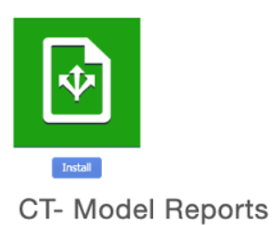
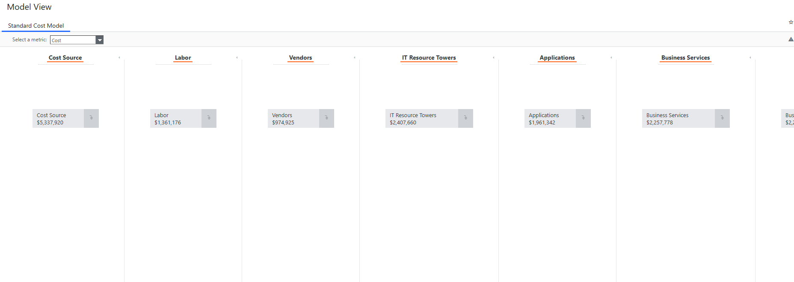
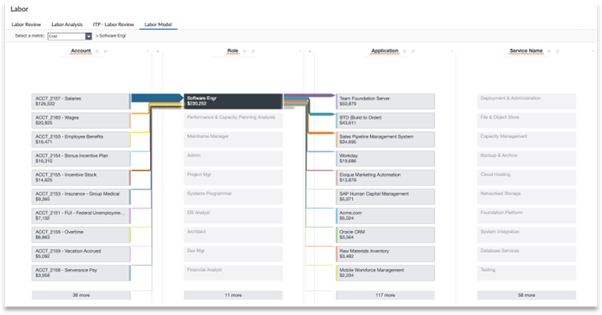
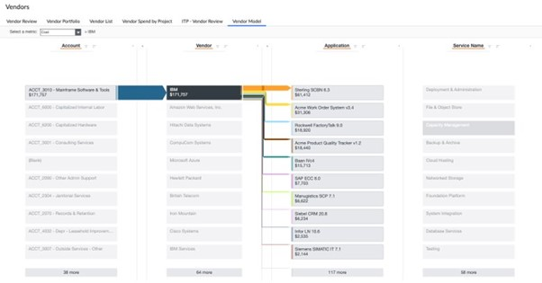
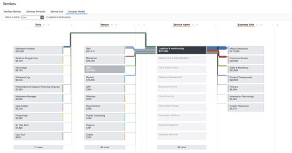
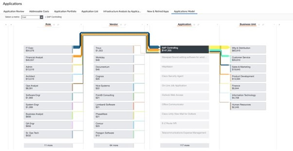
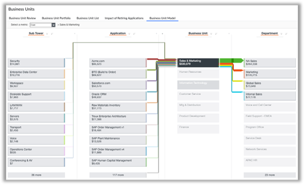

# Vistas del modelo

Los informes de resumen del modelo ofrecen una visión completa de los flujos de costes dentro del modelo, lo que permite a los usuarios visualizar y comprender las asignaciones de costes. Este informe está diseñado para administradores y usuarios avanzados, y ofrece una visión transparente y detallada de los costes.

## Casos de uso

Este informe resuelve los siguientes casos de uso:

- Analizar las imputaciones de costes para comprender cómo se distribuyen los costes entre los distintos objetos
- Proporcionar una visión clara y transparente de los flujos de costes a las partes interesadas
- Identificación de áreas de reducción y optimización de costes
- Utilización de los datos de imputación de costes para tomar decisiones presupuestarias y de previsión

## Personajes

- Administrador
- Usuarios intensivos

## Preguntas contestadas

- ¿Cómo se distribuyen los costes entre los distintos objetos?
- ¿Cuál es el coste de cada objeto?
- ¿Cómo fluyen los costes entre los distintos objetos?
- ¿Cuáles son los principales factores de coste del modelo?
- ¿Cómo optimizar y reducir los costes?

## Visualización

Los siguientes informes se incluyen en un nuevo componente de v120: ***CT- Model Reports***

**Vistas del modelo:** sólo visibles para Apptio Admin y Partner Admin

**Modelo laboral**

**Modelo de proveedor**

**Modelo de servicios**

**Modelo de aplicaciones**

**Modelo de unidad de negocio**

