# Buenas prácticas: Bifurcación de proyectos

**Se aplica a** : TBM Studio 12.1 y posteriores

La ramificación es una función avanzada añadida a la plataforma para Apptio TBM Studio v.12.1. La bifurcación es una función básica de la mayoría de los sistemas modernos de control de versiones. La ramificación permite a los usuarios crear una copia de un proyecto completo, realizar cambios en la copia del proyecto en paralelo y, a continuación, pasar a producción esos cambios con el proyecto original. La bifurcación es un complemento extremadamente potente de la experiencia TBM Studio , y es importante comprender sus usos previstos.

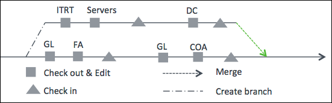

## Oficinas y espacios de trabajo

Un *espacio de trabajo* es un entorno específico del usuario en el que se guardan los cambios realizados en los documentos extraídos hasta que se vuelven a introducir. Cuando usted saca un documento de un espacio de trabajo, tiene un bloqueo exclusivo sobre ese documento. Nadie puede retirar ese documento hasta que se haya registrado.

Una *rama* es una copia completa del proyecto actual en el momento en que se creó la rama. Cuando se extrae un documento de una rama, ese documento pasa a un espacio de trabajo de esa rama. Los cambios realizados en los documentos de los espacios de trabajo de la rama sólo aparecen en la rama una vez que se han registrado dichos documentos. Para ver los cambios en el tronco, la rama debe fusionarse de nuevo en el proyecto principal.

## ¿Por qué utilizar la ramificación?

Las ramas están pensadas para uno de los dos usos principales:

- **Configuración de larga duración** : Hay un conjunto de cambios a realizar que llevarán mucho tiempo antes de que estén listos para ser promovidos a Producción. Mientras tanto, los cambios, como las cargas de datos mensuales, deben realizarse y enviarse a Producción. Puede crear una rama y realizar los cambios en ella mientras sus cargas de datos operativos continúan en el tronco.
- **Hotfix prod** : Hay un problema con algo en Producción, pero se ha realizado un desarrollo que no está listo para pasar a Producción. Puede crear una rama, solucionar el problema específico y, a continuación, fusionar la rama en Producción.
- **Auditar el estado anterior o el estado archivado** : Existe una necesidad empresarial de examinar el estado anterior de un proyecto. Por ejemplo, puede que se haya cerrado un ejercicio anterior y se hayan introducido cambios en el modelo, pero es necesario consultar las cifras de ese estado pasado. Las ramas permiten ver el estado exacto del sistema en un momento anterior.

**Conceptos de rama:**

- Cada rama es una copia completa del proyecto troncal. Esto tiene implicaciones para el rendimiento, tal y como se analiza en la siguiente sección Buenas prácticas y consideraciones sobre el rendimiento.
- El número de sucursales para un entorno está limitado a cinco (5)
- Para abrir y cerrar sucursales, debe estar asignado a un rol que tenga el permiso *Crear y cerrar sucursales*.
- Cerrar una rama elimina el proyecto de la rama junto con cualquier proyecto de compilación, espacios de trabajo, etc. Una rama no puede cerrarse si tiene una compilación utilizada en Producción. Una vez que una compilación en fase de pruebas del tronco se promociona a producción, la rama puede cerrarse. Véase también [Solucionar problemas de un proyecto ramificado que no se puede cerrar](https://community.ibm.com/community/user/viewdocument/troubleshoot-a-branched-project-tha "(se abre en una pestaña o una ventana nueva)").
- Cuando fusionas cambios en una rama, puedes:
  - Seleccione los documentos que desea fusionar.
  - Ver una lista de conflictos, si existe alguno (un conflicto se produce cuando se realizan cambios en el mismo documento en dos ramas diferentes).
- No se puede fusionar un documento si lo *ha extraído* otro usuario que trabaja en tronco.
- Todos los documentos de una rama deben estar *registrados* antes de poder fusionar la rama.
- Existen etiquetas para todas las versiones, y pueden crearse etiquetas personalizadas para identificar versiones específicas.
- Para las ramas de hotfix, cuando la rama se promueve a producción, anula la rama troncal.

## Buenas prácticas y consideraciones sobre el rendimiento

Las ramas utilizan la misma cantidad de recursos (por ejemplo, memoria, CPU, etc.) que el proyecto del que proceden. Por lo tanto, cuando creas una rama, estás añadiendo una carga a tu entorno Apptio igual a la carga de cualquier actividad que puedas realizar con tu proyecto principal. Por lo tanto, es importante dimensionar correctamente el tiempo en su sucursal. Para ello, cambie "Inicio del proyecto" y "Fin del proyecto" en "Ajustes de tiempo" del proyecto para limitar el tiempo a un número adecuado de periodos. Por ejemplo, si trabaja con modelos, probablemente sólo necesite un periodo de tiempo. Si está trabajando en informes con tendencias, podría probarlos con 3 periodos. Si necesita validar los cambios con el intervalo de tiempo completo, puede volver a cambiar el tiempo al intervalo original o final para realizar una prueba final cuando haya terminado.

Cuando cree una rama, tenga en cuenta el impacto tanto en los cálculos del escenario como en la carga del espacio de trabajo y asegúrese de dimensionar correctamente el tiempo para su rama. Para obtener más información sobre el impacto de las ramas en el rendimiento del área de trabajo, consulte [Gestión del rendimiento en su entorno de desarrollo](https://community.ibm.com/community/user/viewdocument/manage-performance-in-your-developm?CommunityKey=44bcb0d2-5ce6-4504-89eb-019253d3b5d8&tab=librarydocuments "(se abre en una pestaña o una ventana nueva)").

Además, salvo en el caso de las ramas de hotfix, los cálculos de las ramas se pondrán en cola con los cálculos del proyecto del que se ramifican. Si creas una rama a partir de una versión del proyecto que tardó tres horas en calcularse, en el momento en que se cree la rama comenzarán los cálculos de dev y stage. Si alguien introduce un cambio en el tronco después de que se haya ramificado, los cálculos resultantes de desarrollo y etapa para el tronco se pondrán en cola detrás de su cálculo de rama.

La siguiente imagen muestra la vista del proyecto AdminDB de los cálculos para todos los cálculos de la rama de proyectos. Observe los dos conjuntos de cálculos de ramas en amarillo y naranja, y el cálculo troncal del proyecto en el que se basan esas ramas en verde:

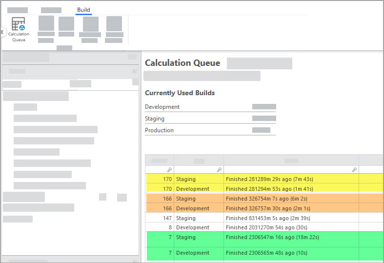

Los TBMA que deseen navegar a esta vista deben ir a Enhanced Access
Administration, seleccionar el mosaico **TBM Studio** y abrir la **cola de cálculo**.

## Crear una rama basada en la última compilación finalizada

En el entorno Escenario, cree una rama mediante el comando **Crear rama** de la pestaña Proyecto, grupo Gestionar.

En el entorno de desarrollo, puede utilizar el comando **Crear rama** sólo si no tiene nada comprobado. Esta restricción está diseñada así. La implicación es que usted puede desear que los cambios en su área de trabajo formen parte de la rama, pero no lo harán hasta que todos los materiales estén registrados y calculados.

## Aplicar una etiqueta personalizada a una compilación

Aunque todas las compilaciones tienen etiquetas predeterminadas, como se indica en [Crear una rama a partir de una compilación anterior que no tenía una etiqueta personalizada aplicada](#BestpracticesBranchingprojects__Createabranchbasedonthemostrecentcompletedbuild), después de haber bloqueado la etapa, el botón **Etiquetar proyecto** pasa a estar disponible. Puede seleccionar **Etiquetar proyecto** para aplicar una etiqueta personalizada a una compilación, lo que puede ayudar a encontrar una compilación mucho más fácilmente.

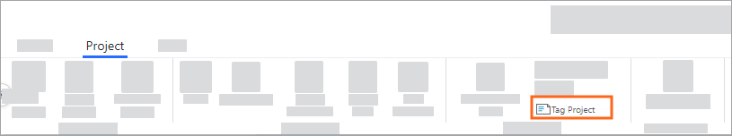

Esta etiqueta aparecerá en la página Builds para que puedas buscarla fácilmente y utilizarla para ramificar.

Nota:

En el momento de escribir esto, el botón Etiquetar proyecto *no* estará disponible después de promover una compilación.

## Crear sucursal con opción de pago automático

Cuando se trabaja con informes que contienen tablas editables, la función de autocomprobación comprueba automáticamente la tabla subyacente cuando se modifica un informe, eliminando la necesidad de la comprobación manual. Esta función sólo está disponible en el proyecto de rama y ofrece varias ventajas, como una mejor experiencia de usuario, un aumento de la productividad y una reducción de los errores. Si una tabla editable es retirada por otra persona, se mostrará un mensaje de error para evitar conflictos y garantizar la transparencia.

1. Navega hasta la sucursal.

   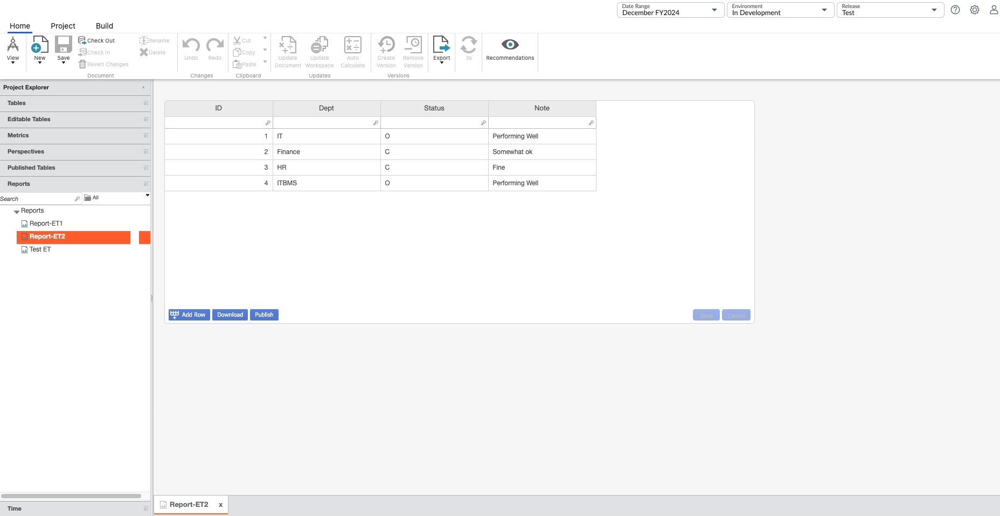
2. Actualice el valor de la columna IT a Extensión IT y **guarde** los cambios.

   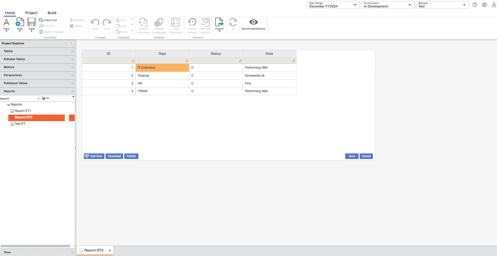
3. El botón **Check in** está activado y la tabla editable subyacente está check out.

   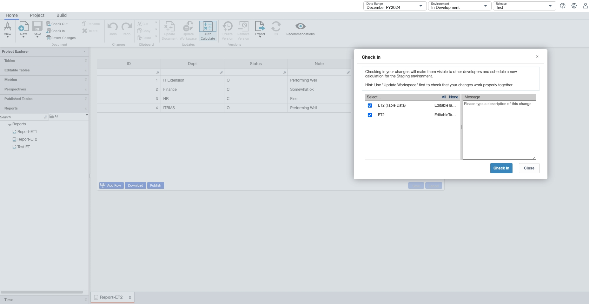

## Crear una rama a partir de una etiqueta

Para bifurcarse a partir de una etiqueta:

1. Busque la etiqueta en el historial de registros.
2. Haga clic con el botón derecho en la etiqueta y seleccione **Crear rama a partir de este punto**.

   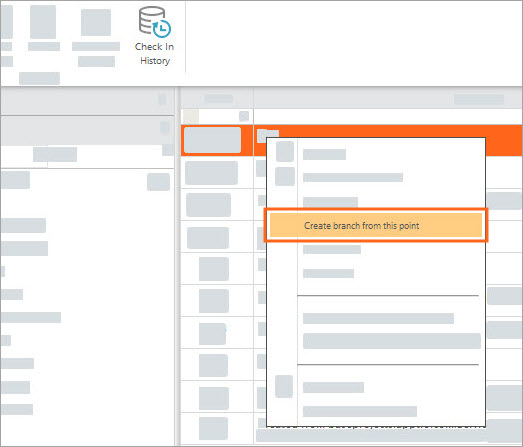

## Crear una rama a partir de una compilación predeterminada a la que no se haya aplicado una etiqueta personalizada

A veces, es posible que desee crear una rama a partir de una compilación anterior que no estaba etiquetada. Por ejemplo, si descubre que algo ha cambiado y necesita averiguar cuándo se introdujo ese cambio. Para crear una rama a partir de una compilación por defecto

1. Seleccione la pestaña **Proyecto** y, a continuación, haga clic en Historial de entradas.
2. Haga clic con el botón derecho del ratón en la pestaña Historial de comprobaciones de la parte inferior y seleccione Vista detallada. Cuando esté en la vista detallada, podrá ver todas las compilaciones predeterminadas sin etiquetas personalizadas marcadas en verde.

   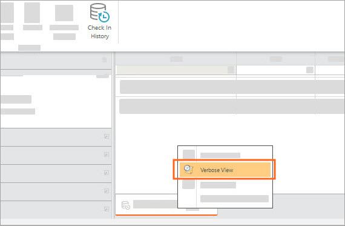
3. Haga clic con el botón derecho en una compilación predeterminada y seleccione **Crear rama desde este punto**.

## Navegar entre las ramas y el tronco

Cuando existe una rama para un proyecto, puedes navegar a la rama, o volver al tronco, utilizando el menú desplegable de la barra de menús:

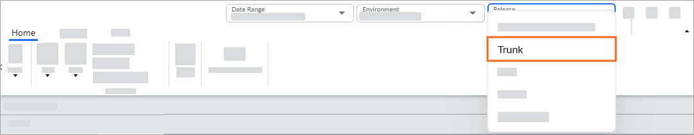

## Utilizar una rama

- **Limitar las entradas en la sucursal a unos 30 documentos** - Cuando se trabaja en una sucursal, la mejor práctica recomendada actualmente es limitar las entradas a unos treinta (30) documentos **:** Tiene 100 documentos registrados en la sucursal. Registre unos treinta documentos, luego otros treinta, y así sucesivamente. Esta acción establece un límite para los tamaños individuales de facturación. Esta práctica se recomienda para hacer frente a una limitación a la hora de fusionar los check ins con el tronco.
- **Realizar cambios** - Una vez creada una rama, los cambios se realizan del mismo modo que en el tronco. Los documentos pueden sacarse, modificarse y volver a registrarse en la sucursal.
- **Ramas y espacios de trabajo** - Tu espacio de trabajo en el tronco está separado de tu espacio de trabajo en las ramas. Si sacas un documento de una rama y luego navegas al tronco, no verás el documento sacado allí porque es un *espacio de trabajo separado*.
- **Consideraciones sobre el check** out - Es posible tener el mismo documento check out en la rama y en el tronco al mismo tiempo. La implicación es que una persona podría estar trabajando en el documento y hacer cambios en el tronco que no están en la rama.

## Fusionar una rama con el tronco

Antes de fusionar, hay algunos requisitos previos:

- Ninguno de los documentos que se van a fusionar se puede comprobar en el tronco.
- El usuario que ejecuta la fusión no puede tener ningún documento retirado en el baúl.
- No fusionar desde el tronco a las ramas, ni entre las ramas.

Aunque la interfaz de usuario admite la fusión entre ramas y del tronco a las ramas, existen limitaciones que hacen que esta acción esté fuera de las mejores prácticas en la actualidad.

## Ejecutar la fusión

Una vez que los cambios se han registrado en una rama, se pueden seleccionar los registros que aparecen en el historial de registros para fusionarlos con el tronco:

1. Seleccione una o varias entradas en el Historial de entradas mediante **Ctrl+clic** o **Mayús+clic**.
2. Haga clic con el botón derecho del ratón en los registros seleccionados y seleccione **Combinar cambios en la rama**. En este momento, se recomienda fusionar los cambios de la rama con el tronco.

   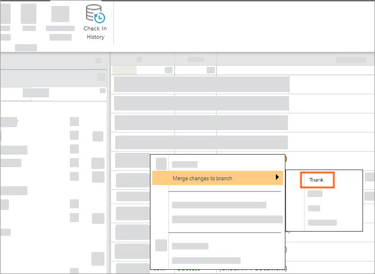

## Resolver conflictos

Al ejecutar una fusión, puede aparecer una ventana de diálogo de fusión indicando que hay conflictos. Los conflictos se producen cuando el tronco tiene una versión del documento que ha sido modificada desde el momento en que se creó la rama. Por lo tanto, si tuviera que fusionar el documento *y* registrarlo, el documento de la rama sobrescribiría el documento principal. Para resolver estos conflictos, debe integrar manualmente los cambios presentes en la copia del documento en el *tronco* en la copia del documento en la *rama*, o bien debe estar dispuesto a dejar que se sobrescriban los cambios.

## Registro después de la fusión

Después de fusionar los cambios, se comprobarán en el tronco. Debe comprobarlos en el tronco antes de que se complete la operación de fusión. Además, tenga en cuenta que hay un documento con el nombre de la propia sucursal, que también debe registrarse.

## Gestionar sucursales

Los administradores pueden utilizar esta función para evitar el borrado accidental de una rama, eliminando así la necesidad de realizar copias de seguridad para recuperar una rama borrada.

En TBM Studio, vaya a la pestaña **Proyecto**, seleccione la opción **Gestionar ramas** y, a continuación, seleccione "X" para cerrar una rama.

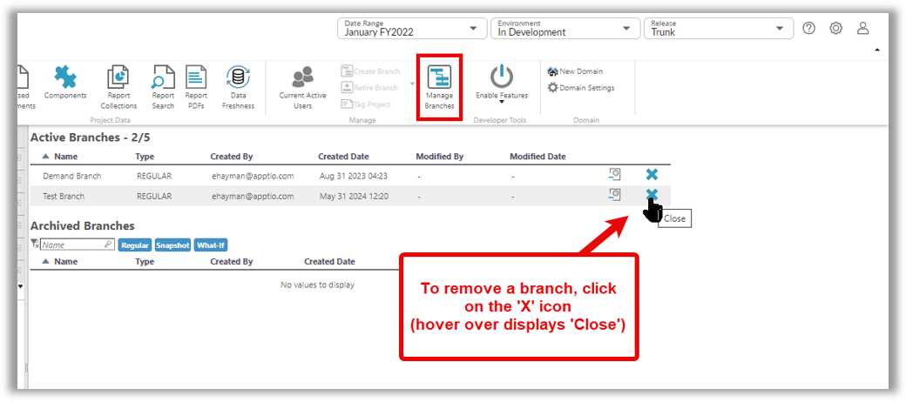

Aparecerá un cuadro de diálogo de confirmación. El administrador debe escribir "eliminar" y luego seleccionar el botón OK.

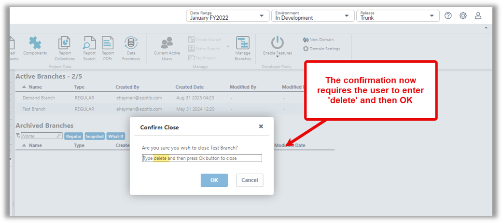

## Cerrar la sucursal

Cuando haya terminado de fusionar los documentos modificados con el tronco, cierre la rama. El cierre de la sucursal ahorra recursos.

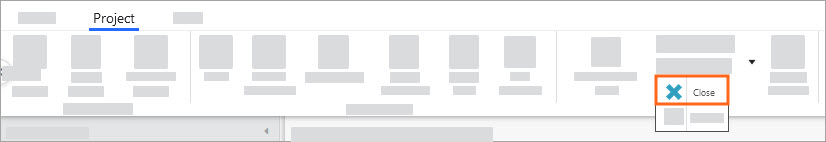

## Utilice una rama para hotfix prod

Ocasionalmente, puede ser necesario un cambio en prod rápidamente y los cambios en fase pueden no estar listos para su despliegue. En este caso, puede ser conveniente aplicar *un hotfix*. Para aplicar una revisión a un documento en prod, siga estos pasos:

1. Navegue hasta el documento en prod.
2. *Consulta* el documento. Cuando aparezca el cuadro de diálogo, puede seleccionar **Desarrollo** o **Hotfix**
3. Seleccione **Hotfix**.

   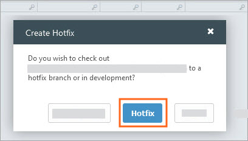
4. Espere hasta que la rama hotfix calcule en etapa. El sistema calculará las ramas de hotfix en paralelo con otros cálculos, por lo que no se aplica la cola de compilación normal.
5. Seleccione **Bloquear** para bloquear la rama del hotfix en la etapa.
6. Seleccione **Promover ahora** para promover la rama del hotfix a producción:

   

   El sistema generará una rama llamada Hotfix, donde podrá realizar su cambio.

Si intenta cerrar la rama del hotfix en este punto, recibirá un error. Esto se debe a que la compilación en prod no se basa en la compilación de hotfix y el sistema no permitirá que se cierre la rama de hotfix.

Para cerrar el proceso de revisión:

1. Fusione los cambios en el tronco. Consulte la sección [Fusionar una rama de nuevo en el tronco](bp-branching-projects.html#BestpracticesBranchingprojects__Mergeabranchbackintothetrunk) anterior para obtener más detalles.
2. Promueva la compilación con los cambios de hotfix a prod.
3. Cierre la rama de revisión.

Véase también [Solucionar problemas de un proyecto ramificado que no se puede cerrar](https://community.ibm.com/community/user/viewdocument/troubleshoot-a-branched-project-tha "(se abre en una pestaña o una ventana nueva)").

## Archivar los plazos y acceder a los archivos

Periódicamente, resulta útil archivar periodos de tiempo pasados. Por ejemplo, cuando desee desactivar el cálculo de uno o varios ejercicios anteriores para reducir el tiempo de cálculo.

Para archivar periodos de tiempo:

1. Antes de cambiar la configuración de la hora, aplique una etiqueta personalizada. Utilice una convención de nomenclatura para la etiqueta, como añadir un prefijo al nombre de la etiqueta con la palabra "Archivo" para que sea fácil encontrar todas las construcciones que correspondan a eventos archivados.
2. Ajusta la hora para que la fecha de inicio del proyecto sea la que desees y, a continuación, regístralo. Esto cerrará los periodos de tiempo antiguos.

Si desea acceder a los periodos de tiempo archivados, busque las etiquetas de archivo y genere una rama a partir de la etiqueta de archivo.

## Preguntas frecuentes sobre la ramificación

**¿Por qué no está disponible Crear sucursal?**

Si el botón **Crear rama** no está disponible, o si no aparece en el menú contextual al hacer clic con el botón derecho en una etiqueta de compilación, es posible que haya superado el número de ramas permitidas para su entorno. El límite de ramas es de cinco ramas para el medio ambiente (incluidos todos los proyectos).

**¿Por qué no puedo cerrar un proyecto ramificado?**

Si hace clic en **Cerrar rama** en la pestaña **Proyecto** y aparece un mensaje de advertencia que indica que el proyecto ramificado no se puede cerrar, consulte [Solucionar problemas de un proyecto ramificado que no se puede cerrar](https://community.ibm.com/community/user/viewdocument/troubleshoot-a-branched-project-tha "(se abre en una pestaña o una ventana nueva)").
