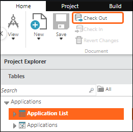
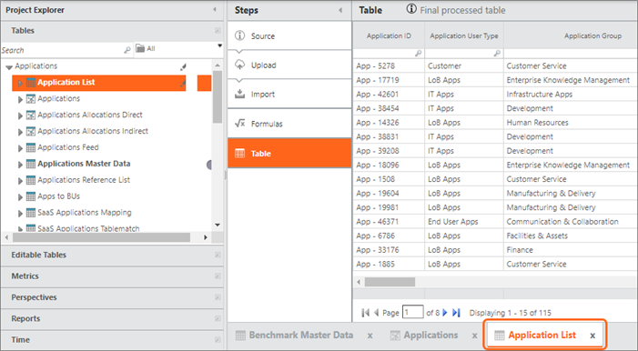
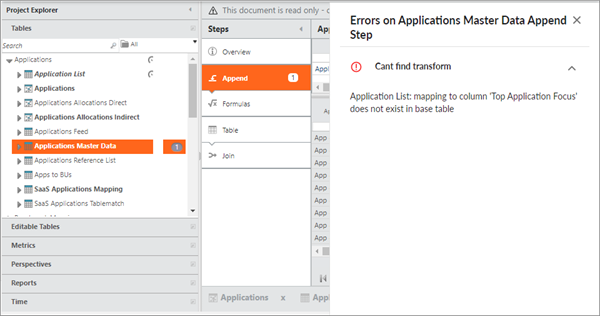
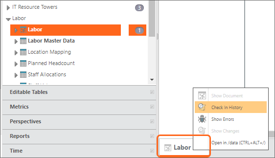
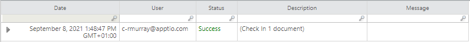

# Buenas prácticas: Check out y check in

◆ Se aplica a: Apptio TBM Studio 12.x y posteriores. En Apptio TBM Studio R12, todos los elementos son documentos, incluidas las tablas de datos, las métricas, las perspectivas y los modelos. Para editar un documento, primero debe verificarlo. Cuando sacas un documento, se bloquea para que otros no puedan editarlo. Puede guardar sus cambios en el documento sin activar un recálculo. Cuando termines de editar un documento, puedes registrarlo. El registro de un documento provoca un nuevo cálculo. Ahora, los demás verán los cambios que hayas realizado en el documento cuando finalice el cálculo en modo de desarrollo y se actualice su espacio de trabajo. Además, ahora otros podrán consultar este documento.

La información que figura a continuación detalla la salida y la entrada de documentos, así como las prácticas recomendadas que deben seguirse para una experiencia óptima.

## Extracción

Para retirar un documento, siga estos pasos:

1. Seleccione el documento en **el Explorador de proyectos**.
2. En la pestaña **Inicio**, en el grupo **Documento**, seleccione **Check Out**.
3. Cuando se retira un documento, aparece un icono de retirada junto al nombre del documento, y el nombre del documento se muestra en texto **naranja** en la pestaña de la parte inferior del área de trabajo.

## Deshacer, rehacer y revertir

A veces, cuando estás editando documentos en tu espacio de trabajo, puede que quieras volver a una versión anterior, o rehacerla. Para ello, puede utilizar tres opciones:

- **Deshacer**
- **Rehacer**
- **Anular el cambio**

Deshacer y rehacer son útiles para deshacer pequeños y discretos cambios en la configuración, como los siguientes:

- Posicionamiento de los elementos de un informe
- Modificaciones discretas de la configuración de los elementos del informe (por ejemplo: texto de los botones, contenido HTML, etc.)
- Edición de fórmulas para columnas en el paso de fórmulas de una tabla

## Revertir

Puedes encontrar deshacer y rehacer en la pestaña **Inicio**, grupo **Cambios**. Revertir abandona todos los cambios que haya realizado en los documentos de salida que seleccione y, a continuación, descarta la salida. Para revertir, siga estos pasos:

1. En la pestaña **Inicio**, en el grupo **Documento**, haga clic en **Revertir cambios**.
2. Seleccione la casilla de verificación situada junto a los documentos que desea revertir y haga clic en **Revertir salida**.

## Facturación

**Examinar los informes de resultados**

Al evaluar la salud del sistema tras realizar cambios en los datos o la configuración, resulta útil examinar los informes diseñados para evaluar posibles problemas de rendimiento.

Nota: Las próximas versiones de TBM Studio dispondrán de informes específicamente diseñados para evaluar el impacto de los cambios en el rendimiento. Cuando esos informes estén disponibles, este documento se actualizará para ofrecer orientaciones específicas. Sin embargo, hasta que esos informes estén disponibles, basta con elegir un informe que se sepa que ejercita bien el sistema. Si no está seguro de qué informe utilizar, consulte a su CSM o al servicio de asistencia Apptio.

## Confirmar que la carga de datos es buena

El principio rector de los espacios de trabajo del proyecto es que esta área es su entorno de desarrollo. Debe estar muy seguro de los datos y la configuración dentro de esa área antes de comprobar los datos. Utilice la siguiente lista de comprobación antes de registrar los documentos y después de haber realizado una carga de datos.

## Lista de control de documentos

- Revise los datos antes de cargarlos en su espacio de trabajo (por ejemplo, confirme que el archivo tiene contenido, está correctamente delimitado, etc.).
- Asegúrese de que las tablas de datos tienen datos y que la validación de cardinalidad está activada.
- Haga clic en **Guardar** en la tabla de datos modificada.
- Validar columnas (por ejemplo, la adición de columnas o el cambio de nombre de columnas) y tipos (véase [Recursos adicionales](#BestpracticesCheckoutandcheckin__addresources) ).
- Si faltan columnas, determine qué efecto tendrá esto en la configuración.
- Compruebe la calidad general de los datos (por ejemplo, si faltan datos o si los totales de las columnas numéricas son correctos) y cree su propia rutina de validación en torno a este punto.
- Mire un informe directamente asociado a los datos y asegúrese de que no ha ocurrido nada extraño.
- Navegue hasta los [informes de Rendimiento](#BestpracticesCheckoutandcheckin__perfreports) y compruebe que responden bien.
- **Si los informes no responden bien o se indican problemas, resuélvalos antes del registro.**
- Coordinar y acordar con los compañeros cuándo registrar los datos y asegurarse de que nadie está esperando para ascender de Etapa a Producción.

## Datalink (Classic) consideraciones

Al utilizar Datalink (Classic), **además de** los puntos anteriores, se aplica lo siguiente:

- Cuando Datalink (Classic) carga un documento, éste se carga en un espacio de trabajo de Datalink (Classic) y se registra *inmediatamente*.
  - Considere la posibilidad de utilizar grupos de conectores Datalink (Classic) para gestionar grandes conjuntos de cargas. El uso de un grupo de conectores dará lugar a un único registro para el grupo frente a registros individuales para cada carga. Para más información, consulte [Agrupar varios conectores](../../datalink-classic/datalink/group-connectors.html "(se abre en una pestaña o una ventana nueva)").
- Si hay problemas de validación, el documento se retendrá en el espacio de trabajo Datalink
  (Classic) hasta que se resuelvan los errores de validación y el documento se registre manualmente.

## Confirmar los cambios de configuración

Al igual que con las cargas de datos, tenga cuidado antes de registrar los cambios de configuración. Utilice la siguiente lista de comprobación antes de registrar los cambios de configuración. Para saber cómo acelerar la validación, consulte [Consejos sobre técnicas de validación](#BestpracticesCheckoutandcheckin__validation).

## Lista de comprobación

- Haz clic en **Guardar** cuando termines de modificar cualquier documento.
- Resuelva cualquier error seleccionando los números que aparecen junto a las tablas de datos, por ejemplo:
- Validar cómo los cambios de datos y configuración han afectado a las asignaciones.
- Validar cómo los cambios de datos y configuración han afectado a los informes.
- Compruebe el tamaño de los Ratios de Asignación de las Tablas Modelizadas dentro de cada Métrica Modelizada asociada a esa tabla.
- Compruebe que los informes en los que ha trabajado responden cuando se visualizan. Si un informe no se carga como se espera, puede indicar un problema de configuración (por ejemplo, si el informe no se carga nunca, o si se carga después de MUCHO tiempo). Si crees que se trata de un problema del navegador, puedes actualizar tu navegador y luego volver al informe y asegurarte de que se carga correctamente. Si no se carga correctamente, solucione el problema antes de facturar.
- Navegue hasta los [informes de Rendimiento](#BestpracticesCheckoutandcheckin__perfreports) y compruebe que responden bien. Si los informes no responden bien o se indican problemas, resuélvalos antes del registro.
- Coordinar y acordar con los compañeros el momento de registrar los documentos y asegurarse de que nadie está esperando para ascender de Etapa a Producción.

## Registrar un proyecto

Cuando muchas personas trabajan en un mismo proyecto con la posibilidad de que se registren varios documentos el mismo día, siga estas directrices para controlar qué se calcula y cuándo. Este paso debería formar parte del proceso del ciclo de vida de desarrollo de software (SDLC) de cualquier cliente. Merece la pena recapitular lo que ocurre después de facturar. Las actividades de cada entorno dentro de un mismo proyecto Apptio cuando se produce un check-in:

- **Desarrollo** - Una comprobación desencadena el procesamiento del nodo o nodos dev calc:
  - Transformaciones
  - Métricas
- **Etapa** - Un check in activa el aprovisionamiento de nodos calc stage, que puede tardar hasta 15 minutos, y una vez aprovisionados, los nodos calc stage calculan lo siguiente después de que el calc in dev haya finalizado:
- - Taladros
  - Informes

    Nota: Cuando se producen varios eventos de check-in durante un periodo de tiempo suficientemente largo (por ejemplo, unos minutos), esto puede dar lugar a más de un evento de cálculo. Cuando un cálculo está en marcha, cualquier comprobación posterior se incluirá en el siguiente evento de cálculo. Más adelante se ofrecen soluciones a este problema.
- **Producción** - Una publicación a producción sólo puede ejecutarse después de que se hayan completado todos los cálculos de etapa pendientes. La publicación a prod en v.12 es casi instantánea.

## Cálculos de control

Cuando se registran cambios en los datos, la configuración o los informes, se activan los cálculos en el desarrollo y la fase. Esto supondrá una carga de trabajo para el medio ambiente. Hasta que se complete el cálculo de la etapa, la etapa de navegación de los usuarios recibirá un aviso de que el entorno no está actualizado. No será posible ascender a la fase de producción hasta que no se hayan completado todos los cálculos de la fase.

## Establezca una política de facturación

Se recomienda que el equipo de TBMA en su conjunto determine una política de check in al inicio del proyecto y la revise cuando sea necesario. Las siguientes directrices han demostrado su eficacia en otras implantaciones de Apptio v.12 :

- Coordine el registro para que se produzca una o dos veces al día (por ejemplo, a la hora de comer y al final de la jornada).
- Si un proyecto tiene un tiempo de cálculo de etapas más largo, coordine la comprobación en todo el equipo para que tenga lugar al mismo tiempo. Esto ayudará a limitar la posibilidad de que se realicen cálculos en dos fases.*Si, a pesar de todo, obtiene cálculos en cola,* consulte [Limitar el tiempo de](#BestpracticesCheckoutandcheckin__limitcalc) cálculo para limitar el tiempo de cálculo.
- Si es necesario publicar en producción, bloquee la etapa cuando se hayan completado todas las comprobaciones acordadas para evitar que se produzca otra comprobación antes de que se haya publicado en producción.

## Ver el estado del cálculo

Hasta ahora, hemos hablado de 1) lo que ocurre cuando haces clic en facturar, 2) lo que debes hacer antes de hacer clic en facturar y 3) cuándo debes hacer clic en facturar. Esta sección explica lo que ocurre **después de un registro**. La cola de cálculo muestra lo que se ha calculado (y cuánto tiempo ha llevado), lo que se está calculando y lo que está a la espera de ser calculado. Para ver la cola de cálculo:

1. En el menú TBM Studio , seleccione la pestaña **Construir**.
2. Haga clic en **Cola de cálculo**.

Muestra la última compilación de cada entorno y las compilaciones que han terminado de calcular, están calculando activamente y han terminado de calcular. [Más información sobre la cola de cálculo](monitor-builds-calculation.html "(se abre en una pestaña o una ventana nueva)")

## Limitar el tiempo de cálculo

Si un cálculo está en marcha y se producen comprobaciones posteriores, esos cambios se pondrán en cola hasta que finalice el cálculo en marcha. Si el tiempo de calcinación de su etapa es largo, puede considerar utilizar la función Cancelar compilación ( v.12.3.1+ ) para cancelar la compilación en curso de modo que los cambios pendientes se incluyan en la siguiente compilación. Para más información, consulte [Cancelar un cálculo en curso](https://community.apptio.com/docs/DOC-8376 "(se abre en una pestaña o una ventana nueva)").

## Ver el historial de check-in

Para ver un historial de quién ha registrado un documento concreto, siga estos pasos:

1. Seleccione el documento en **el Explorador de proyectos**.
2. Haga clic con el botón derecho del ratón en la pestaña situada en la parte inferior del área de trabajo y seleccione **Historial de entradas** :
3. Aparece una tabla que muestra la fecha, el usuario, el estado, la descripción y cualquier mensaje incluido con el registro.
4. Para volver a la vista del documento, vuelva a hacer clic con el botón derecho del ratón en la pestaña y seleccione **Mostrar documento**.

## Retrotraer

A partir de v.12.2.2, puede deshacer los cambios realizados en un proyecto a partir de un cambio específico. Todos los cambios realizados después del cambio específico se revertirán. Sin embargo, hay que tener en cuenta algunas consideraciones importantes antes de utilizar esta función. Para más información, consulte [Deshacer una configuración](roll-back-configuration.html "(se abre en una pestaña o una ventana nueva)").

## Bloquear y promover un proyecto

El bloqueo y la promoción se tratan en [Bloquear y promover un proyecto](lock-promote-project.htm "(se abre en una pestaña o una ventana nueva)").

## Técnicas de validación

Una forma de acelerar la validación es tener abiertas *dos* pestañas del navegador: una pestaña con lo que se ve en el área de trabajo y otra pestaña con lo que es visible en la construcción de la etapa actual. Esto es más útil cuando hay cambios de configuración pero no de datos, y cuando no hay cálculos de etapas pendientes. Sin embargo, también puede ser útil en otras circunstancias. Para utilizar dos pestañas del navegador:

1. Navegue hasta el documento que está validando (tabla, informe, modelo, etc.).
2. Abra otra pestaña, y navegue hasta el mismo documento en stage, prod, y así sucesivamente.
3. Algunos navegadores como Chrome tienen la opción Duplicar pestaña al hacer clic con el botón derecho en una pestaña abierta del navegador. Esto puede acelerar la creación de una nueva pestaña al no tener que repetir la navegación a Enhanced Access Administration, etc.
4. Mantenga pulsada **la tecla Ctrl** y haga clic en el botón de **tabulación**. Esto debería alternar entre las dos pestañas abiertas. Esto le permite evaluar rápidamente las diferencias entre las vistas.

**Recursos adicionales**

- Localizar y solucionar problemas de validez de datos: [Localizar y corregir problemas de validez de los datos](https://community.apptio.com/docs/DOC-6790 "(se abre en una pestaña o una ventana nueva)")
- Vídeos de validación de datos: [Validación de datos ( v.12 )](https://community.apptio.com/videos/1305 "(se abre en una pestaña o una ventana nueva)")
