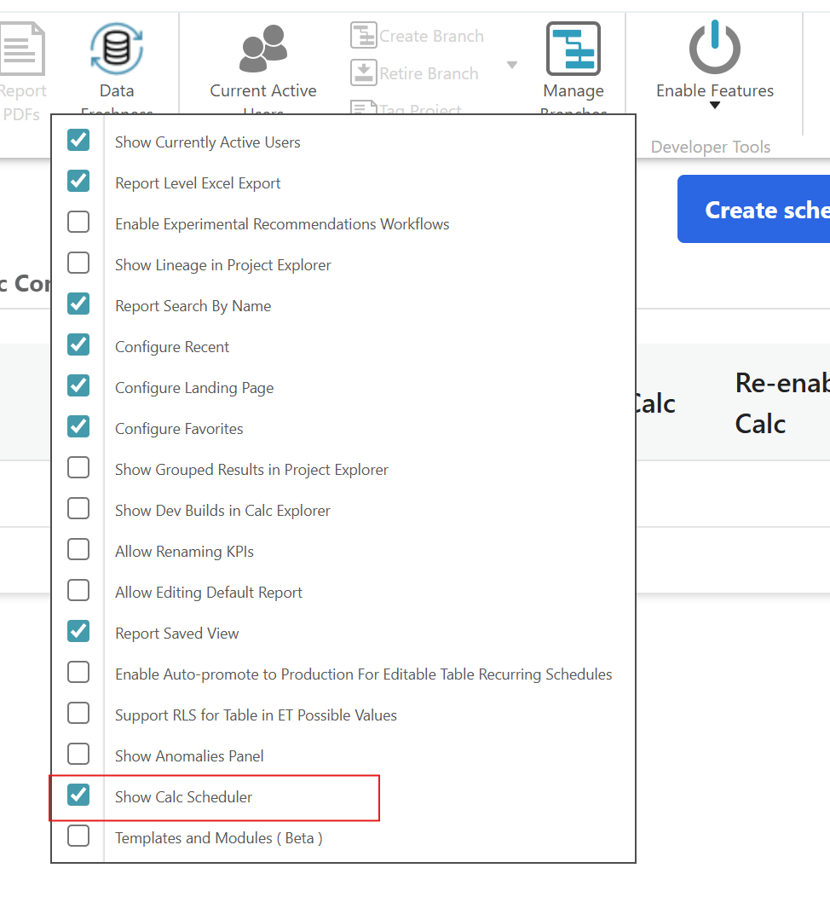
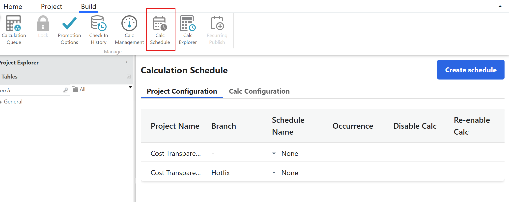
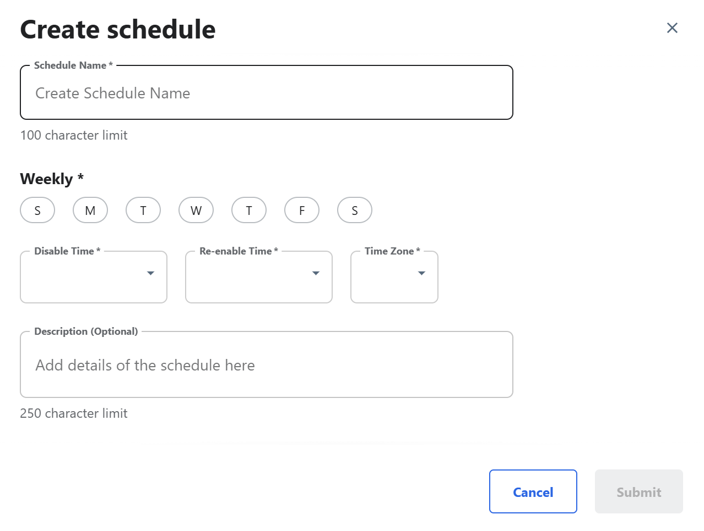
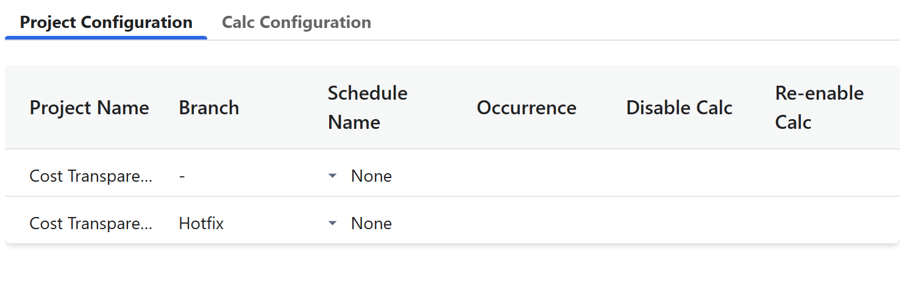
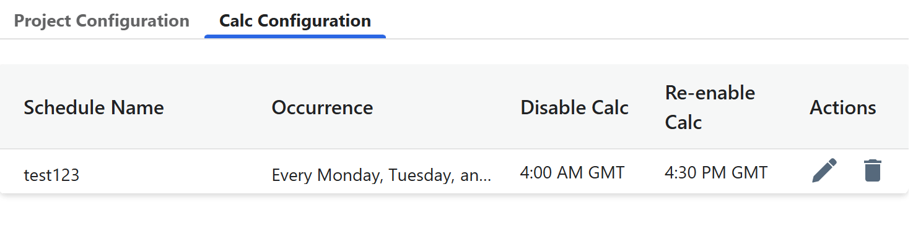
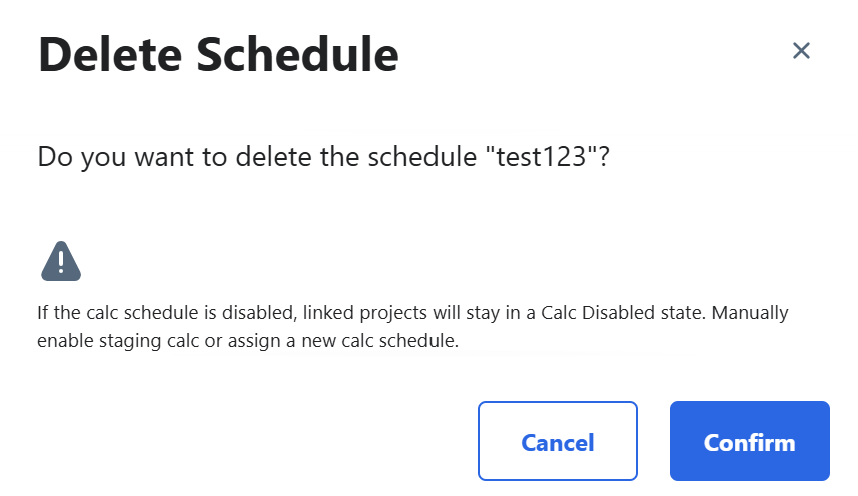

# Programador de gestión de Calc

Se aplica a: 2.16 y posteriores. Esta función automatizará los cálculos de puesta a disposición a nivel de proyecto y de rama.

Para Habilitar Calc management Schedule navegue a **Project** > **Enable Features**, y luego seleccione **Show Calc Scheduler**. Aparecerá una ventana emergente para confirmar que la función está activada.

## Configuración del proyecto

Vaya a la pestaña **Construir** de la cinta TBM Studio y seleccione **Calc Schedule**.

Para crear una programación, haga lo siguiente

1. Haga clic en el botón **Crear horario**.

   
2. Introduzca el **nombre del programa**.
3. En el campo **Semanal**, seleccione los días deseados para realizar los cálculos.
4. Seleccione **Reactivar tiempo** para reiniciar los cálculos.
5. Seleccione **Desactivar tiempo** para detener los cálculos.
6. Seleccione la **zona horaria**.
7. Pulse el botón **Enviar**.

Las programaciones creadas pueden aplicarse a varios proyectos.

Contiene la siguiente información:

| Campo | Descripción |
| --- | --- |
| Nombre de proyecto | Nombre del proyecto |
| Rama | Nombre de la sucursal |
| Nombre de planificación | Nombre del programa. Seleccione un programa para asignar al proyecto en la lista desplegable de programas. |
| Aparición | Mostrar los días en que se realizan los cálculos |
| Desactivar Calc | Muestra el tiempo de desactivación para detener el cálculo. |
| Volver a activar Calc | Visualice la hora de reactivación para reiniciar el cálculo. |

## Configuración Calc

Para editar la programación existente, seleccione el icono de edición

- Una vez iniciado un cálculo, la edición de la **hora de Reactivación** o de **Desactivación** no interrumpirá los cálculos en curso.
- Durante el cálculo, los cambios en el **tiempo de Reactivación** o **de Desactivación** sólo tendrán efecto en cálculos futuros.

Para borrar la programación existente, seleccione el icono de borrar. Haga clic en el botón **Confirmar** en la ventana emergente de advertencia.

Nota: Para cambiar el estado de activación/desactivación de Re de un proyecto, vaya a **Build** > **[Calc Management](cacl-mgmt-settings.html "Se aplica a: 12.11.0 y posteriores. Los clientes pueden ahora desactivar/activar los cálculos de escalonamiento a nivel de proyecto, de modo que pueden controlar qué proyectos se calculan y, a su vez, reducir el número de cálculos totales.")** y edite manualmente Disable/Enable Staging Calc según sea necesario.
