# Explorador de cálculos

## Visión general

Calc Explorer permite a los administradores obtener información sobre los procesos de cálculo y analizar el rendimiento de compilaciones largas. Sienta las bases para futuras mejoras en los análisis de configuración y rendimiento. El Calc Explorer sólo captura los elementos que tardan más de 10 segundos en calcularse. Por ejemplo, puede navegar a un informe, y luego a un período dentro del informe, pero no encontrar ningún componente en la lista. Esto se debe a que para esa compilación, informe y periodo de tiempo ningún componente del informe tardó más de 10 segundos en calcularse. El Explorador de Calc también muestra construcciones específicas de Trunk o de una rama, por separado. El usuario puede cambiar entre Trunk y cualquier sucursal activa para ver las construcciones deseadas en lugar de desplazarse por la enorme lista. El "quilate" sólo se mostrará si hay varios cálculos de la misma construcción.

A partir de la versión 12.11.4, Calc Explorer está disponible por defecto para todos los administradores (GA).

## Navegación

Para acceder a Calc Explorer, vaya a la pestaña Construir de la cinta TBM Studio y seleccione Calc Explorer.

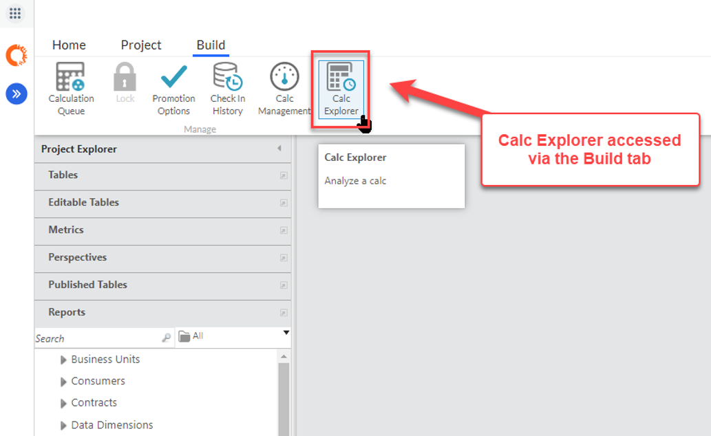

Se abre un nuevo documento con una lista de construcciones para analizar.

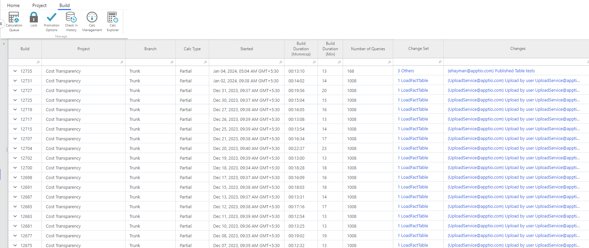

## Definiciones

| Campo | Descripción |
| --- | --- |
| Crear | Un punto específico en la progresión de Check Ins que puede calcularse para su visualización en Flagship. |
| Calc | Un cálculo de una construcción específica. |
| Entidad | Componente de un proyecto (por ejemplo, transformaciones, métricas, informes). |
| Tipo Calc | Una descripción del número de entidades calculadas en comparación con el proyecto completo.  - **Todos** - Un calc que requiere que todas las entidades sean calculadas completamente. Ejemplo:   - Una compilación que se activa después de borrar la caché o actualizarla.   - Se registra un cambio material, como un ajuste de Tiempo de Proyecto en el que se añaden periodos de tiempo adicionales. - **Parcial** - Un calc que requiere el cálculo de entidades que dependen del conjunto de cambios. Ejemplo: Una compilación que se activa tras una carga de datos o un cambio de configuración. - **Ninguno** - Un calc que no requiere que se calcule ninguna entidad. Ejemplo: Se realiza un cambio no material en el proyecto, como desactivar un informe. |
| Consulta | La unidad más pequeña de una calc, normalmente una entidad para un periodo de tiempo específico. |
| Duración de la construcción | Tiempo que tarda la construcción - en hh:mm:ss y en mins. Puedes buscar la construcción más grande o más corta especificando el rango, como <5, >70, etc. |
| Períodos máximos | Muestra el número máximo de periodos de tiempo para la construcción. |
| Número de consultas | Muestra todas las consultas de una compilación, en forma de tabla. Puede buscar y clasificar entidades concretas. También se puede acceder a la lista de periodos calculados. |
| Conjunto de cambios | Qué cambios se han realizado en el proyecto desde la versión anterior. |
| Cambios | Qué comprobaciones se han realizado desde la versión anterior. |
| Esfuerzo de cálculo | Medida de los recursos necesarios para completar una consulta concreta, expresada en forma de número. Ejemplo, 3.2M en lugar de 3.200.000. |
| Transformar | Una tabla con todos sus pasos de transformación asociados, basada normalmente en una fuente de datos sin procesar. |
| Número de columnas | El número de columnas en el paso de salida de un Transform. Ejemplo, 2.50L en lugar de 2.50.000. |
| Número de filas | El número de filas en el paso de salida de un Transform. Ejemplo, 2.50L en lugar de 2.50.000. |
| Informe | Informe que contiene una colección de KPI, gráficos, cuadros y tablas. |
| Componente del informe | Un único KPI, gráfico, tabla o cuadro que forma parte del informe. |

## Interacción

Al hacer clic en una construcción en el Explorador de Calc, se muestra un resumen de la construcción, incluidas varias entidades basadas en el ámbito del cálculo.

## Construcción parcial

Muestra las entidades relevantes para el cálculo parcial.

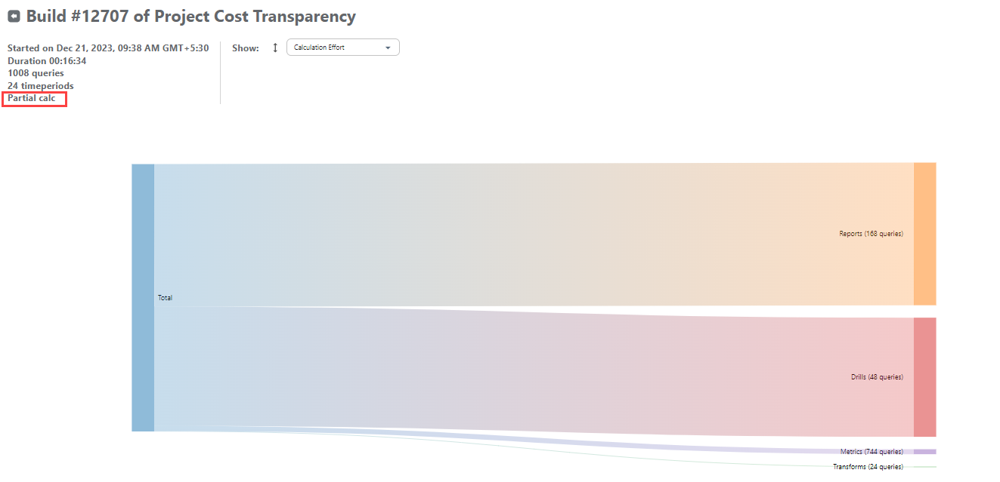

## Todo construido

Presenta un diagrama de Sankey a partir del Nivel 1, mostrando las entidades dimensionadas y ordenadas por Esfuerzo de Cálculo. Profundice en cada entidad para ver los componentes de cálculo detallados y los datos específicos de cada entidad.

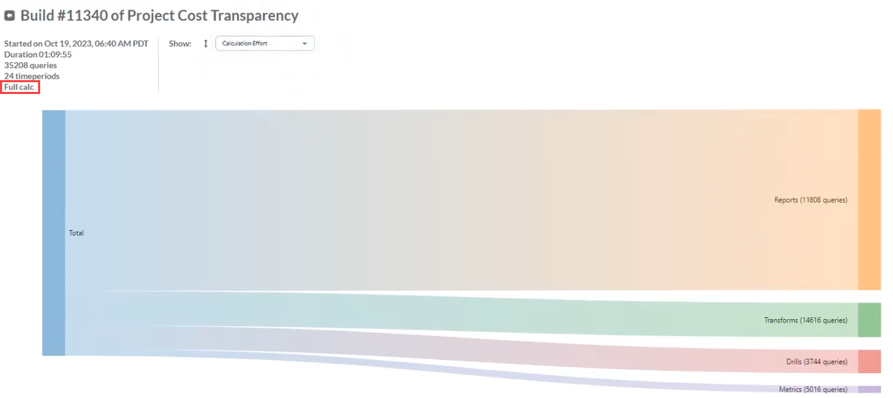

Nota: Sólo se podrá acceder a las construcciones creadas después de activar la función Calc Explorer; el historial anterior no está disponible. Esto incluye a los clientes que ya tenían acceso a la versión beta.

## Navegación Sankey

## Informes

Haga clic en la entidad Informe para acceder al primer nivel de información, donde se muestran los 10 informes principales, con el resto de informes consolidados en un único flujo. El tamaño de cada flujo se basa en el esfuerzo de cálculo y se clasifica en orden descendente. Al pasar el ratón por encima del nombre de un informe se muestra el Esfuerzo de cálculo para ese informe específico, incluido el % del Total y el % del Padre.

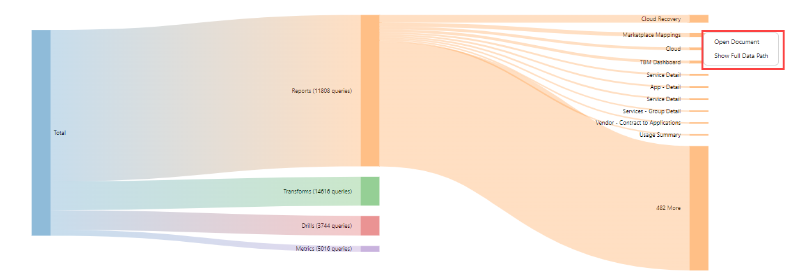

Haga clic con el botón derecho en el informe para abrir el documento (para el periodo seleccionado) o ver la ruta completa de los datos.

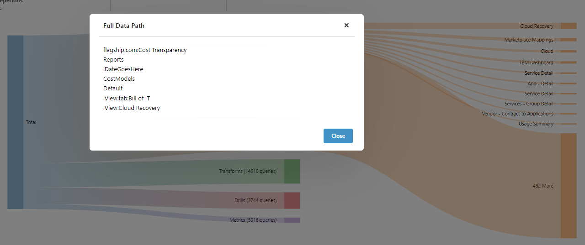

Filtre informes específicos por nombre introduciendo un término de búsqueda en la casilla Buscar último nivel. Navegue por la lista completa de informes utilizando las flechas izquierda/derecha alrededor de la función de paginación Mostrar 1-10 de X situada debajo del cuadro de búsqueda.

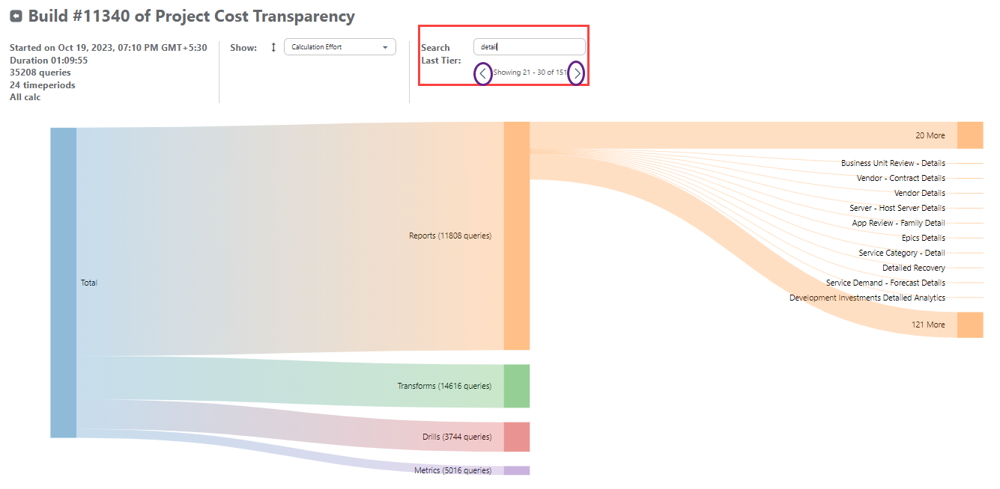

El taladro de segundo nivel muestra los diez periodos de tiempo más importantes por Calc Effort, con el resto consolidado en un único flujo. También en este caso, puede hacer clic con el botón derecho del ratón en el periodo de tiempo para abrir el documento o ver la ruta completa de los datos.

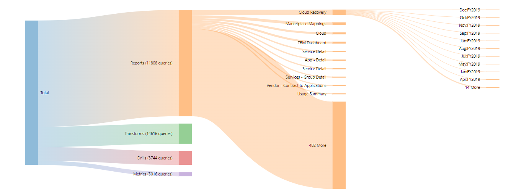

El tercer nivel de desglose muestra los componentes del informe que requieren más cálculos. Al pasar el ratón por encima del componente, obtendrá información detallada sobre su consumo de tiempo máximo de cálculo, tanto en relación con su informe principal como con el tiempo agregado de todas las entidades.

Nota: Sólo los Informes tienen un desglose más allá del nivel Período de tiempo

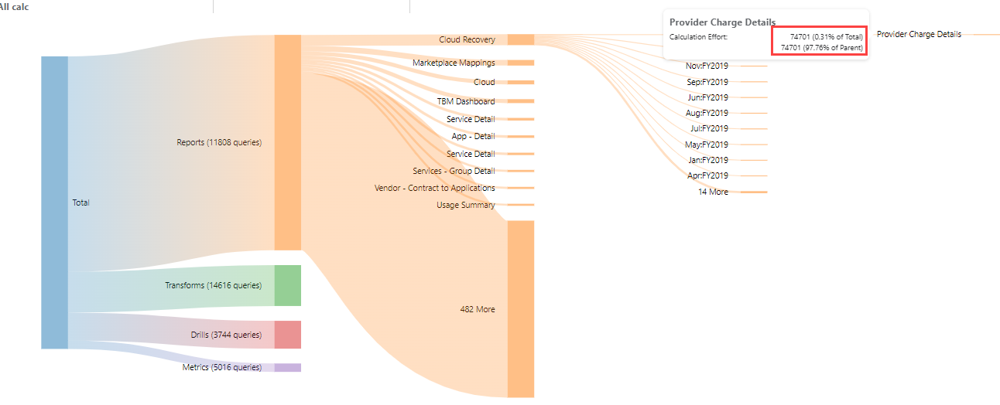

Puede hacer lo siguiente para encontrar la ubicación exacta de un componente del informe:

1. Haga clic con el botón derecho del ratón sobre el componente del informe en el Explorador de Calc.
2. Seleccione "mostrar documento".
3. Cuando se abra el informe, el componente del informe debe aparecer en azul:

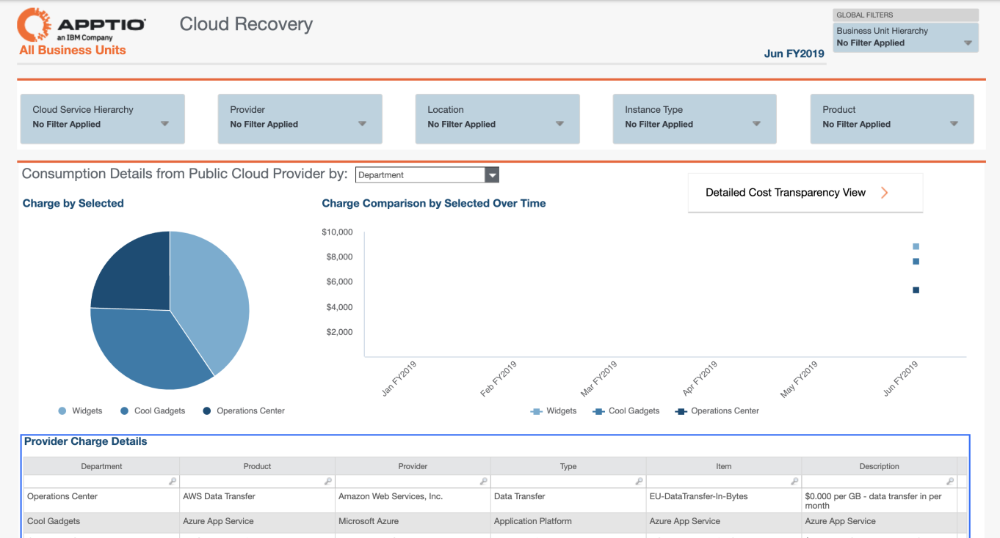

## Transformaciones

Al hacer clic en Transformaciones saldrá de la entidad anterior que estaba viendo y se mostrará el primer nivel de transformaciones con la ordenación por defecto por Esfuerzo de Cálculo.

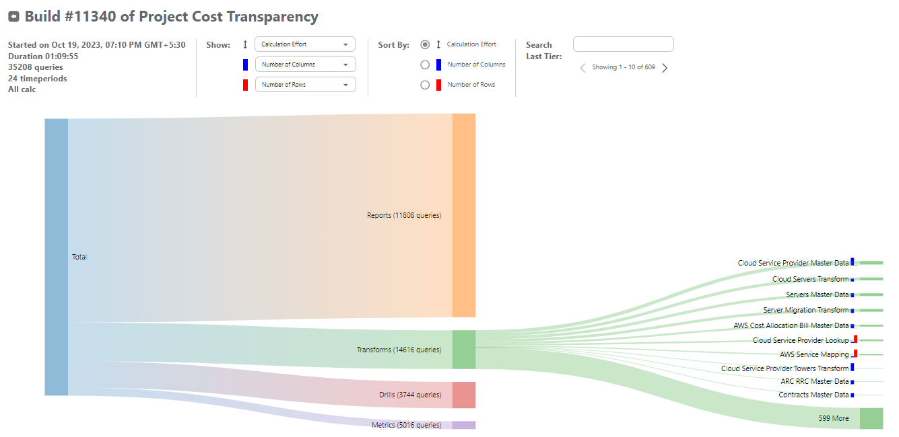

Transforms funciona de la misma manera que Reports, excepto que tienen dos elementos secundarios - fila (barra roja) y columnas (barra azul). Puede explorar las Transformaciones utilizando Ordenar por para organizar los flujos por esfuerzo de cálculo, # filas o # columnas. Las barras rojas y azules son indicadores visuales secundarios y se controlan mediante la opción Mostrar:

- El valor del primer desplegable determina el grosor de las líneas y los recuadros
- El valor de la barra azul desplegable determina la altura de las barras azules
- El valor de la barra roja desplegable determina la altura de las barras rojas

Sólo las Transformaciones tienen los atributos Filas y Columnas, como se muestra:

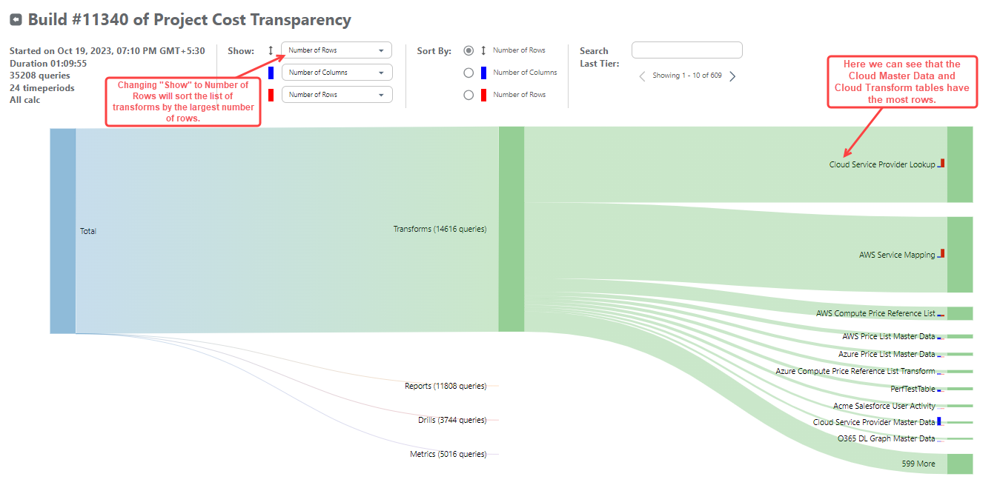

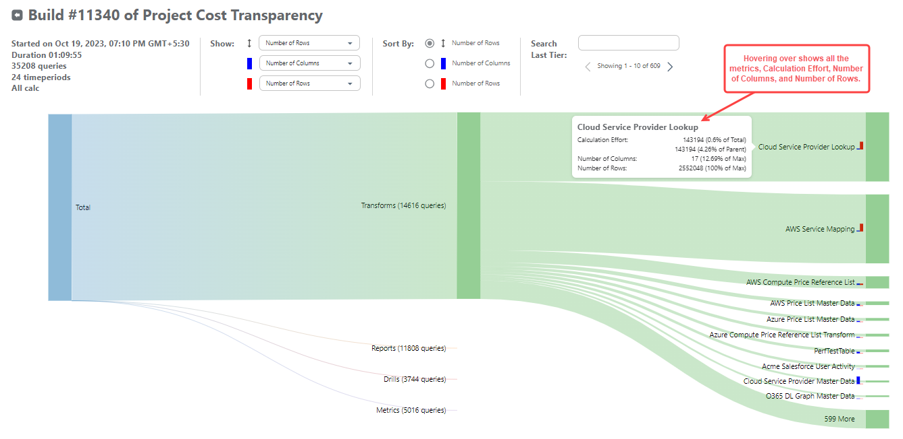

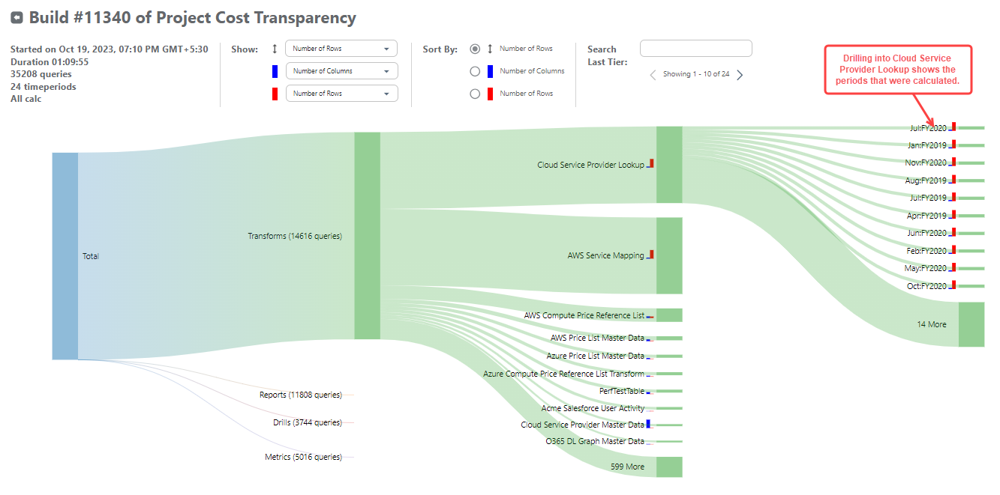

Haga clic con el botón derecho del ratón en el periodo de transformación para abrir el documento o ver la ruta completa de los datos.

## Ejercicios y métricas

Los ejercicios y las métricas funcionan de forma similar a los informes y las transformaciones.

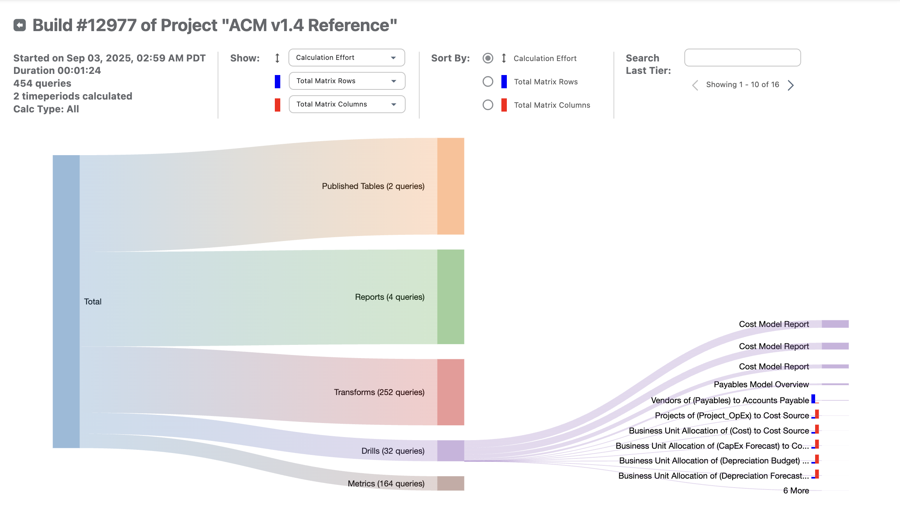

Se introducen métricas secundarias adicionales para los ejercicios con el fin de proporcionar una visión más profunda de su rendimiento relacionado. Para desglosar métricas adicionales, haga clic en la opción **Taladros**. Estas métricas proporcionarán los siguientes datos:

- **Total filas matriz** - Número total de filas de la matriz calculada
- **Columnas totales de la matriz** - Número total de columnas de la matriz calculada
- **Filas de ratio de asignación** - Recuento de filas que contienen valores de asignación reales (excluye filas vacías/cero)
- **Tipo de matriz** - Indica si la matriz es densa (alto porcentaje de valores distintos de cero) o dispersa (mayoría de valores cero/vacíos)

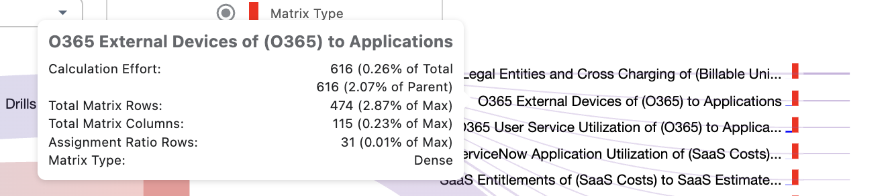

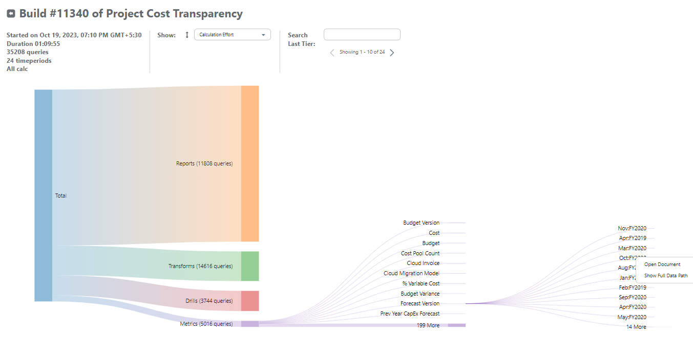
