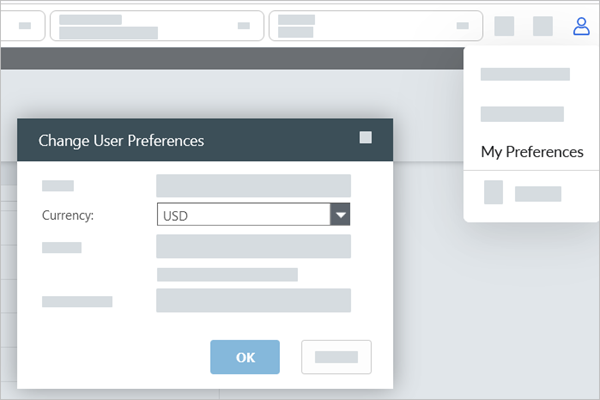
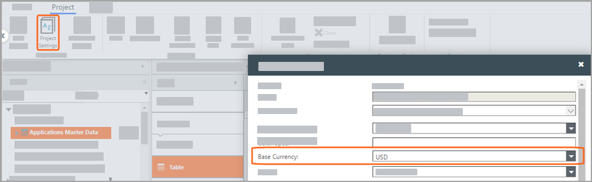

# Configurar la moneda común

**Se aplica a** : TBM Studio 12.0 y posteriores. Puede cambiar la moneda común para su perfil individual o para todos los proyectos de TBM Studio .

## Cambiar la moneda común de su perfil

Es posible cambiar la moneda común sólo para su cuenta de usuario sin que ello afecte al proyecto de los demás usuarios.

1. Navegue hasta .
2. En **Moneda**, seleccione la moneda que prefiera.
3. Pulse **Aceptar**.

   

   Nota: Las preferencias de moneda de su perfil tendrán prioridad sobre la Configuración del proyecto en la mayoría de las páginas de TBM Studio.

## Cambiar la moneda base de todo el proyecto

Con los permisos correctos, puede cambiar la moneda común utilizada en todo el proyecto, lo que afectará a todos los usuarios que puedan acceder al proyecto.

1. En la pestaña **Proyecto**, en el grupo **Configuración del proyecto**, haga clic en **Configuración del proyecto**.

   
2. En **Moneda base**, seleccione la moneda que prefiera.
3. En **Compactación numérica**, establezca la compactación que prefiera para miles, millones, miles de millones y billones.
4. En **Símbolos de moneda**, establezca el símbolo de moneda que prefiera.
5. Haga clic en **Guardar** para aplicar los cambios.

   Nota: Los ajustes del proyecto sólo pueden modificarse si no están actualmente a disposición de ningún otro usuario.
