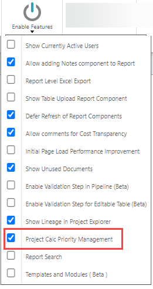
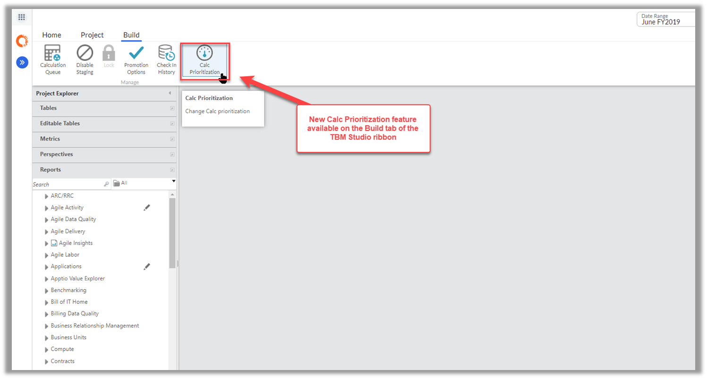
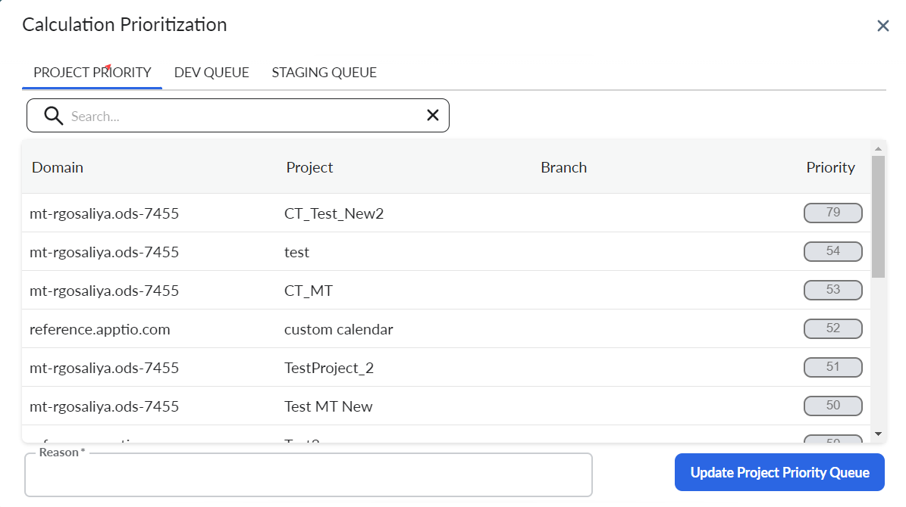
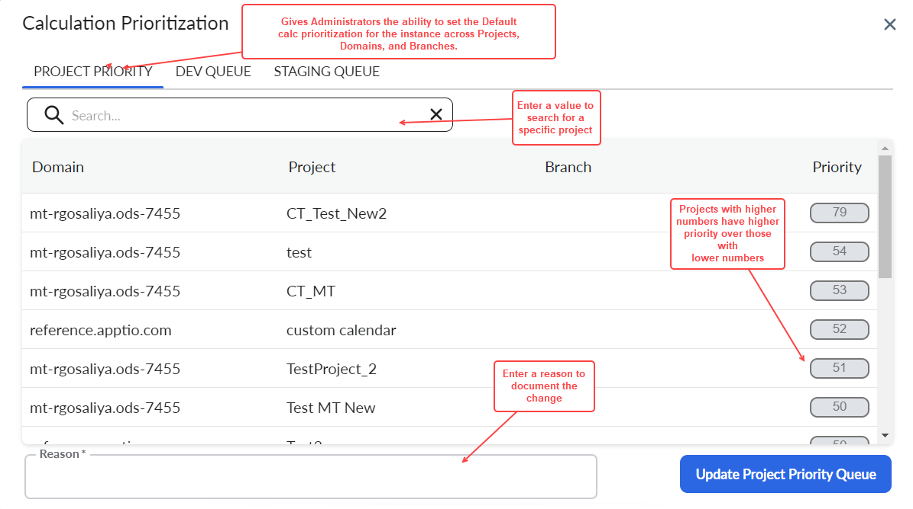
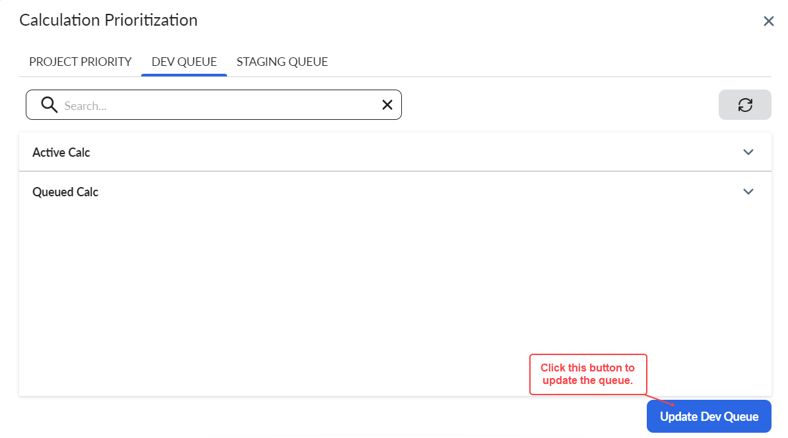
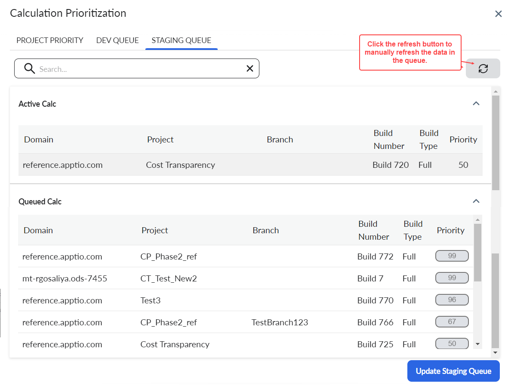
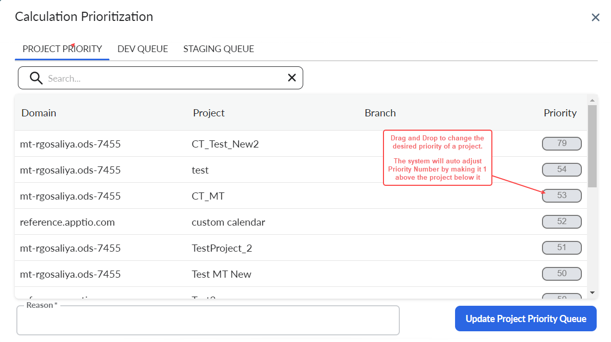

# Priorización Calc

Se aplica a: 12.10.9 y 12.10.10. De 12.11.0.

Los administradores pueden priorizar el cálculo de los proyectos en función de su importancia o urgencia. Es aplicable a todos los proyectos, dominios y ramas en su instancia dentro de TBM Studio. A partir de ahora, los proyectos se calcularán en función de los números que se les hayan asignado. Los administradores pueden arrastrar y soltar proyectos en el orden deseado y documentar el motivo de los cambios. La principal ventaja es establecer el orden de cálculo de los proyectos tras un reinicio de instancia. Además, si se está realizando un cálculo, la priorización de las calificaciones determinará el orden de los controles posteriores.

Ver [Calc Management](cacl-mgmt-settings.htm "(se abre en una pestaña o una ventana nueva)")

La Priorización de Calc no está activa por defecto. Para activarla, vaya a **Proyecto** > **Activar funciones** y, a continuación, seleccione **Gestión de prioridades de Calc del proyecto**.

Nota: La Priorización de Calc por defecto no es compatible con la instancia multi-tenancy. La función actual sólo admite la Priorización de Calc por defecto. La futura mejora soportará los cambios en las colas de las calcetas Dev y Staging.

:

## Navegación

Vaya a la pestaña **Construir** de la cinta TBM Studio y seleccione **Calc Priorización**

Aparece la ventana emergente Cálculo de prioridades con tres pestañas: Prioridad del proyecto, Cola de desarrollo y Cola de preparación

## Prioridad del proyecto

Sólo se aplica a: 12.10.9 y 12.10.10. Esta pestaña muestra la lista de proyectos con su prioridad.

Esta pestaña muestra la lista de proyectos con su prioridad.

Introduzca un **Motivo** para documentar el propósito del cambio y haga clic en **Actualizar cola de prioridad del proyecto**.

## Cola de desarrollo

Esta pestaña muestra la lista de tareas que están actualmente en la cola de desarrollo. Hay dos secciones Calc activa y Calc en cola, y muestran las tareas que están en curso y en cola respectivamente.

La cola activa es estática, mientras que la lista en cola puede modificarse en función de las preferencias del usuario.

## Cola de puesta en escena

Esta pestaña muestra la lista de proyectos/ramas que se encuentran actualmente en la cola de preparación. Hay dos secciones Calc activa y Calc en cola, y muestran los proyectos y/o ramas que están en curso y en cola respectivamente.

## Cambio de prioridades

Puede cambiar las prioridades de todos los elementos en cola y de la prioridad del proyecto arrastrando y soltando una fila del proyecto o introduciendo un valor manual para cambiar la prioridad. El número de prioridad se ajustará automáticamente para crear la priorización deseada. El sistema asignará un número añadiendo 1 al proyecto directamente a continuación

También puede buscar para filtrar por dominio, proyecto y sucursal. Las colas Dev y Staging pueden actualizarse manualmente para comprobar si hay actualizaciones.

note

Nota: No se pueden cambiar las prioridades de las tareas en curso.
