# Demostración de linaje

La función Lineage no está activa por defecto. Un Administrador puede habilitarlo navegando a la pestaña **Proyecto** > **Habilitar Características**, y luego seleccionando **Mostrar Linaje**. A continuación, se puede acceder a ella desde diferentes entidades, como Tablas, Columnas en Tablas, Tablas editables e Informes de métricas.

Veamos un ejemplo para demostrar el poder del linaje: Tome Apptio One Cost project (históricamente llamado Cost Transparency) y extraiga un conjunto de datos simple en un modelo simple sólo para empezar.

Considere el conjunto de datos Apptio Value Explorer >>Value Master. Aquí, en el canal de datos, tiene un paso de anexión con un par de tablas conectadas, un paso de fórmula que incluye una búsqueda en otra tabla. También puede ver el paso Unir, que muestra múltiples relaciones entre tablas. Estas son algunas de las relaciones que puede identificar rápidamente aquí.

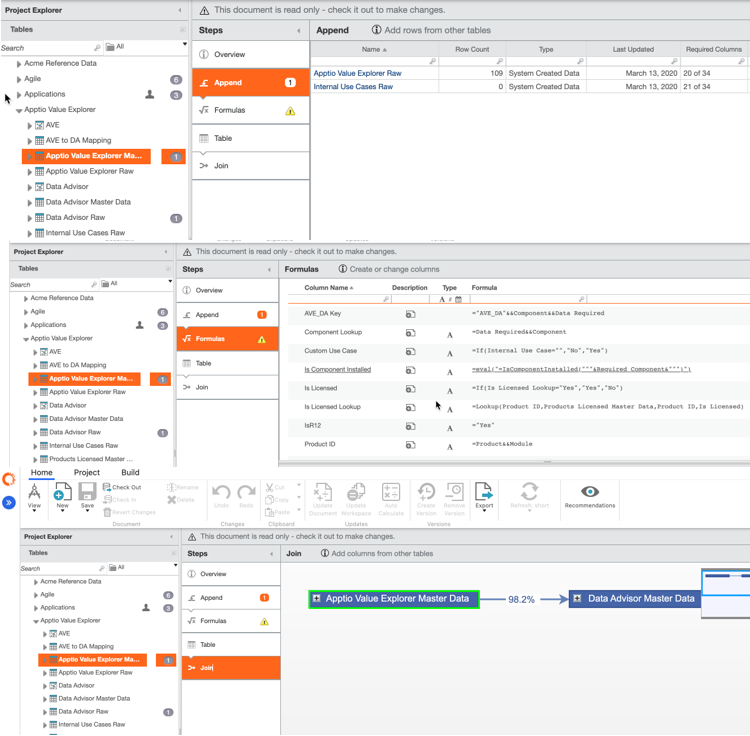

Para explorar el linaje de esta tabla, navegue hasta el explorador de proyectos, haga clic con el botón derecho y seleccione **Trazar linaje para este documento**. Aparece una nueva pestaña para el linaje con un diagrama bastante complejo.

El color azul representa los objetos relacionados con el modelo (AVE) y el color tostado representa los informes.

La vista inicial está limitada a una profundidad de 1 y mostrará las dependencias descendentes, ya que partimos de una tabla que puede aumentarse en función de la complejidad de las relaciones de la entidad seleccionada. A medida que el proyecto se hace más complejo, se puede profundizar más en las relaciones. También puede cambiar entre dependencias descendentes, que es lo predeterminado si elige una tabla, o dependencias ascendentes, que es lo predeterminado si elige un informe.

También puede incluir o excluir los subcomponentes o subtipos asociados a las tablas, el objeto modelo o los informes. Seleccione la casilla del subtipo que desea ver en su diagrama de linaje. Los números que acompañan a cada subtipo indican el número total de entidades presentes en el diagrama. También puede Seleccionar todos/Deseleccionar todos los subtipos mediante la alternancia de subtipos.

Para obtener información adicional sobre cualquier entidad, pase el ratón por encima de ella. Si hace clic en la flecha roja superior, se mostrará la lista de entidades a añadir encima del objeto seleccionado en el gráfico.

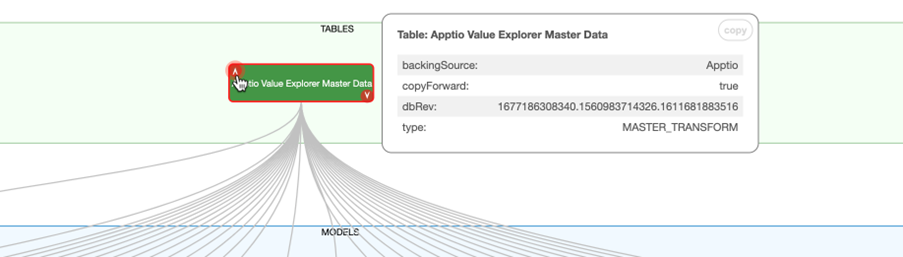

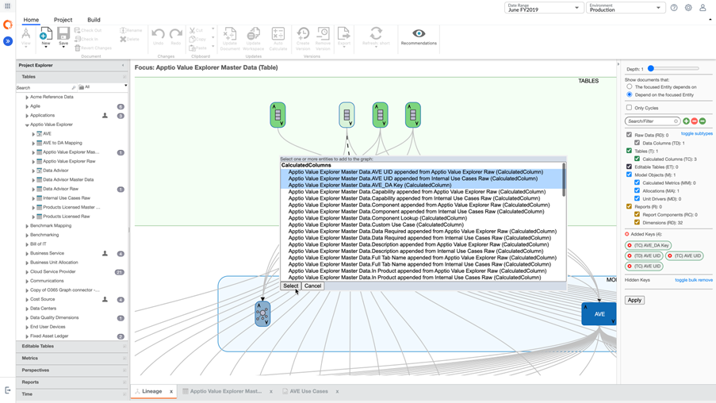

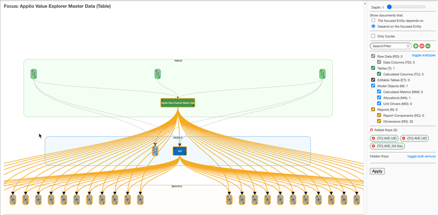

Del mismo modo, haga clic en la flecha roja descendente para ver las entidades descendentes.

Ahora, elimine todos los subtipos y seleccione **Aplicar**. Puedes ver una tabla en el nivel superior entrando en un modelo. Ahora aumente la profundidad y aplique para ver más información con estas dos entidades enfocadas.

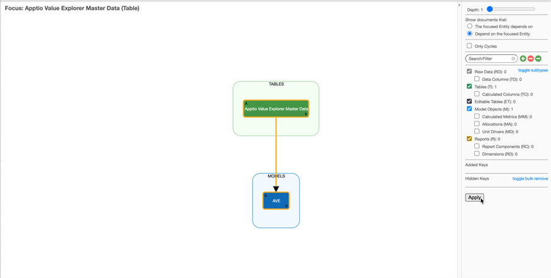

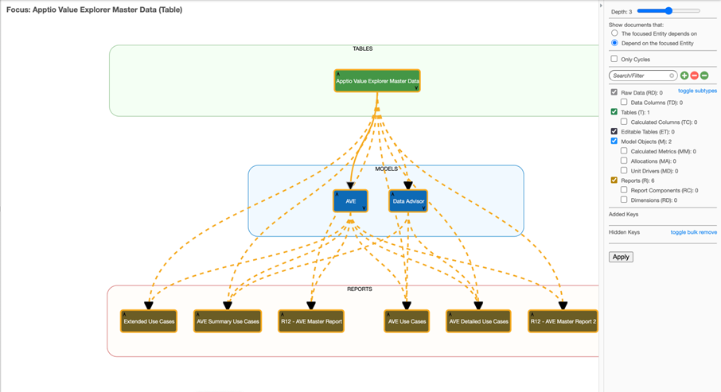

En este caso, una **línea continua** significa que existe una dependencia directa entre las dos entidades y puede verse cuál es esa dependencia pasando el ratón por encima de la línea. La **línea de puntos** significa que existe una dependencia indirecta: probablemente otras entidades intermedias entre las dos del diagrama. Puede hacer doble clic en la línea de puntos para ver cuáles son esas dependencias intermedias.

También observará que la profundidad a elegir aumenta hasta el nivel 5, lo que significa que incrementamos sólo un par de capas cada vez. Esto se hace para mantener el mismo rendimiento con cada iteración y devolver más información. Al elegir la profundidad máxima, observará que la tabla está asociada a dos modelos diferentes, que están proporcionando información a varios informes.

Ahora, al hacer clic con el botón derecho en cada entidad, tienes opciones para:

- **Mostrar dependencias** directas: que lleva el foco a las entidades seleccionadas para ver las dependencias directas.
- **Ocultar esto** : eliminará la entidad del gráfico.
- **Abrir documento** : abrirá el documento en otra pestaña.

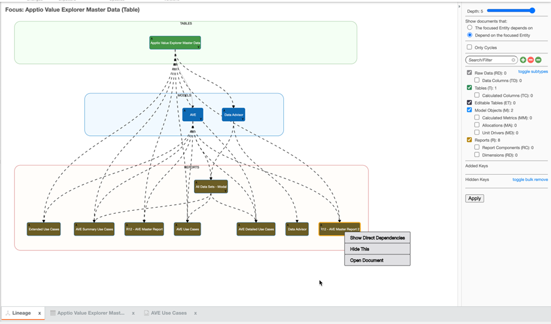

Ahora que ya entiendes cómo funciona Lineage, vamos a otro caso de uso en el que querías ver una columna y entender el impacto si la cambiamos.

Tomemos la tabla Benchmark Tower Spend Transform, y supongamos que estamos interesados en una columna concreta % Tower Spend. Puede hacer clic con el botón derecho en la columna y hacer clic en **Trazar linaje para esta columna**.

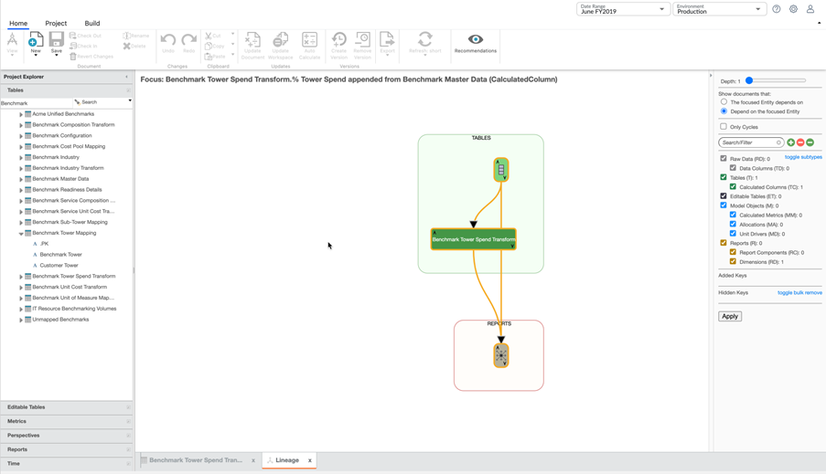

En la dependencia descendente, queda claro que esta columna métrica está asociada a la tabla y al informe denominado Resumen de evaluación comparativa. Al aumentar la profundidad al máximo, vemos lo siguiente:

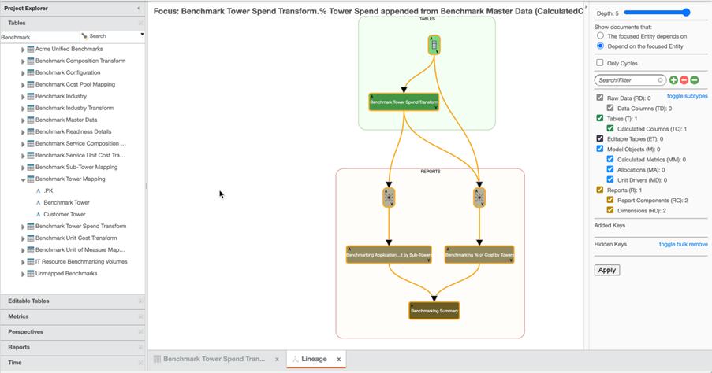

Por lo tanto, esta vista nos da información sobre a qué informes y tablas está asociada la columna. También puede querer ver de qué entidades depende su columna (ascendente) y puede cambiar a "La entidad enfocada depende de" en el panel derecho. En general, esto le ayudará a identificar el impacto para deshacerse de esta columna.

## Linaje a través de un informe

Este es otro caso de uso del linaje. Vaya a **Informes**, seleccione **Vendor Insights Gastos sin pedido**, haga clic con el botón derecho y seleccione **Trazar linaje para este documento**. El gráfico de linaje aparece como se muestra. Ahora, active los subtipos y aumente la profundidad, para ver que hay más tablas y relaciones, y puede ver la tabla de cuentas a pagar y el conjunto de datos maestros, con algunos informes asociados.

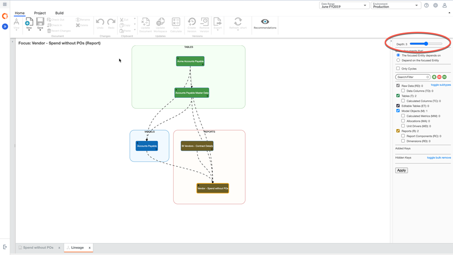

Si profundiza aún más, verá que hay más tablas y relaciones. El plan de cuentas está alimentando la orden de compra, debido a la cuenta que está asociada con la orden de compra. Es probable que la asignación organizativa se deba a los centros de costes y las responsabilidades organizativas asociadas a este cuadro y, en última instancia, a los informes. Una vez más, tiene la posibilidad de navegar tanto por las tablas como por una columna, una métrica calculada o un informe.

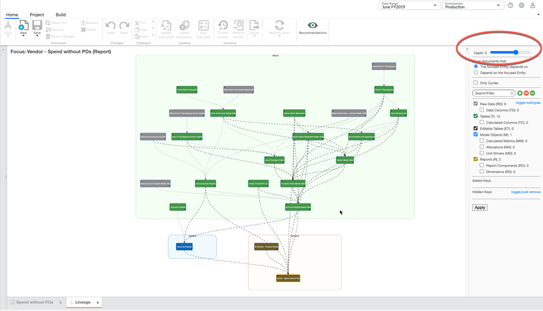
