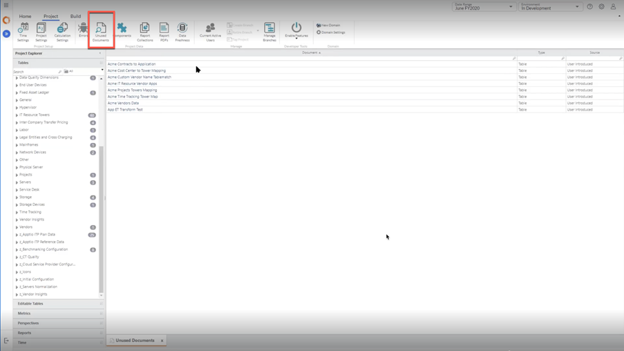

# Cómo encontrar documentos no utilizados

En la pestaña Proyecto, Activar función, haga clic en Activar Mostrar documentos no utilizados. Ahora esta función estará disponible en la propia pestaña Proyecto para su uso. Seleccionémoslo y se abrirá una lista de tablas con cualquier métrica calculada, nombre de tabla o informe que haya sido introducido por el usuario pero que no haya sido utilizado por nada. Así que esto realmente le da la oportunidad de eliminar estas entidades.

Nota: Los resultados para los documentos no utilizados se muestran sólo mientras se utiliza Lineage, donde no estamos considerando ninguna dependencia externa del proyecto, y hay un alcance futuro prospectivo para ello. En tales casos, podemos tender a eliminar cualquier entidad, pero asegurándonos de volver a comprobar que no se utiliza en ningún otro proyecto.
