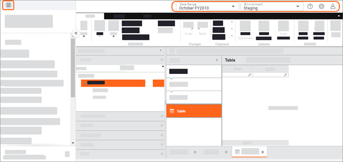
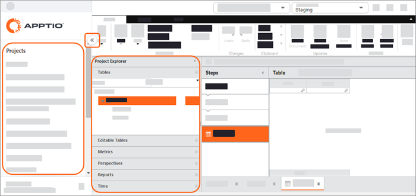

# Oriéntate en TBM Studio

## Barra de herramientas

|  |  |  |
| --- | --- | --- |
|  | Todos los productos | Ir a otro producto Apptio |
|  | Intervalo de fechas | Cambiar entre periodos de tiempo |
|  | Entorno | Alternar entre los entornos de desarrollo, ensayo y producción  [Más información sobre medio ambiente](#FindyourwayaroundTBMStudio__Environments) |
|  | Ayuda | Puede:  - buscar en el Centro de ayuda - enviar comentarios |
|  | Valores de aplicación | Puede:  - ir a la administración de aplicaciones - crear o importar un nuevo proyecto - Cambiar de dominio - Configurar la seguridad a nivel de filas - ver detalles de la aplicación, como la versión y el entorno |
|  | Valores de perfil | Puede:  - gestionar su perfil - suplantar a otro usuario Consejo: Los administradores pueden querer hacer esto para comprobar los permisos de un usuario o para solucionar problemas. - Cerrar sesión |

## Navegación

## Panel de proyectos

En el panel Proyectos, puede ver una lista de todos los Proyectos de su inquilino y seleccionar el Proyecto en el que desea trabajar.

- Para minimizar el panel Proyectos, seleccione . Para volver a maximizar el panel, seleccione .

## Panel Explorador de proyectos

El panel Explorador de proyectos incluye secciones para cada tipo de documento:

- **Tablas** : Lista las tablas que se han cargado en la aplicación.
- **Métricas** : Enumera las métricas calculadas y del modelo.
- **Perspectivas** : Enumera los campos añadidos desde otra sección que están disponibles para crear informes.
- **Informes** : Lista los informes de objetos generados por la aplicación y los informes personalizados creados por los usuarios. También enumera los modelos de informes.
- **Tiempo** : Enumere los valores como meses, trimestres y mitades que pueden utilizarse para agrupar datos en gráficos y tablas en los informes.

Al seleccionar una sección, ésta se amplía. Sólo se puede ampliar una sección cada vez.

- Para minimizar el panel Explorador de proyectos, haga clic en la flecha Minimizar situada en la esquina superior derecha del panel.
- Para ajustar la anchura del panel Explorador de proyectos, arrastre el divisor vertical.

También hay varios iconos que aparecen en el Explorador de proyectos:

| Icono | Información sobre herramientas (se muestra al pasar el ratón por encima) | Detalles |
| --- | --- | --- |
|  | *"Este documento ha sido revisado por usted"* | Lo has sacado del proyecto de montaje para editarlo. |
|  | *"Este documento ha sido transferido a <insert username here>"* | Alguien además del usuario actual lo ha comprobado. Pase el ratón por encima del icono para conocer el nombre de usuario de quien lo ha sacado. |
|  | *"Para compartir este documento, haga clic en registrarse"* | Un nuevo elemento en tu espacio de trabajo. Lo has creado y aún no lo has registrado. No será visible para otros usuarios hasta que se registre. |
|  | *"Este documento se está calculando. Estará disponible cuando se completen los cálculos"*  **Después de calcular, la información sobre herramientas cambia:**  *"Existe una versión más reciente de este documento. Para obtener la nueva versión, haga clic en Actualizar espacio de trabajo"* | Acaba de registrar el artículo y está calculando. El icono se actualizará cuando se haya completado el cálculo del registro.  **Después de calcular:**  El elemento ha sido registrado por usted u otro usuario desde la última actualización de su área de trabajo. Haga clic en Actualizar espacio de trabajo para cargar la versión actual. |

## Entornos

Hay tres entornos en TBM Studio:

- Desarrollo
- Transfiriendo
- Producción

Para cambiar de entorno, utilice el menú Entorno de la barra de herramientas.

Nota: En las versiones R11.x de TBM Studio, los tres entornos tenían cada uno un URL independiente. Ahora, los tres entornos se agrupan en un único URL.

## Entorno de Desarrollo

Cuando retira un documento a su espacio de trabajo y lo edita, automáticamente está trabajando en el entorno de Desarrollo. Las ediciones que realice serán locales en su espacio de trabajo. Si otros usuarios están editando objetos en TBM Studio, verá los listados de sus entornos de Desarrollo. Cuando no tenga ningún documento pendiente de edición, pasará automáticamente al entorno de preparación.

Si otros usuarios están trabajando en TBM Studio y tienen uno o más documentos retirados, verá sus entornos listados en el menú Entorno. Si dispone de los privilegios de acceso correctos, puede cambiar al entorno de desarrollo de otro usuario y editar los documentos que éste haya extraído.

## Entorno de ensayo

Al registrar un documento, éste se registra en el entorno de preparación. Todas las ediciones realizadas por todos los usuarios se agregan en el entorno de preparación.

## Entorno de producción

El administrador de Apptio puede promover un proyecto del entorno de preparación al de producción. Los usuarios que tienen acceso de sólo visualización a Apptio siempre están viendo el entorno de Producción. Si el entorno de Etapa no se ha promocionado al entorno de Producción, Producción no se mostrará en el menú Entorno.

## Documentos y fichas de documentos

Un documento es un objeto que puede editarse. Los documentos incluyen tablas, métricas, perspectivas e informes. Al retirar un documento, aparece una pestaña en la parte inferior del panel Detalles/Previsualización de datos. Las pestañas son como las de las hojas de cálculo de Excel. Puedes cambiar entre dos vistas de un documento utilizando los comandos del menú **Ver** de la pestaña **Inicio** :

- **Mostrar documento** : Esta es la vista de edición estándar de un documento.
- **Mostrar cambios** : Muestra una lista de los cambios realizados en el documento.

Para suprimir un documento, debe retirarlo, suprimirlo mediante el comando **Suprimir** de la pestaña **Inicio** y, a continuación, volver a retirarlo. Para encontrar un documento en el Explorador de proyectos, utilice el campo de búsqueda situado en la parte superior de una sección. En el ejemplo siguiente, se buscan todas las tablas cuyo título contenga la palabra "datos".

## Check out y check in

Para editar un documento, debe comprobarlo.

- En la pestaña **Inicio**, en el grupo **Documento**, haga clic en **Retirar**.

Cuando sacas un documento, se bloquea para que otros no puedan editarlo. Puede guardar los cambios en el documento sin activar un recálculo. Cuando termines de editar un documento, guárdalo y vuelve a comprobarlo.

- En la pestaña **Inicio**, en el grupo **Documento**, haga clic en **Registrar**.

Esto activa un recálculo y los demás verán los cambios que has hecho en el documento. Los cambios estarán disponibles en el entorno Staging. [Más información sobre la consulta de documentos](bp-check-out.html "(se abre en una pestaña o una ventana nueva)")

## Actualización con cambios recientes

Mientras trabajas en TBM Studio, puedes actualizar documentos y espacios de trabajo utilizando las opciones de **Actualización de** la pestaña **Inicio**. Las opciones incluyen:

- Actualizar documento: actualiza el documento activo con los cambios introducidos.
- Actualizar espacio de trabajo - Actualice su espacio de trabajo con los cambios de todos los documentos actualmente extraídos.
- Cálculo automático - Actualiza todos los documentos que has comprobado cada vez que guardas un documento.
- Para activar las opciones Actualizar documento o Actualizar área de trabajo, seleccione primero Cálculo automático.

## Guardado automático

En TBM Studio, las siguientes acciones activan el autoguardado de todos los documentos retirados:

- Creación de un nuevo documento.
- Pasar de un paso de una transformación a otro o crear un nuevo paso de transformación.
- Pasar de una pestaña de documento a otra.
