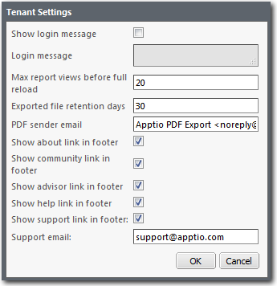
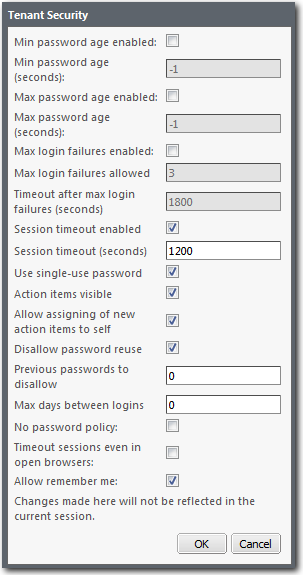

# Acerca de la administración de proyectos de Studio

**Se aplica a** : TTBM Studio 12.0 y posteriores.

La administración de proyectos incluye la creación de proyectos, funciones y usuarios, y el seguimiento de errores. Para administrar proyectos en Apptio, debe tener el rol por defecto de **Power User** o **Admin**, o un rol personalizado con los permisos apropiados. Para acceder a las funciones de Administración, haga clic en la pestaña **Proyecto**. Los conceptos de administración incluyen:

- **Proyectos** - Los proyectos agrupan conjuntos de datos, métricas, modelos e informes. Al crear un nuevo proyecto, puede elegir entre estos tipos principales: Costing Standard, Personalizado. Puedes crear varios proyectos. Para obtener más información sobre la creación de proyectos, consulte [Crear y eliminar proyectos](create-deleting-projects.html "Se aplica a: TBM Studio 12.0 y posteriores").
- **Usuarios y roles** - El acceso a Apptio se controla definiendo usuarios y asignándoles roles. Las funciones **Usuarios** y **Funciones** están disponibles en la pestaña **Proyecto**. Para obtener información sobre la creación de usuarios y funciones, consulte [Control de acceso a las aplicaciones Apptio](control-access-apptio.html "Se aplica a: TBM Studio v12.1, v12.2 y posteriores").
- **Mensajes de error** - Puede revisar los mensajes de error haciendo clic en **Errores** en el **Proyecto**. La ventana **Errores** muestra todos los mensajes de error. Los mensajes de error son útiles para solucionar problemas. Para más información, consulte [Revisar los mensajes de error](review-error-messages.html "Se aplica a: TBM Studio 12.0 y posteriores.").
- **Configuración del dominio** : puede controlar la configuración general de un dominio haciendo clic en **Configuración del dominio** en la pestaña **Proyecto**. El diálogo se muestra en la siguiente imagen:

  
- **Seguridad del dominio** : puede controlar la configuración de seguridad general de un dominio haciendo clic en la pestaña **Proyecto** y haciendo clic en **Seguridad del dominio**. El diálogo se muestra en la siguiente imagen:

  

  Nota: Un valor de -1 en el campo **Edad mínima de la contraseña** y en el campo **Edad máxima de la contraseña** significa "ilimitada" Deje el campo Edad mínima de la contraseña en -1.

Esta sección incluye:

- [Conceptos esenciales de TBM Studio](essential-tbmstudio-concepts.html "Se aplica a: TBM Studio 12.0 y posteriores. En TBM Studio, organizas tu trabajo en proyectos. Dentro de un proyecto, se recopilan y transforman datos en conjuntos de datos, se crean modelos, se añaden objetos a los modelos, se asignan conjuntos de datos a los objetos, se imputan costes de un objeto a otro y se resumen los resultados en uno o varios informes. Instancias, dominios y proyectos organizan tu trabajo:")
- [Oriéntate en TBM Studio](navigate-tbm-studio.html)
- [Atajos del teclado](keyboard-shortcuts.html)
- [Mejores prácticas de check out y check in](bp-check-out.html "◆ Se aplica a: Apptio TBM Studio 12.x y versiones posteriores. En Apptio TBM Studio R12, todos los elementos son documentos, incluidas las tablas de datos, métricas, perspectivas y modelos. Para editar un documento, primero debe verificarlo. Cuando sacas un documento, se bloquea para que otros no puedan editarlo. Puede guardar sus cambios en el documento sin activar un recálculo. Cuando termines de editar un documento, puedes registrarlo. El registro de un documento provoca un nuevo cálculo. Ahora, los demás verán los cambios que hayas realizado en el documento cuando finalice el cálculo en modo de desarrollo y se actualice su espacio de trabajo. Además, ahora otros podrán consultar este documento.")
- [Deshacer una configuración](roll-back-configuration.html "En Apptio TBM Studio versión 12.2.2 y posteriores, es posible utilizar la función de retroceso en Historial de comprobación para retroceder una configuración a un punto anterior en el tiempo. Esta función es útil para revertir cambios cuando algo ha ido mal, y es similar a la función Deshacer todo después del registro de auditoría de v.11.")
- [Editar las propiedades del usuario](edit-user-properties.html "◆ Se aplica a: TBM Studio 12.0 y versiones posteriores.")
- [La API Apptio](the-apptio-api.html "Se aplica a: TBM Studio 12.0 y posteriores")
- [Configurar proyectos](configure-projects.html "Se aplica a: TBM Studio 12.0 y posteriores. Este artículo describe las tareas esenciales que puede realizar para configurar proyectos.")
- [Especifique la versión para las actualizaciones de componentes](specify-version-component.html "◆ Se aplica a: TBM Studio 12.3.1 y versiones posteriores. Al actualizar aplicaciones dentro de TBM Studio, puede especificar qué versión utilizar para las actualizaciones de componentes. Esta configuración se aplica a todas las actualizaciones de componentes y a las nuevas instalaciones de componentes.")
- [Instalar el componente Evaluación del rendimiento](install-performance-review.html "Se aplica a: Apptio Costing Standard en TBM Studio 12.5 y posteriores. El componente de Revisión de Rendimiento es una utilidad dentro de la aplicación que crea informes que un administrador de Apptio TBM Studio puede utilizar para obtener información sobre el impacto que la configuración actual de su proyecto tiene en el rendimiento de la aplicación.")
- [Control de acceso a las aplicaciones Apptio](control-access-apptio.html "Se aplica a: TBM Studio v12.1, v12.2 y posteriores")
- [Revisar los mensajes de error](review-error-messages.html "Se aplica a: TBM Studio 12.0 y posteriores.")
- [Supervise el compromiso con Apptio Informes de uso](monitor-engagement-apptio.html)
- [Supervisar las construcciones con la cola de cálculo](monitor-builds-calculation.html "◆ Se aplica a: TBM Studio 12.2 y versiones posteriores. Utilice la tabla Cola de Cálculo para supervisar el estado de las compilaciones para los entornos (Desarrollo, Puesta en Escena y Producción) en su dominio.")
