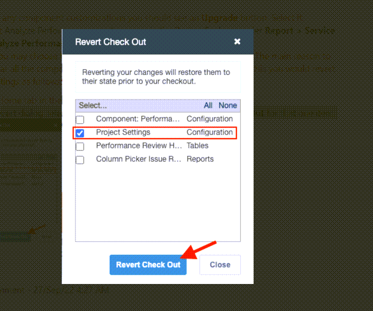
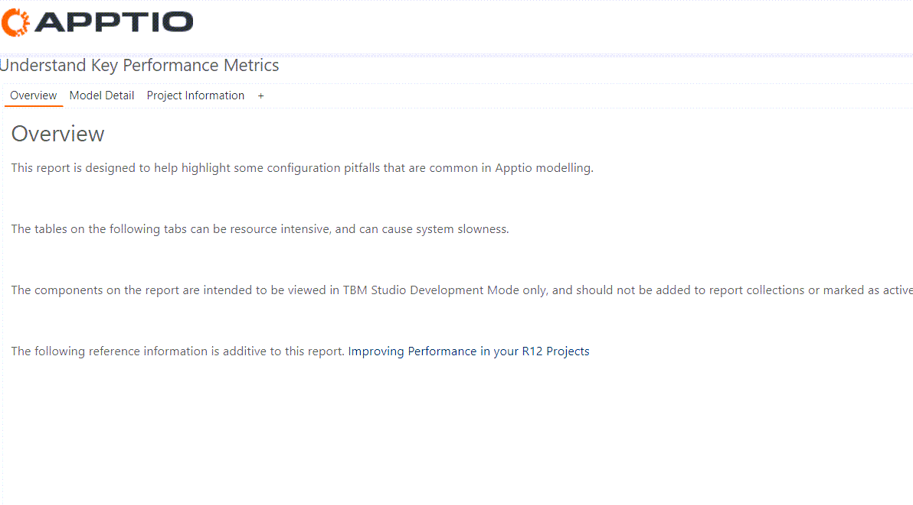

# Utilizar el componente de evaluación del rendimiento

Se aplica a: Apptio TBM Studio 12.5 y posteriores. El componente Revisión del rendimiento es una utilidad integrada en la aplicación que crea informes que un administrador de Apptio TBM Studio puede utilizar para obtener información sobre el impacto que la configuración actual de su proyecto tiene en el rendimiento de la aplicación. Este componente está disponible en R12.5 y posteriores y formaba parte de la carga útil de contenidos de v.105.

Este documento proporciona una visión general de los informes instalados por el componente de Evaluación del Rendimiento.

- Para obtener instrucciones de instalación, consulte [Instalación del componente Evaluación del rendimiento](install-performance-review.html "Se aplica a: Apptio Costing Standard en TBM Studio 12.5 y posteriores. El componente de Revisión de Rendimiento es una utilidad dentro de la aplicación que crea informes que un administrador de Apptio TBM Studio puede utilizar para obtener información sobre el impacto que la configuración actual de su proyecto tiene en el rendimiento de la aplicación.")
- Para obtener información más detallada sobre el ajuste del rendimiento de la configuración, consulte [Mejora del rendimiento de sus proyectos en R12](https://community.apptio.com/viewdocument/improving-performance-in-your-r12-p "(se abre en una pestaña o una ventana nueva)")

## Actualizar el componente de evaluación del rendimiento

Siga estas instrucciones si el componente de evaluación del rendimiento ya está instalado. Si no es así, debe instalar el componente. Para más información, visite [Instalar el componente Evaluación del rendimiento](install-performance-review.html "Se aplica a: Apptio Costing Standard en TBM Studio 12.5 y posteriores. El componente de Revisión de Rendimiento es una utilidad dentro de la aplicación que crea informes que un administrador de Apptio TBM Studio puede utilizar para obtener información sobre el impacto que la configuración actual de su proyecto tiene en el rendimiento de la aplicación.").

1. En la pestaña Proyecto del grupo Configuración del proyecto, seleccione **Configuración del proyecto**.
2. En la lista desplegable Versión de los componentes, seleccione la **versión 110** (o la más reciente) y, a continuación, haga clic en **Guardar**.
3. En la pestaña Proyecto, en el grupo Datos del proyecto, seleccione **Componentes**. Ahora debería ver el componente Evaluación del rendimiento.
4. Seleccione **Revisión del rendimiento**.
5. Si, en este punto, ve mensajes indicando que ha habido personalizaciones, necesita **Revertirlas**. Para revertir, desplácese hasta la parte inferior de la página **Analizar componente de rendimiento**. Si hay personalizaciones presentes, seleccione la flecha de revertir junto a la entrada del componente personalizado para revertir. Después de revertir cualquier personalización de componentes, seleccione el botón **Actualizar**.
6. Ahora, el último análisis de rendimiento aparece en el Explorador de proyectos en **Informe > Costos del servicio > Analizar rendimiento**.
7. En este punto, puede optar por revertir el cambio a la Versión de componentes, de modo que no se muestren todos los componentes como actualizados. Para ello, revierta la **configuración del proyecto** como se indica a continuación:
   1. En la pestaña Inicio del grupo Documento, seleccione **Revertir cambios**.
   2. En el cuadro de diálogo de revertir, seleccione sólo **Configuración del proyecto** y seleccione **Revertir Check Out**.

      

## Navegue hasta los Informes del Componente de Evaluación del Rendimiento

Al instalar el componente Evaluación del rendimiento se crea un informe accesible en throughApptio TBM Studio. Este informe está disponible para los usuarios con el rol ADMIN. Para obtener más información, consulte Gestión de permisos y funciones de usuario. El informe se encuentra en el Explorador de proyectos, en Informes > Cálculo de costes de servicio > Analizar rendimiento.

El informe tiene tres pestañas principales:

- Visión general
- Detalle del modelo
- Información sobre el proyecto

  

Las pestañas Detalle del modelo e Información del proyecto tienen subpestañas que contienen los informes que se tratan en este documento.

**Nuevas funciones en 12.9.3 / Contenido v109**

- Permite analizar los cambios en el espacio de trabajo de un usuario.
- Admite la comparación del espacio de trabajo en relación con el escenario.
- Posibilidad de cambiar la métrica que examina el analizador.
- Ayuda para identificar problemas de recuento de rutas.
- Soporte para "ejercicios de enfoque" personalizados.
- Posibilidad de modificar el umbral de filas pequeñas.
- Pequeñas mejoras en la precisión de la tabla de filas.

## Consejos importantes

Haga clic en el icono ToolTip  de cualquier tabla para obtener información sobre el contenido de la misma. En algunos casos, es posible que el contenido de las pestañas no se muestre inicialmente. Si una tabla no se carga, haga clic derecho y seleccione actualizar datos.

## Ficha Visión general

Esta pestaña contiene información básica sobre el componente de Evaluación del Rendimiento y enlaces a información complementaria sobre el rendimiento del proyecto R12 en el sitio comunitario TBM Connect.

## Ficha Detalle del modelo

En la pestaña Detalle del modelo, puede observar la métrica del modelo que el informe está configurado para examinar. En la siguiente captura de pantalla se configura el modelo de Costes para su análisis.

## Modificación del modelo y/o del objeto inferior

Para examinar un modelo diferente, puede modificar la tabla Performance Review Config haciendo clic en el enlace del informe.

Para analizar un modelo diferente, puede editar el valor de la Métrica de la tabla Performance Review Config. También puede especificar un Objeto inferior diferente para situaciones como modelos personalizados con un objeto inferior distinto de la Fuente de costes. Cuando cambie esto en su área de trabajo, los cambios se reflejarán en los informes Analizar rendimiento de su área de trabajo.

## Detalle del modelo: Información sobre la asignación

Esta pestaña muestra todos los objetos del modelo que tienen relaciones de asignación y muestra el tamaño de las tablas de Relaciones de Asignación para cada asignación. Esto permite identificar rápidamente las mayores asignaciones que pueden estar contribuyendo a aumentar los tiempos de cálculo del modelo. Para ver las relaciones más grandes, seleccione Recuento de filas > Orden descendente.

## Detalle del modelo: Información sobre la broca y el identificador

La pestaña Información de perforación e identificador contiene información sobre la granularidad de las tablas y la eficacia de las asignaciones entre tablas. La tabla utiliza un formato condicional para ayudar a identificar las áreas en las que los identificadores de objetos y las relaciones de datos entre tablas relacionadas pueden estar alcanzando umbrales que podrían afectar negativamente al rendimiento del proyecto y a los tiempos de cálculo globales.

## Filas AR

Para ver las tablas de proporciones de asignación más grandes de todos los objetos del modelo en relación con el objeto inferior, seleccione Filas AR > Ordenar descendente. Seleccione el icono ToolTip  en el informe para obtener más información.

## Dispersión

La columna "Sparseness" puede ordenarse de forma descendente para ver lo cerca que están las tablas AR del peor caso teórico. El peor caso teórico es una dispersión uniforme de todo lo que hay en el objeto inferior hacia el superior.

## Identificador Puntuación de salud

La columna "Puntuación de la salud de los identificadores" muestra la salud estimada de los identificadores medida por la variación de los identificadores a lo largo del año. Las puntuaciones están en una escala de 1 (peor) a 100 (mejor).

En un mundo ideal, el identificador del objeto sería el mismo en todos los periodos de tiempo. Por lo tanto, si hay 10 identificadores únicos en todos los periodos, entonces habría 120 en total para el año o exactamente una proporción de 1:12. Si la proporción es mayor, indica una mayor variación a lo largo del tiempo. Mucha variación de identificadores significa que el sistema tiene que calcular una tabla más grande para informar sobre agregados temporales (por ejemplo, año hasta la fecha o tendencias).

La ejecución de este informe puede causar una carga significativa dependiendo de su configuración. Tenga esto en cuenta cuando trabaje con una configuración sospechosa.

## Detalle del modelo: Granularidad del modelo

Esta pestaña se centra en la intersección entre la granularidad de los objetos del modelo y las unidades asignadas por fila, identificando las áreas del modelo en las que las asignaciones bajas pueden estar contribuyendo a alargar los tiempos de cálculo del modelo. En el siguiente ejemplo, el objeto Almacenamiento, que tiene un recuento total de filas de 71.787 filas y un valor total de 19.233.756 $, tiene 57.787 filas, o el 80% de su recuento total de filas, que representan un total de 3.000 $, 115.57. Esto sugiere una oportunidad para la optimización de las filas pequeñas.

## Detalle del modelo: Taladros Focus

A veces la configuración dará lugar a grandes perforaciones entre dos objetos que no tienen nada que ver con la Fuente de Costes. Si esto ocurre, la tabla Focus Drills puede utilizarse para añadir ejercicios personalizados para relaciones de datos problemáticas en un modelo. Utilícelo como un medio para complementar la tabla de información de brocas e identificadores para brocas específicas en modelos específicos que necesitan atención adicional. No debe utilizarla como sustituto de la tabla de información sobre perforaciones e identificadores.

Para personalizar la tabla, haga clic en el enlace Performance Review Focus Drills para navegar a la tabla asociada.

Compruebe y edite la tabla adecuadamente para añadir o eliminar ejercicios personalizados:

Ver los resultados en el informe:

Para ver la columna Modelo:

1. Haga clic con el botón derecho del ratón en la cabecera de la tabla.
2. Seleccione Mostrar/Ocultar columnas.
3. Marque la casilla Modelo.
4. Haga clic en OK
5. Mueva la columna Modelo si lo desea.

   

## Detalle del modelo: Comparación por entorno

La pestaña Comparación por entorno muestra los tamaños de las tablas AR, los tamaños de los identificadores, los taladros en el peor de los casos y la escasez en su espacio de trabajo en relación con la última compilación de Stage. Esto le permite evaluar si su espacio de trabajo contiene configuración que pueda tener un efecto negativo en el rendimiento antes de comprobar la configuración. ¡Filtra las distintas columnas de "cambios" con "!BLANK" y ordenar para ver los cambios y su magnitud. La ejecución de este informe puede causar una carga significativa dependiendo de su configuración. Tenga esto en cuenta cuando trabaje con una configuración sospechosa.

## Detalle del modelo: Trayectorias del modelo

La pestaña Trayectorias del modelo mide la complejidad de su modelo. Cuando Apptio se prepara para calcular ejercicios en apoyo de la elaboración de informes, primero tiene que determinar todos los caminos que pueden tomar las asignaciones. En algunos casos, el cálculo de la ruta del modelo puede llegar a ser significativo, lo que aumenta el tiempo de cálculo. Si el valor "Caminos hasta el fondo" es superior a un millón, es posible que la complejidad del modelo esté afectando a los tiempos de cálculo. Consulte a su TAM o al servicio de asistencia Apptio para que le orienten sobre cómo reducir el número de rutas.

## Ficha Información del proyecto

La pestaña Información sobre el producto contiene datos que pueden ser difíciles de obtener de otro modo.

## Información sobre el proyecto: Información del informe

El Informe utiliza los siguientes campos:

| Campo | Descripción |
| --- | --- |
| ID de informe | Número de identificación del informe utilizado por la plataforma |
| Título | Nombre real del informe  Si el informe tiene un nombre alias, no mostrará el alias en esta columna. |
| Precarga | El informe configurado a precalculado. Se trata de un ajuste en la cinta de informes |
| Personalizado | Esta columna muestra si un informe Out of the Box ha sido modificado por un usuario en TBM Studio |
| Última fecha de modificación | Fecha de la última vez que se guardó este informe en la interfaz de usuario |
| Última modificación por | Este nombre de usuario del último editor para hacer un save de este informe |
| Acceso | Qué roles de TBM Studio tienen acceso a este informe  Si este campo está vacío, todos los roles que tienen acceso al proyecto pueden acceder al informe. |
| Ruta completa | La ruta URL a este informe tal y como se muestra en la barra de direcciones de un navegador web |

## Información sobre el proyecto: Tamaños de los conjuntos de datos

La pestaña Tamaños de los conjuntos de datos muestra información sobre todos los conjuntos de datos que forman parte del proyecto:

| Campo | Descripción |
| --- | --- |
| Nombre | Esta columna contiene el nombre de la tabla tal y como aparece en el explorador de proyectos TBM Studio . |
| Origen | El nombre del archivo fuente, en el caso de que el sistema haya generado el archivo, puede ver Maestro o Generado por el sistema como fuente. |
| Tipo | Esta columna muestra la fuente del conjunto de datos.  - Maestro - Este conjunto de datos es un conjunto de datos maestro creado por el contenido de la aplicación - Transformación - Este conjunto de datos es una transformación de otro conjunto de datos - Datos creados por el sistema: son datos creados por la aplicación pero no son un conjunto de datos maestros - Datos de la API: datos que se cargan mediante Datalink o una llamada manual a la API - Tabla editable - Una tabla de origen Editable - Tabla generada - Tabla de fuentes generadas - Cargar - Archivos cargados por un usuario a través de la interfaz de usuario |
| Categoría | El valor del campo Categoría. Esto lo define el usuario en la carga. |
| Oculto a la vista | Tablas que no se mostrarán en el Explorador de proyectos a menos que se seleccionen explícitamente en el filtro de campos |
| Oculto a la inferencia | Se trata de tablas que llegaron a TBM Studio R12 desde una actualización de la plataforma R11  Se trata de una configuración heredada. |
| Copiar Adelante | Una configuración heredada de proyectos que llegaron a R12 a partir de una actualización de la plataforma R11 |
| Estado de personalización | Muestra si una tabla Out of the Box ha sido modificada por un usuario a través de la interfaz de usuario |
| Recuento de filas | Este es el recuento de filas de la tabla después de que se hayan procesado todos los pasos de Transform Pipeline |

## Información sobre el proyecto: Versiones de transformación

Esta pestaña le indica cuándo se versionó una transformación.

## Información sobre proyectos: Tendencias de tamaño

Esta pestaña es útil para ver el crecimiento del tamaño de las filas de la tabla a lo largo del tiempo y aislar los picos que pueden estar asociados a problemas de rendimiento.

