# Añadir datos

**Se aplica a** : TBM Studio 12.0 y posteriores

Puede añadir datos de una o varias tablas de origen a una tabla de destino mediante el paso **Añadir** transformación de datos. El paso **Añadir** siempre añade filas de la tabla de origen a la tabla de destino.

Cuando añades datos:

- Cuando se añaden datos a la tabla de destino, los datos añadidos se añaden como nuevas filas en la tabla de destino. Las filas de las tablas de origen y destino nunca se combinan. Para combinar filas, utilice un paso de transformación de datos **Join**.
- Las columnas de una tabla de origen pueden asignarse a columnas existentes en la tabla de destino.
- Las columnas de una tabla de origen pueden añadirse a la tabla de destino como nuevas columnas.
- Los complementos se aplican a la versión actual de la tabla. Cuando se selecciona un periodo fuera del intervalo de fechas de la tabla versionada, la adición se bloquea.

Si desea combinar datos en tablas sin crear nuevas filas, debe utilizar un paso de [Unión](join-data.htm "(se abre en una pestaña o una ventana nueva)"). Además, puede crear nuevas columnas en la tabla de destino y extraer datos de las tablas de origen mediante la función **Búsqueda**. Para más información, consulte [las funciones Lookup y Lookup\_Wild](../formulas-and-functions/functions/lookupandlookup_wild.htm "(se abre en una pestaña o una ventana nueva)").

## Ejemplo

Suponga que tiene las dos tablas siguientes que tienen columnas coincidentes:

Cuadro 1

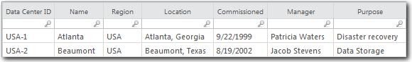

Cuadro 2

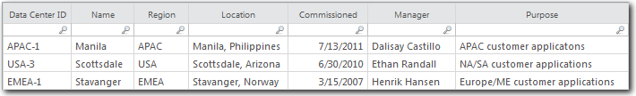

Si añades la Tabla 2 a la Tabla 1, obtendrás la siguiente tabla:

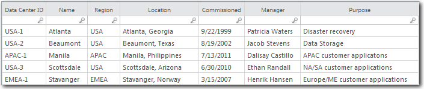

A continuación se describen los pasos generales para realizar un anexo:

- Echa un vistazo a la tabla de objetivos.
- Añada el paso **Append** a la transformación de datos.
- Seleccione una tabla de origen.
- Asigne columnas de la tabla de origen a columnas de la tabla de destino o utilice fórmulas.
- Opcionalmente, añada columnas de la tabla de origen.

## Consulta la tabla de objetivos

La tabla de destino aceptará datos de una o varias tablas de origen. La tabla de destino debe ser una tabla de transformación.

Para comprobar el conjunto de datos de destino:

1. En la sección **Tablas** del **Explorador de proyectos**, haga clic en la tabla de destino.
2. Añada el paso **Añadir** a la cadena de transformación.

## Seleccionar un conjunto de datos de origen

1. Haga clic en **Añadir fuente de datos**.

   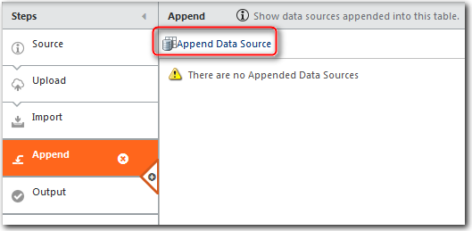
2. Haga clic en el nombre de la tabla de origen y, a continuación, en **Siguiente**.Aparecerá el cuadro de diálogo **Anexar**, tal y como se muestra en la siguiente imagen:

   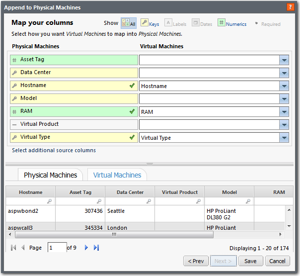

## Columnas del mapa

A continuación se describen los elementos clave del cuadro de diálogo de asignación que aparece en la imagen anterior:

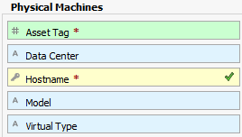

La columna de la izquierda muestra las columnas de destino. Los iconos y colores indican el tipo de columna: clave, etiqueta, fecha, numérica. Un asterisco indica que la columna se ha marcado como obligatoria. En este contexto, *necesaria* significa que la columna es necesaria para iluminar completamente los modelos e informes basados en los datos. Sin embargo, puede realizar la adición sin asignar la columna.

Una marca verde indica que la columna ha sido asignada.

Puede filtrar la columna de la izquierda seleccionando un tipo de columna en la leyenda de la esquina superior derecha del cuadro de diálogo. Por defecto, se muestran todas las columnas.


La columna de la derecha muestra las columnas de la tabla de origen. Si un nombre de columna de la tabla de origen coincide con un nombre de columna de la tabla de destino, se muestra el nombre de la columna de destino. No se distingue entre mayúsculas y minúsculas.

La columna de la derecha contiene listas desplegables para seleccionar las columnas de origen. Las columnas que aparecen en la lista se basan en el tipo de columna de destino. Por ejemplo, si la lista es para una columna clave, sólo se enumerarán las columnas clave del conjunto de datos de origen:

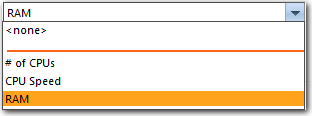

Puede introducir fórmulas en los campos desplegables, empezando por =. Es posible que desee utilizar una fórmula si la columna que desea asignar en la tabla de origen no coincide con el tipo de columna de la tabla de destino. Si introduce una columna con un nombre que incluye caracteres especiales, encierre el nombre de la columna entre llaves { }.

Para ayudarle a emparejar columnas, las tablas de origen y destino se muestran en la parte inferior del cuadro de diálogo en pestañas separadas:


Para asignar una columna:

1. Si hay muchas columnas en la tabla y desea limitar las columnas mostradas, seleccione un tipo de columna de la clave situada en la esquina superior derecha del cuadro de diálogo.
2. Abra la lista desplegable de la columna de la derecha y seleccione una fuente column.If la columna que desea asignar en la tabla de origen no coincide con el tipo de columna de la tabla de destino, introduzca una fórmula.

   **Ejemplos** :`={column name}`

   ```
   =If({Cost
                   Pool} IN ("FTE Labor","Depreciation"),"Fixed","Variable")
   ```

   ```
   =Lookup(ACCOUNT,Chart of Accounts,ACCOUNT,Cost
                 Pool)
   ```

   Puede asignar columnas clave a columnas de etiquetas y viceversa.

Para añadir una o varias columnas de origen a la tabla de destino:

1. Haga clic en el enlace **Seleccionar columna de origen adicional** situado debajo de las columnas de destino y origen.
2. En el cuadro de diálogo **Seleccionar columnas**, seleccione las columnas que desea añadir y haga clic en **Aceptar**.

## Revisar las fuentes de datos

Después de anexar uno o más conjuntos de datos de origen a una tabla de destino, éstos se enumeran en el panel de pasos. El panel muestra información sobre los conjuntos de datos anexados, incluido el número de columnas necesarias del conjunto de datos de origen que se han asignado al conjunto de datos de destino. Si no hay columnas obligatorias, no se mostrará la columna **Columnas obligatorias**. En la imagen siguiente, no hay columnas obligatorias:

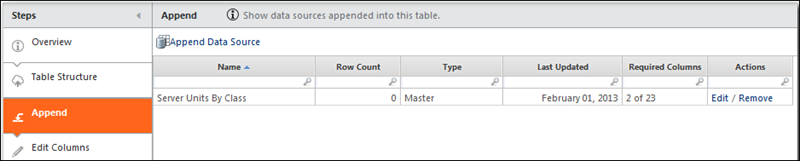

Hay varias acciones que puede realizar desde el panel:

- **Editar** - Editar la asignación de anexos
- **Eliminar** - Elimina el conjunto de datos añadido
- **Añadir fuente de datos** - Añadir otra fuente de datos

## Añadir ejemplo 1

Suponga que tiene las dos tablas siguientes que tienen columnas coincidentes:

Cuadro 1


Cuadro 2


Si se añade la Tabla 2 a la Tabla 1, se obtiene la siguiente tabla:


## Añadir ejemplo 2

Suponga que tiene las dos tablas que se muestran a continuación. Desea combinarlas en una única tercera tabla llamada **Machine CMDB**, conservando la columna **RAM** en el conjunto de datos Virtual Machines. Además, desea asignar la columna **ID virtual** a la columna **Etiqueta de activo**.

Máquinas virtuales

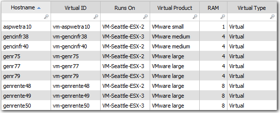

Máquinas físicas

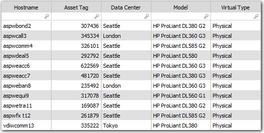

Cuando haya terminado, querrá que el conjunto de datos anexado tenga el siguiente aspecto:

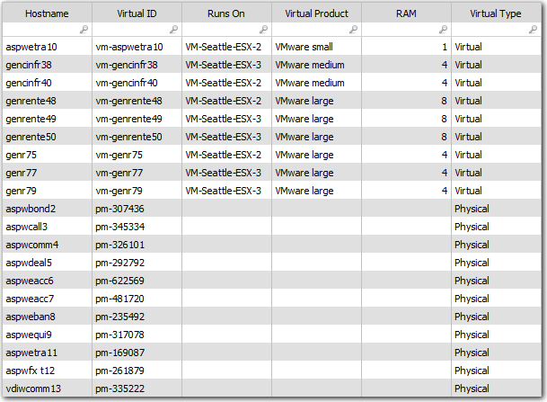

Para realizar la anexión:

1. Haga una copia de la tabla **Máquinas Virtuales** para crear la tabla **Máquina CMDB**.
2. Compruebe la tabla **Machine CMDB** y añada un paso de transformación **Edit Columns**.
3. Configure todas las columnas como **Etiqueta**, excepto la columna **Nombre de host**. La columna **Hostname** debe ser **Key**.
4. Añada un paso **Añadir** a la transformación después del paso **Editar columnas**.
5. Haga clic en **Append Data Source** y haga clic en el conjunto de datos Physical Machines y haga clic en **Next**. Tenga en cuenta que las columnas **Hostname** y **Virtual Type** se asignan automáticamente.
6. La columna **Asset Tag** en la tabla **Physical Machines** es *numérica*, pero el campo **Virtual ID** en el conjunto de datos **Machine CMDB** es *label*. **La Etiqueta de Activo** no aparecerá en la lista desplegable porque es un tipo de columna diferente al campo **ID Virtual**. Para asignar la columna **Asset Tag** a la columna **Virtual ID** en el conjunto de datos **Machine CMDB**, añada el prefijo pm- introduciendo la siguiente fórmula en el campo de la lista desplegable: `="pm-"&{Asset Tag}`
7. Pulse **Guardar**.
