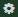
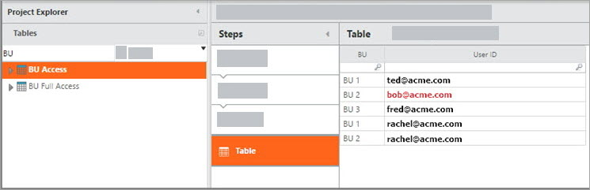

# Aplicar seguridad a nivel de fila

◆ Se aplica a: TBM Studio 12.2 y posteriores

Para garantizar la seguridad de los datos a nivel de fila, puede filtrar tablas e informes en función del usuario actual. Las filas que no están asociadas al usuario actual se ocultan. La seguridad a nivel de fila está disponible en las tablas. El filtrado a nivel de fila se denominaba "Filtros de vista" en TBM Studio 11.

Vea este vídeo de demostración: [Seguridad a nivel de filas en R12](https://community.ibm.com/community/user/viewdocument/demo-video-row-level-security-in-r "(se abre en una pestaña o una ventana nueva)"). O consulte [todos los vídeos de Apptio](https://community.ibm.com/community/user/groups/community-home/librarydocuments?LibraryKey=c5be284a-1f80-41dd-a913-019253cf761a "(se abre en una pestaña o una ventana nueva)").

Para obtener información sobre el uso DataLink Para cargar datos de seguridad a nivel de fila, consulte [Cargar datos en el proyecto de seguridad a nivel de fila usando DataLink](load-low-level-security-data-datalink.htm "(se abre en una pestaña o una ventana nueva)").

Mientras que todas las tablas que pueden crearse con Ad Hoc Query están censuradas, algunas tablas heredadas no lo están.

Nota: La seguridad a nivel de fila afecta a todos los usuarios. No confíe en la seguridad a nivel de filas para proteger los datos de los usuarios administradores, ya que éstos tienen acceso al modo Studio y, en última instancia, pueden crear informes que la eludan, añadirse a las tablas de seguridad a nivel de filas y desactivar por completo la seguridad a nivel de filas.

Los elementos que puede ver cada usuario se especifican en un proyecto independiente denominado **Seguridad a nivel de filas**. El proyecto **Row-Level Security** se instala automáticamente cuando se crea una nueva instancia de Apptio. El proyecto se utiliza para la seguridad a nivel de fila en todos los proyectos de un dominio.

Para acceder al proyecto, abra el menú Configuración  y haga clic en **Configurar la seguridad a nivel de filas**.

## Configurar la seguridad a nivel de filas

Hay dos pasos principales para configurar la seguridad a nivel de fila:

- **Paso 1** : En el proyecto **Row-Level Security**, cree una o más tablas de mapeo que identifiquen los elementos (filas en una tabla) que cada usuario podrá ver.
- **Paso 2** : Defina los filtros de vista para las tablas que se protegerán añadiendo un paso de **seguridad a nivel de fila** al proceso de transformación.

Exploraremos la configuración con un ejemplo cubierto en las siguientes secciones. En este ejemplo, configuramos la Seguridad a Nivel de Fila en la Fuente de Costes y en las Torres de Recursos TI en un modelo simplificado. La configuración limitará la visibilidad de los datos de la unidad de negocio en función del usuario. A continuación, examinamos los efectos sobre los informes desde la perspectiva de nuestro usuario de prueba " [bob@acme.com](mailto:bob@acme.com "(se abre en una pestaña o una ventana nueva)") " para ver cómo entra en juego la limitación a las tablas drillTo señalada anteriormente.

## Crear las tablas de asignación

Las tablas de asignación identifican los elementos que cada usuario puede ver. Una tabla de asignación debe tener dos columnas:

- **ID** : El ID del usuario. El ID debe coincidir con un nombre de usuario de la tabla Usuarios del proyecto de redacción.
- **Artículo:** Nombre del artículo al que puede acceder un usuario tal y como aparece en la tabla del proyecto de trabajo. Por ejemplo, si tuviera una tabla con información sobre centros de datos, introduciría el nombre del centro de datos.

Tenga en cuenta que no debe preocuparse por el nombre de la tabla ni por el nombre de la columna de la tabla de asignación que contiene el elemento. El nombre de la tabla y el nombre de la columna se proporcionarán al definir los filtros.

Puede crear una o varias tablas de asignación. Si sólo tiene una regla para controlar la seguridad a nivel de fila, una tabla será probablemente todo lo que necesite. Si tiene más de una regla, por ejemplo, usuarios que deben poder acceder a todos los centros de datos, es posible que desee crear más de una tabla para ayudarle a organizar los elementos.

En general, creará las tablas de asignación fuera de la aplicación Apptio y, a continuación, cargará las tablas.

La tabla de asignación que se muestra a continuación define el acceso a las unidades de negocio para cuatro usuarios. Observe que bob@acme.com está configurado para tener acceso sólo a BU 2. Además, tenga en cuenta que rachel@acme.com tiene acceso a dos BU.

Aunque sería posible dar a los usuarios que deberían tener acceso a todas las BU tres entradas (una para cada una de las BU 1, BU 2 y BU 3), en este ejemplo, si se añadieran BU adicionales, tendríamos que seguir añadiendo entradas para esos usuarios. Por lo tanto, en este ejemplo, también creamos la tabla BU Full Access para poder dar acceso a sally@acme.com a todos los datos de BU independientemente de si se añaden BU adicionales.

Observe que la palabra Admin se utiliza en columnas de esta tabla y filtros más adelante en este ejemplo. Esto es diferente de los **permisos de la función de** administrador mencionados en la sección de limitaciones anterior.

## Configurar los filtros de seguridad a nivel de fila

Para aplicar la seguridad a nivel de filas a una tabla, debe añadir un paso de **Seguridad a nivel de filas** a la cadena de transformación de la tabla. El filtro hará referencia a las tablas de asignación que creó en el paso anterior. Se puede añadir una tabla de transformación filtrada a un informe y la seguridad a nivel de fila se aplicará a la tabla.

Para definir la seguridad a nivel de fila para una tabla:

1. Abra la tabla desde el **Explorador de proyectos**.
2. Insertar un paso de **seguridad a nivel de fila** [(¿Cómo?](transform-workspace.htm "(se abre en una pestaña o una ventana nueva)") ).
3. Añadir entradas al filtro. Puede añadir más de una entrada. Las entradas suelen utilizar la lógica "o". Si alguna de las entradas es verdadera, el usuario podrá ver la entrada.
   - **Primer campo:** Seleccione la columna de la tabla que contiene los elementos a filtrar.
   - **Segundo campo (intersecta):** Seleccione la tabla de asignación que contiene la información de seguridad a nivel de fila. Esta es la tabla que cargaste en el Paso 1.
   - **Tercer campo:** El nombre de la columna de la tabla de asignación que contiene los elementos que un usuario tiene permiso para ver.
   - **Cuarto campo (donde está el usuario)** : El nombre de la columna de la tabla de asignación que contiene los ID de usuario.

     Consejo: Al añadir un paso de canalización de seguridad de nivel de fila se añadirá automáticamente un paso de modelado. Sólo a las Tablas Modeladas y a las Tablas Editables se les puede aplicar Seguridad a Nivel de Fila.

Aquí vemos el filtro para Fuente de Coste configurado con una regla que cubre los usuarios habituales de la tabla Acceso BU. La regla proporciona acceso a las filas de la tabla en las que los valores de la columna Coste Source.BU coinciden con los valores de la columna BU Access.BU en la que la columna ID BU Access.User es igual al ID de usuario del usuario conectado que visualiza la tabla.

Ahora, queremos probar nuestro filtro para asegurarnos de que funciona. Aquí vemos el filtro de vista previa que se utiliza para ver las filas que Bob podría ver:

Ahora, queremos añadir acceso para Sally. Para ello, debemos añadir una columna de fórmula a la tabla que tenga el valor que aparece en la columna "BU Full Access.Is Admin". Ese valor es "Sí", así que hacemos esto:

En este punto, modificamos el paso "Row-Level Security pipeline" para utilizar la lógica OR de forma que si el usuario aparece en la tabla "BU Full Access.Is Admin", tenga acceso a todas las filas. La siguiente captura de pantalla muestra este filtro adicional y el resultado de poner sally@acme.com en el filtro de previsualización.

Nota: Las tablas no heredan automáticamente la configuración de RLS. Debe añadir un paso RLS para cada paso del modelo.

## Seguridad por filas en los informes

Ahora que hemos configurado la Seguridad a Nivel de Fila para nuestras tablas modeladas, queremos ver los efectos en los informes y entender la limitación listada arriba. Para ello, hemos creado un informe que contiene un resumen del objeto Torres de recursos de TI, un desglose de Torres de recursos de TI a Fuente de costes y un resumen del objeto Fuente de costes. Aquí hay una captura de pantalla de ese informe que se ve a través de la función Admin. Tenga en cuenta que la tabla desglosada muestra los datos de todas las Unidades de Negocio.

Antes de ver lo que Bob vería, tenga en cuenta que las asignaciones en este ejemplo incluyen una asignación de BU 3 a BU 2:

Ahora, suplantamos [(¿Cómo?)](https://community.apptio.com/docs/DOC-6891 "(se abre en una pestaña o una ventana nueva)") bob@acme.com para ver lo que Bob vería. La siguiente captura de pantalla lo muestra.

## Seguridad a nivel de filas en los informes de resumen de modelos

En un informe de resumen de modelo, un nivel refleja la seguridad a nivel de fila si se ha aplicado seguridad a nivel de fila a la tabla. Sin embargo, los valores de los niveles sólo aplicarán la seguridad a nivel de fila aplicada al nivel específico. En el ejemplo siguiente, la seguridad a nivel de línea se ha aplicado sólo al nivel Centro de coste. Obsérvese que los valores de ese nivel suman menos que los 5.097.741 dólares indicados para las torres de recursos informáticos.

**Tema principal:** [Seguridad de los datos](../../studio/new-uc/howtoguides/work-with-data/data-security.html)
