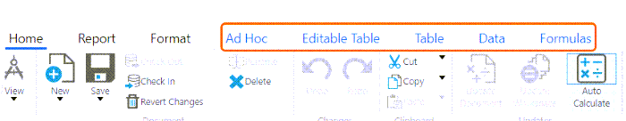
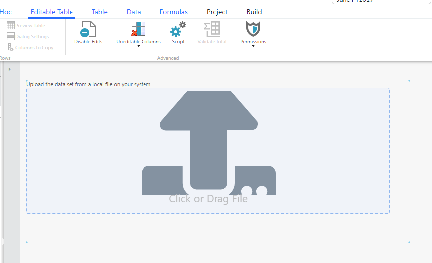

# Introducción manual de datos mediante tablas editables

**Se aplica a** : TBM Studio R12.0 y posteriores

Puede utilizar tablas editables para introducir datos manualmente. Estos datos se mantienen directamente en la base de datos del proyecto Apptio. Por ejemplo, puede utilizar tablas editables para asignar otros grupos de costes a las torres de recursos de TI.

Puede crear dos tipos diferentes de tablas editables:

- Tabla editable en blanco: Se trata de una tabla sencilla en la que una o varias personas escriben directamente los valores de las filas y columnas en la interfaz de usuario Apptio.
- Tabla editable enriquecida: Se trata de una tabla mixta o generada en la que algunos de los valores se teclean y otros proceden de otra tabla.

Debe utilizar una tabla editable enriquecida si tiene datos generados por una máquina que necesitan que un humano los enriquezca. Por ejemplo, puede que desee que un humano proporcione un "proyecto responsable" para cada etiqueta de instancia detectada en una factura de Amazon Web Services.

Consejo: Si los usuarios finales desean poder añadir y eliminar filas en la superficie de informes, cree una tabla editable independiente en blanco. En este caso, debe considerar que la tabla editable es la fuente de verdad, no la superficie de información.

## Tablas editables en blanco

Puede crear una tabla sencilla en la que uno o varios usuarios introduzcan los valores de las filas y columnas directamente en la interfaz de usuario Apptio.

## Crear una tabla editable en blanco

1. En la pestaña **Inicio** del grupo **Documento**, seleccione Nuevo > Tabla editable.
2. En el cuadro de diálogo Nueva tabla introducida manualmente, seleccione Tabla en blanco.
3. Cuando se le solicite, introduzca un nombre para la tabla editable y seleccione OK.
4. Vaya a Pasos > Configurar Columnas y actualice las propiedades de la columna.

   [Más información sobre las propiedades de las columnas](editabletables.html "Se aplica a: TBM Studio 12.6 y posteriores")
5. Comprobar en la tabla editable.

## Tablas editables enriquecidas

Puede crear una tabla editable basada en una tabla Transform existente. Los usuarios no pueden eliminar filas de una tabla editable enriquecida porque las filas incluidas se basan en la tabla Transform de origen.

Nota: A veces, los usuarios emplean tablas editables enriquecidas cuando una [función TableMatch](../formulas-and-functions/functions/tablematch.html "Devuelve un valor basado en una tabla de reglas que funciona como un conjunto de sentencias IF. Cada fila de la tabla de reglas define una regla. Las condiciones en la misma fila se combinan con AND, y los valores dentro de la misma celda se tratan como condiciones OR.") o similar sería una mejor opción. Aunque existen casos de uso válidos para las tablas editables enriquecidas, considere si son la solución correcta.

## Crear una tabla editable enriquecida

1. En la pestaña **Inicio** del grupo **Documento**, seleccione Nuevo > Tabla editable.
2. En el cuadro de diálogo Nueva tabla introducida manualmente, seleccione Tabla enriquecida.
3. Cuando se le solicite, introduzca un nombre para la tabla editable y seleccione OK.
4. Vaya a Pasos > Generados y configure la tabla de origen.
5. Para añadir columnas editables a la tabla enriquecida, vaya a Pasos > Configurar columnas, seleccione Añadir una nueva columna y actualice las propiedades de la columna.

   [Más información sobre las propiedades de las columnas](editabletables.html "Se aplica a: TBM Studio 12.6 y posteriores")
6. Comprobar en la tabla editable.

## Cómo se introducen los datos en una tabla editable

**Componente de informe Tabla editable**

El componente de informe Tabla editable permite introducir, actualizar y cargar datos directamente sin necesidad de acceder a TBM Studio .

**Cómo introducir directamente los datos en línea**

1. En la vista Explorador de proyectos, seleccione **Informes**.
2. Seleccione un informe.
3. Seleccione **Check Out** > las funciones de los componentes del informe están disponibles.

   
4. Seleccione **Tabla editable** en la lista de características. Ahora, puede introducir directamente sus datos en la tabla > Seleccione **Guardar**.

**Cómo cargar datos en una tabla editable**

1. En la vista Explorador de proyectos, seleccione **Informes**.
2. Seleccione un informe.
3. Si se desplaza hacia abajo en la tabla, obtendrá opciones de descarga y carga.

   
4. Descargue la tabla con **Abrir en Excel** > Realice sus cambios > Cargue la tabla con la opción **Hacer clic o arrastrar archivo**.
5. Seleccione **Check Out**.

Nota: Puede que también desee ver el [componente Carga de tablas](../reports/table-report-upload-component.html "Se aplica a: TBM Studio 12.9.3 y posteriores") para familiarizarse con esa función, ya que tiene un propósito similar.

El flujo de datos de una tabla bruta a la tabla Transform no se producirá a menos que la tabla bruta esté registrada.
