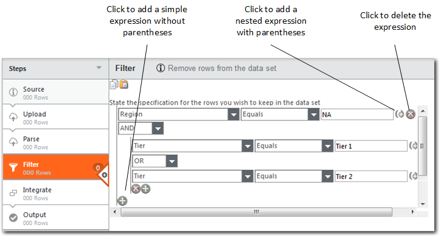
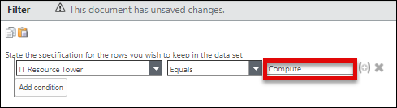
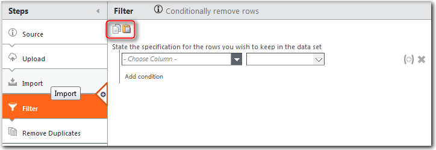

# Filtrar datos

**Se aplica a** : Apptio TBM Studio R12.0 y posteriores

Para filtrar datos, añada un filtro a los pasos de la transformación. Puede introducir una o varias expresiones de filtro y combinarlas utilizando la lógica AND y OR. Además, puede anidar expresiones de filtro utilizando paréntesis. Puede aplicar filtros a lo siguiente:

- Conjuntos de datos en la cadena de transformación
- Objeto modelo
- Asignaciones

Consejo: Como práctica recomendada, si utiliza OR/AND, asegúrese de utilizar paréntesis para agrupar los argumentos relacionados.

## Filtrar filas

Para añadir una expresión de filtro:

1. Añade un paso de filtro al proceso de transformación.
2. Construye la primera expresión de filtro:
   - En el menú desplegable del paso de filtrado, seleccione la columna que desea filtrar.
   - En el campo desplegable del centro, seleccione un operador (**Igual**, **No igual**, etc.).

     Nota: Algunos operadores de filtro de filas sólo funcionan con determinados tipos de datos. Véase [Operadores y tipos de datos con filtros](#Filterdata__Operatorsanddatatypeswithfilters).
   - En el campo de la derecha, introduzca un valor de filtro (ejemplo: Compute).

     

Si lo desea, añada más expresiones de filtro.

Para añadir una expresión de filtro simple (utilizando OR o AND, no ambos), siga estos pasos:

1. Haga clic en **Añadir condición**, justo debajo de la expresión de filtro anterior. Se añade una nueva línea de expresión debajo de la anterior, junto con una lista de selectores booleanos (para AND y OR).
2. Seleccione AND u OR.
3. Introduzca los valores de columna, operador y filtro de la nueva expresión y haga clic en **Guardar**.

Se aplica el filtro.

Para añadir una expresión de filtro compleja (que utilice tanto OR como AND), siga estos pasos:

1. Haga clic en el icono **Plus-Parenthesis** de la derecha. 
2. Al seleccionar el icono de los paréntesis, una expresión se separa de los demás argumentos.

   

   Consejo: Como práctica recomendada, cuando utilice OR/AND, asegúrese de utilizar paréntesis para agrupar los argumentos relacionados. Esto ayuda a garantizar que las expectativas del usuario se reflejen correctamente en la configuración del filtro. El uso de ambos argumentos OR/AND sin paréntesis puede provocar que el sistema no filtre los registros según las expectativas del usuario.
3. Haga clic en **Añadir condición**. Se añade una nueva línea de expresión sangrada debajo de la línea anterior, lo que significa que también se encierra entre paréntesis, junto con una lista de selectores booleanos (para AND y OR).
4. Seleccione AND u OR.
5. Introduzca los valores de columna, operador y filtro de la nueva expresión y haga clic en **Guardar**.

Más opciones al añadir expresiones:

- Para añadir una línea de expresión sin subanidar, haga clic en **Añadir condición** a la izquierda. Seleccione un operador booleano y, a continuación, complete la línea de expresión como antes.
- Para añadir una línea de expresión con otra capa de subanidación, haga clic en el icono **más-paréntesis**  a la derecha. Seleccione un operador booleano y, a continuación, complete la línea de expresión como antes. Los usuarios pueden ver cuando una expresión está entre paréntesis porque la expresión está sangrada para mostrar cómo los paréntesis están agrupando expresiones.
- Para eliminar una línea, haga clic en el icono **Eliminar**  situado a la derecha de los criterios.

## Copiar/pegar filtros

Utilice los iconos **Copiar/Pegar** para copiar o pegar un conjunto de filtros de una tabla a otra.

## Operadores y tipos de datos con filtros

Algunos operadores de filtro de filas sólo funcionan con determinados tipos de datos. Por ejemplo, **Menos que** funciona sólo con columnas que contengan datos numéricos, mientras que **Iguales** funciona con columnas que contengan cualquier tipo de datos. La siguiente tabla describe los tipos de datos que funcionan con cada operador de filtro de filas. El grupo superior de operadores de la tabla proporciona una funcionalidad similar a la de los comodines. Los filtros no admiten símbolos comodín tradicionales, como \*.

|  |  |
| --- | --- |
| Operador de filtro de filas | Tipo de datos de la columna |
| ContainsDoes No ContainEnds WithDoes No termina WithStarts WithDoes No empieza por | Serie |
| Menor ThanLess Mayor o igual que ToGreater ThanGreater Mayor o igual que | Numérico |
| EqualsNot EqualsIs NullIs No NullIs InIs No In | Todos los tipos |
| Interseca CurrentUser ColumnIntersects Tabla:Columna | Serie |

## Operadores In y Not In

El operador **Is In** comprueba si un valor de una columna también existe en otra **u otras** columnas de la tabla. El operador **No está dentro** comprueba si un valor de una columna no existe en otra **u otras** columnas. A diferencia de los otros operadores, **Is In** y **Is Not In** pueden tomar múltiples entradas en el campo derecho. Cada entrada debe ir separada por una coma.

Para que el filtro se aplique a una fila, la expresión del filtro debe ser verdadera para todas las columnas de la lista.
