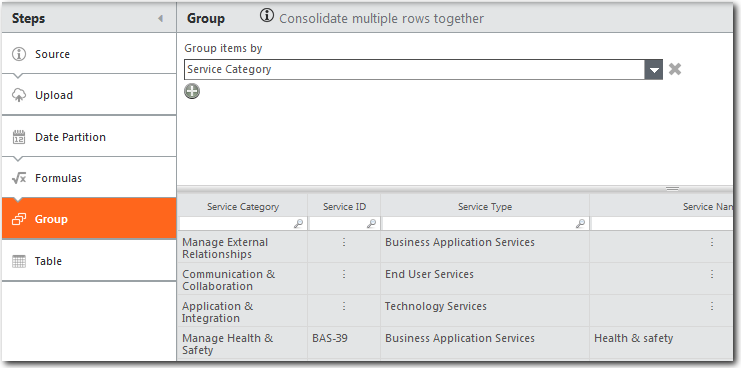
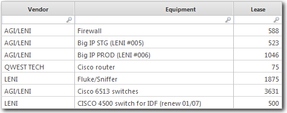
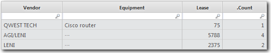

# Datos de grupo

**Se aplica a** : TBM Studio 12.0 y posteriores

Si una tabla tiene varias filas con los mismos valores en una columna, puede agrupar la tabla por esa columna. Los datos se agregan en función de las entradas de la columna. Esto puede ser útil para crear gráficos y tablas en los informes.

Para agrupar datos:

1. Añade un paso de **Grupo** a la transformación de datos.
2. Seleccione una o varias columnas por las que agrupar.

Vea este vídeo de demostración de Apptio Education Services: [Solucionar el mensaje "Varios en el tiempo"](https://community.apptio.com/videos/1902 "(se abre en una pestaña o una ventana nueva)"). O consulte [todos los vídeos de Apptio](https://community.apptio.com/docs/DOC-7714 "(se abre en una pestaña o una ventana nueva)").

## Ejemplo

Suponga que tiene la tabla que se muestra a continuación:

Agrupe la tabla por la columna **Proveedor** para obtener la tabla que se muestra a continuación:

La tabla está ahora organizada por **Proveedor**, y se ha añadido un nuevo campo**.Count**. El campo**.Count** muestra cuántas entradas hay en cada fila agregada. Como los vendedores AGI/LENI y LENI tienen valores diferentes en la columna **Equipo**, la columna muestra los tres puntos.

Si hay campos vacíos en la columna por la que ha agrupado, se mostrará una fila en la parte inferior de la tabla con los siguientes valores:

|  |  |
| --- | --- |
| En esta columna: | Se muestra este valor: |
| La columna Agrupar por | Vacío |
| contar | Número de filas en blanco |
| Columnas numéricas | Suma de todas las filas con espacios en blanco en la columna Agrupar por |
