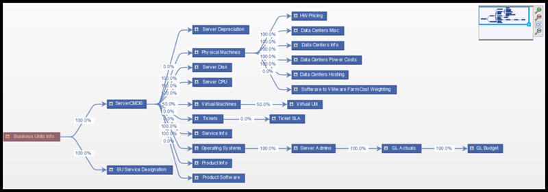
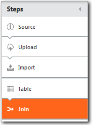
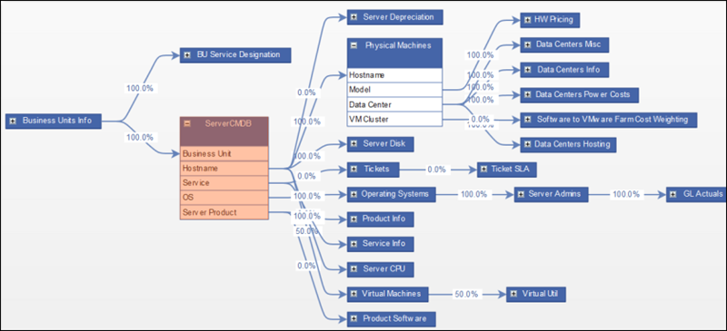
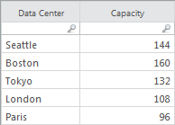

# Unir datos

**Se aplica a** : TBM Studio 12.0 y posteriores

El paso **Unir** vincula la tabla actual con otras tablas haciendo coincidir los valores de una columna de la tabla actual con los valores de una columna de otra tabla. Esto puede ser útil para la elaboración de informes y para añadir información a una tabla que servirá como controlador de unidades en un modelo. El objetivo del paso **Unir** es producir una única tabla con todos los datos necesarios para la elaboración de informes.

El diagrama de **unión** muestra la tabla de interés a la izquierda y las tablas relacionadas a la derecha. Los porcentajes indican el grado de coincidencia. Cuanto mayor sea el porcentaje, más entradas coincidirán en las dos tablas.

El paso **Unir** en una cadena de transformación viene después del paso **Tabla**, como se muestra a continuación. El paso **Tabla** no reflejará los resultados de la unión. Sin embargo, todas las columnas unidas se mostrarán en **el Explorador de proyectos** :

## Unir vs Añadir

Un paso de transformación de datos **Join** combina datos de dos o más tablas en las mismas filas basándose en valores comunes en una o más columnas. Si no desea combinar los datos en las mismas filas, utilice el paso de transformación **Añadir** datos. Un paso **Append** añade filas a la tabla.

## Mostrar detalles de las columnas de la tabla

Para ver los detalles de las columnas de una tabla, haga clic en el signo **más**. La tabla se amplía y muestra los porcentajes de coincidencia de cada columna.

## Ver detalles del enlace

Para ver los detalles de un enlace, haga clic en él. Las partidas se muestran en columnas **No coincidentes**, **Coincidentes** y **Referencia** en una tabla debajo del diagrama. La columna **Referencia** se refiere a las partidas.

## Añadir un enlace

Para añadir un enlace entre dos tablas, haga clic en el botón **Añadir enlace** y rellene los campos del cuadro de diálogo **Añadir enlace**.

## Ejemplo

Supongamos que tiene las siguientes dos tablas: **Información de centros de datos** y **Alojamiento de centros de datos**. Ambas contienen información sobre centros de datos, pero la información es diferente en cada tabla. Quieres combinarlos en una sola tabla. Tienen una columna con los mismos valores: Centro de datos. Esta columna se utilizará para cotejar los datos de las dos tablas.

Centros de datos

Centros de datos Alojamiento

Para unir las dos tablas:

1. Abra la tabla **Data Centers Info** en **Project Explorer** y añada un paso **Join** a la canalización como se muestra a continuación:

   
2. En el diagrama de relación de datos, observe que hay una unión entre la tabla **Información de centros de datos** y la tabla **Alojamiento de centros de datos**, que muestra una coincidencia del 100%.
3. Añada un paso **Modelo** a la tabla Información del Centro de Datos. La tabla Información de centros de datos del Explorador de proyectos muestra ahora todas las columnas unidas, incluidas las columnas Alojamiento de centros de datos. Ahora puede utilizar las columnas unidas en una tabla de informe:

   

Nota: En el pipeline, el paso **Tabla** no mostrará las columnas unidas.
