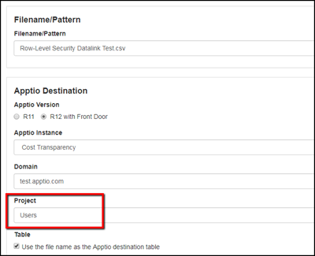

# Cargar datos en el proyecto de seguridad a nivel de filas mediante DataLink

El proyecto de seguridad a nivel de fila se utiliza para limitar la visibilidad de los datos a nivel de fila.

## Acerca de esta tarea

Si se desea, los datos de seguridad a nivel de fila pueden cargarse directamente en el proyecto mediante Datalink (Classic).

[Más información](apply-row-level-security.html "(se abre en una pestaña o una ventana nueva)")

Cargar datos en la seguridad a nivel de fila

1. Navegue hasta su instancia Datalink (Classic) .
2. Seleccione el agente y el conector que desee.

   Se abre la página **Configuración**.
3. En la sección **Proyecto**, escriba "Usuarios".

   
4. Complete el resto del proceso como lo haría para cualquier otra ejecución de Datalink
   (Classic) .
