# Partición de datos por fecha

**Se aplica a** : TBM Studio 12.0 y posteriores

Cuando se introducen datos en la aplicación, a menudo se introducen para un periodo y un año concretos. Por ejemplo, los datos de utilización y de servicios en nube suelen actualizarse mensualmente. Sin embargo, hay ocasiones en las que se introducen en la aplicación datos con fecha y se desea distribuirlos por periodos en función de las fechas. Un ejemplo sería un libro mayor.

La mayoría de las veces querrá distribuir los datos en función de la fecha de la transacción. Cuando trabaje con datos fechados, utilice la función **Partición de fechas** para distribuir los datos en los periodos de tiempo correctos. Los datos con fecha y hora se muestran en función del periodo seleccionado en el selector de fechas de la parte superior de la ventana de la aplicación:

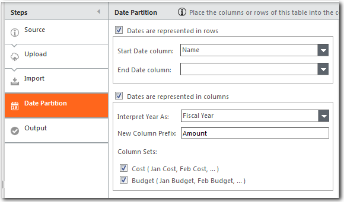

Cuando se realiza una partición de fecha en una tabla, se añaden una o más columnas a la tabla que contienen los valores del periodo seleccionado.

## Formatos de datos

Los datos con fecha y hora suelen tener uno de estos dos formatos: por filas o por columnas. A veces, puede incluir ambas cosas. Un ejemplo típico de datos basados en filas es un libro mayor como el que se muestra a continuación. Hay una columna que contiene las fechas, y hay una fecha para cada fila:

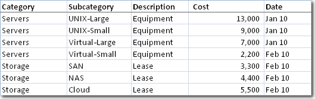

Los datos basados en columnas incluyen una columna para cada mes del año. Los datos presupuestarios y salariales suelen presentarse en este formato. A continuación se muestra un ejemplo de datos presupuestarios por columnas:

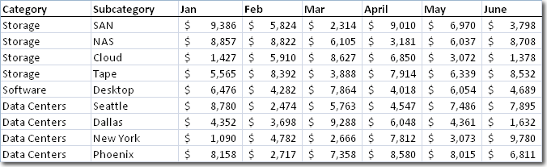

Menos comunes son los datos con fecha y hora que también incluyen fechas en filas y columnas. Un ejemplo son los tickets del servicio de atención al cliente. Las fechas de inicio y fin se representarían en filas, y el coste por mes en columnas.

## Datos por filas

Los datos basados en filas suelen incluir una o varias columnas con fechas. Por ejemplo, los datos de los tickets de servicio pueden incluir columnas de fecha de inicio y fecha de fin. Una tabla como la que se muestra en la siguiente imagen, cuando se particiona en la columna Fecha de inicio de la línea de base, tendría el aspecto de la tabla que se muestra en la imagen siguiente:

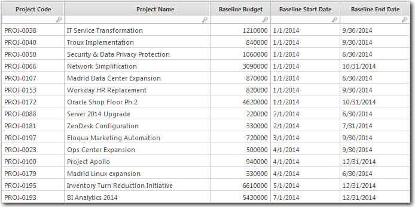

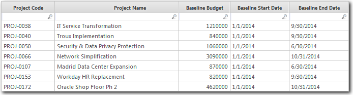

Para particionar este tipo de datos:

1. Seleccione la opción **Las fechas se representan en filas**.
2. Seleccione las columnas **Fecha inicial** y **Fecha final**.

La aplicación agrupa las filas en los periodos correctos.

## Datos por columnas

Cuando se trabaja con datos basados en columnas, normalmente los datos incluyen una columna para cada periodo de un año fiscal o natural. Los títulos de las columnas pueden tener cualquier formato de fecha válido, como Ene, Ene 2016 o P1 2016. Cuando los títulos de las columnas especifican sólo un año, el año debe ir solo o al final del título, por ejemplo, 2016 o Tasa 2016 pero no Tasa 2016. Una tabla como la que se muestra en la siguiente imagen, cuando se particiona por fechas, tendría el aspecto de la tabla de la imagen siguiente:

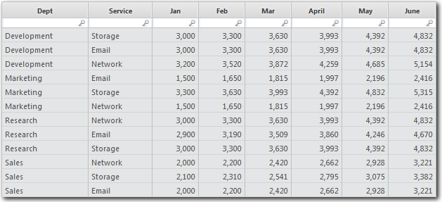

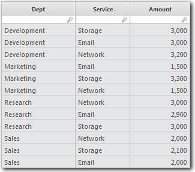

Para particionar este tipo de datos:

1. Seleccione la opción **Las fechas se representan en columnas**.
2. En la columna Interpretar año como, seleccione **Año fiscal** o **Año natural**.
3. En el campo **Nuevo prefijo de columna**, introduzca una etiqueta que desee que se añada a la columna label.For ejemplo, si las columnas de la tabla original se etiquetan como Ene, Feb, etc, y se introduce Importe en el campo **Nuevo prefijo de columna**, las columnas de la tabla separada por fechas se denominarían **Importe enero**, **Importe febrero**, etc.
4. Seleccione los conjuntos de columnas que deben utilizarse para particionar los datos. Si el conjunto de datos incluye dos o más conjuntos de columnas, puede particionar los datos por cada conjunto. Por ejemplo, suponga que tiene un conjunto de datos que incluye columnas mensuales para el coste y el presupuesto, como se muestra en la siguiente imagen:

   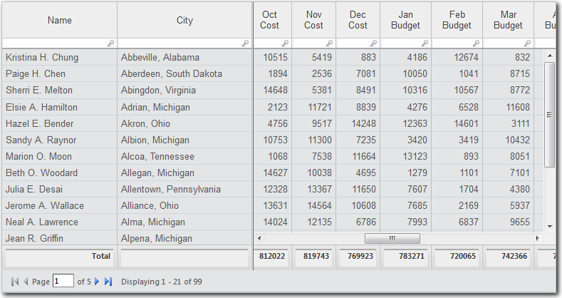
5. Puede elegir dividir los datos por Coste, Presupuesto o ambos. Si eliges **Coste**, el resultado sería como el de la siguiente imagen:

   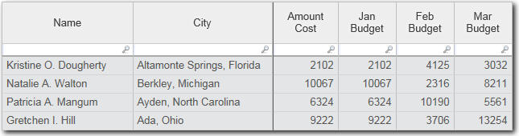

   Si elige **Presupuesto**, el resultado sería como el de la siguiente imagen:

   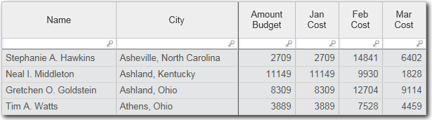

   Y, si elige tanto **Coste** como **Presupuesto**, el resultado será como el de la siguiente imagen:

   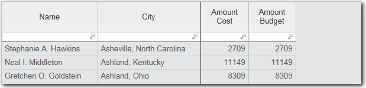
