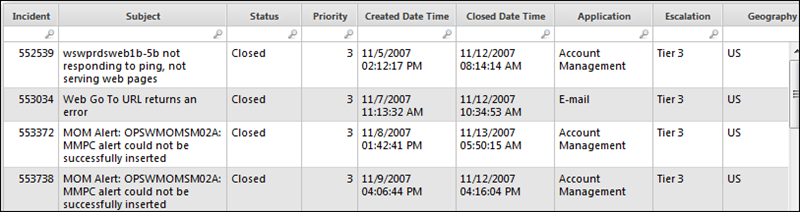
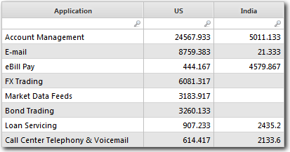

# Datos pivotantes

**Se aplica a** : TBM Studio 12.0 y posteriores

Con la función **Pivot** se pueden resumir los datos de las partidas, como el libro mayor, la información de las incidencias o la utilización de la CPU. Por ejemplo, es posible que desee resumir los datos por centro de datos, aplicación o tipo de servidor.

Para ilustrar el poder de los datos pivotantes, suponga que tiene una tabla de incidencias como la siguiente:

Le gustaría totalizar los minutos de ticket de problema por aplicación por ubicación, donde las aplicaciones son las filas en la tabla, las ubicaciones son las columnas, y las celdas muestran los minutos totales. Al pivotar la tabla, la aplicación crea una tabla con el siguiente aspecto:

## Pivotar una tabla

1. Echa un vistazo a la tabla.
2. Añada un paso **Pivot** al proceso de transformación.
3. Completa lo siguiente:
   - **Fila pivotante** : Seleccione la columna de la tabla que se utilizará para los valores de la primera columna de la tabla pivotante. En el ejemplo anterior, se ha seleccionado la columna **Aplicación**.
   - **Columna pivotante** : Seleccione la columna de la tabla que se utilizará para los encabezados de columna en las columnas siguientes a la primera columna. En el ejemplo anterior, se ha seleccionado la columna **Geografía**.
   - **Valor pivotante** : Seleccione la columna cuyos valores se sumarán y se mostrarán en las celdas de la tabla dinámica. En el ejemplo anterior, se ha seleccionado la columna **Duración** (no visible).
4. Para realizar el pivote, haga clic en **OK**.

## Crear múltiples pivotes

Si tiene datos que se beneficiarían de múltiples pivotes, puede crear una nueva tabla de datos para cada pivote. Para crear una nueva tabla, haga clic con el botón derecho del ratón en el paso **Salida** del canal de transformación y haga clic en **Crear nueva tabla a partir de este paso**.
