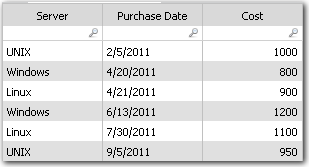

# Eliminar duplicados de una tabla

**Se aplica a** : TBM Studio 12.0 y posteriores

Si está trabajando con un conjunto de datos que tiene entradas duplicadas en la columna clave, puede eliminar las entradas duplicadas utilizando el paso de transformación **Eliminar duplicados**. Si hay entradas duplicadas con el mismo valor, se seleccionará la entrada de la tabla que coincida con el tipo de comparación.

## Eliminar duplicados

1. Si el proyecto es temporal, seleccione el periodo y el año.
2. Echa un vistazo a la tabla.
3. Añada un paso **Eliminar duplicados** a la transformación.
4. Seleccione valores para los campos:
   - **Columna clave**. Seleccione la columna que desea filtrar.
   - **Columna de comparación**. Seleccione la columna que contiene los valores utilizados para determinar la fila que se conservará.
   - **Tipo de comparación**. Seleccione las filas que desea conservar: **Mayor** o **Menor**. El tipo de comparación elegido determina los valores conservados. Por ejemplo, la columna podría incluir fechas. Si elige el tipo de comparación **Mayor**, se conservará la fila con la fecha más reciente.

## Ejemplo de filtrado de filas únicas

Suponga que tiene una tabla que enumera las compras de servidores por precio de compra y fecha, como se muestra a continuación. Desea filtrar la tabla para que sólo se muestren las últimas compras de cada tipo de servidor. La columna clave es **Servidor**, la columna de comparación es **Fecha de compra** y el tipo de comparación es **Mayor** :

