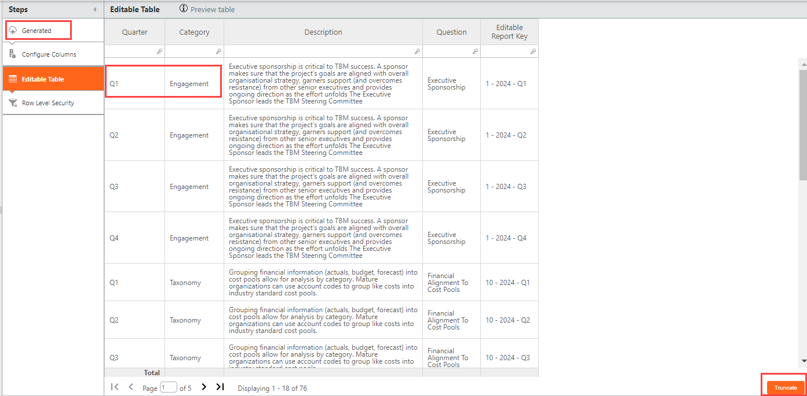
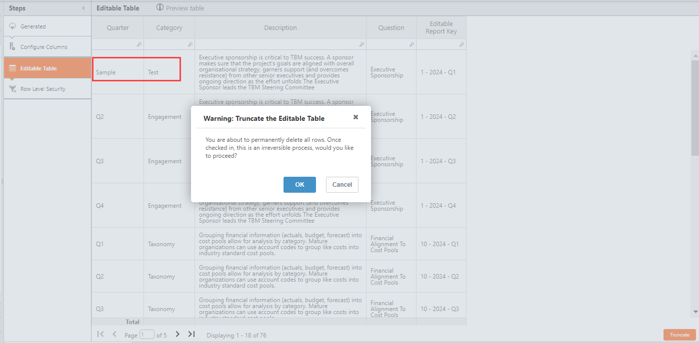
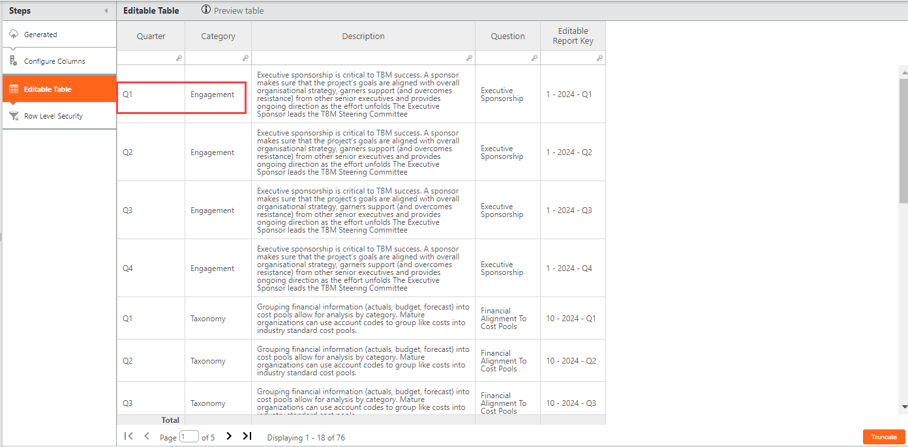
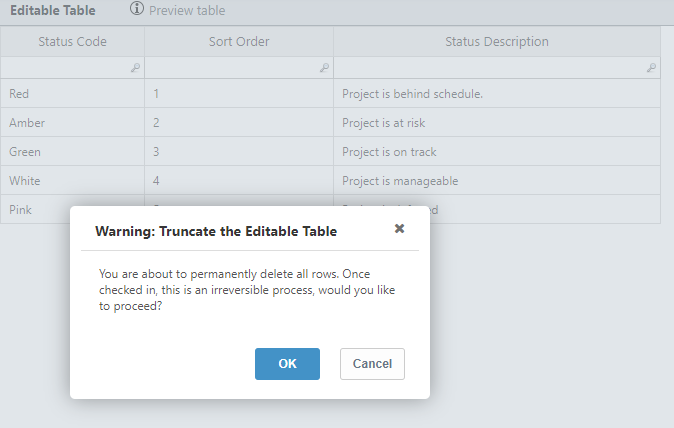
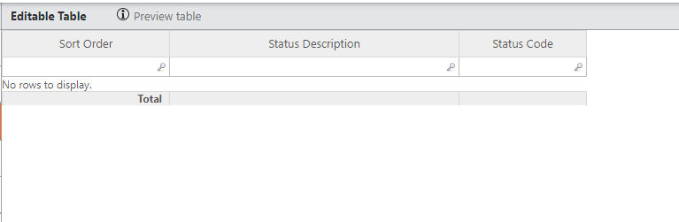

# Editar propiedades de tabla

## Filtrar por valor

Mantenga el cursor sobre la celda/para la que desea filtrar la tabla. Haga clic con el botón derecho y seleccione Filtrar por valor para ver los resultados filtrados por el valor de esa celda.

## Añadir una fila a una tabla

Haga clic en el botón **Añadir fila** de la parte inferior de la tabla. Se añade una nueva fila en la parte inferior de la tabla, en color naranja.

## Truncar

**Se aplica a** : 12.11.4 y posteriores

El botón **Truncar** aparece tanto para las tablas editables Generales como para las Enriquecidas. Sin embargo, la función Truncar sólo funciona para las tablas generadas.

1. Abrir una tabla editable enriquecida. El botón **Truncar** aparece en la parte inferior derecha de la página.

   
2. Cambie el valor ' Q1 ' y 'Compromiso en las celdas resaltadas arriba, guarde la tabla y, a continuación, seleccione **Truncar**. Aparece un mensaje de advertencia emergente como se muestra.

   
3. Seleccione **Ok**. El valor original de Q1 y Compromiso se revierte como se muestra.

   
4. Ahora, abra una tabla general editable.

   
5. Seleccione **Truncar**. Aparece el mensaje emergente.

   
6. Seleccione el botón **Aceptar**. Se eliminan todas las filas de la tabla.

   
7. Comprobar en la tabla editable. El truncamiento es permanente sólo después de comprobarlo en la tabla editable. Las filas se eliminan de MySQL DB, y este cambio tampoco aparecerá en **Mostrar cambios**.

Nota: Si una tabla editable está vinculada a un informe, las filas truncadas se eliminarán incluso en ese informe.

**Revertir cambios**

Si desea revertir la acción de truncar, debe hacerlo antes de registrar la tabla. Una vez truncada y registrada la tabla, no es posible revertir la acción de truncado.
