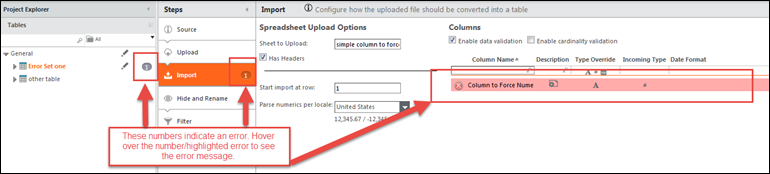
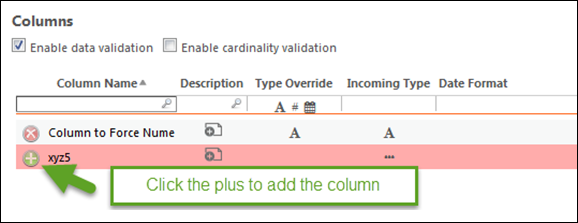
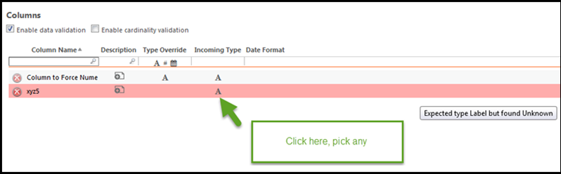
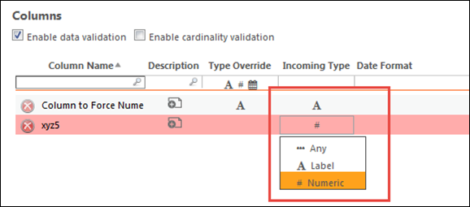

# Mensajes de error del marco de validación: Explicaciones y soluciones

**Se aplica a** : TBM Studio 12.0 y posteriores

En este artículo se describen errores comunes que pueden producirse en documentos de tablas en Apptio TBM Studio. Estos errores ponen de manifiesto problemas de configuración que harán que su proyecto se comporte de forma distinta a la esperada. Apptio aconseja encarecidamente a los clientes que resuelvan los errores.

¿Qué aspecto tiene un error?

Nota: Este artículo describe errores comunes y no es exhaustivo. Además, con frecuencia se añaden nuevos errores. Si recibe un error no mencionado aquí y desea más información al respecto, añada un comentario a continuación y lo investigaremos.

La información que figura a continuación está ordenada por pasos del oleoducto. Dentro de cada paso, enumeramos los errores, cuando están disponibles, que son aplicables a ese paso.

## Todos los pasos

Errores de recursión
:   *Mensaje* - "<información> Err: Recursión detectada para <información>" o "Recursión al intentar acceder a la tabla"

    *Descripción* - Este error es como el mensaje Ciclo Detectado, excepto que en este caso la tabla es referencia a sí misma, y por lo tanto esa porción de la configuración no será calculada.

Ciclo detectado
:   *Mensaje* - "Ciclo detectado. Este paso no se calculará ya que está implicado en una referencia circular. <tabla> hace referencia a <tabla> (paso de tubería en la otra tabla)."

    *Descripción* - El error **Ciclo detectado** indica que este paso del pipeline está siendo ignorado por completo. Esto se debe a que calcularlo daría como resultado una referencia circular, y por tanto su modelo no podría calcularse. Para resolver este problema, debe decidir qué lado de la referencia circular desea conservar y eliminar o cambiar el otro lado de la referencia circular para eliminar la circularidad.

    

    Nota: Este mensaje de error se introdujo en TBM Studio v12.3.4. Anteriormente, en algunos pasos se producían otros mensajes de error que eran específicos de cada paso, y no se detectaban algunas circularidades que ahora sí se encuentran.

## Mensaje de error de origen

Conversión de cadenas dobles
:   *Mensaje* - La tabla que desencadena esto normalmente tendrá un error como el siguiente:

    "Mismatched lookup from column "< table.Column >" of type "<Type>" ("<varies>") to column “<Column2>” of type "<Type>" ("<varies>")"

    *Descripción* - Este error significa que otra tabla está haciendo referencia a la columna especificada con la expectativa de que sea de tipo Label, pero es una columna numérica o ha tenido valores numéricos en ella.

    Para resolver este error

    - Cambiar el tipo de columna en la tabla local o en la tabla remota para que las columnas coincidan; o bien
    - Hacer conversión explícita de tipo.

    **Otros errores en tablas con un origen de Tabla Existente** - Para una tabla que se basa en otra tabla, los errores en la otra tabla saldrán a la superficie en el paso de origen en algunas situaciones. Examine la tabla de fuentes para obtener más información en esta situación.

## Mensaje de error de tabla existente

Error al obtener la tabla de respaldo '<nombre de tabla>'
:   *Mensaje* - "Error al obtener la tabla de respaldo '<nombre de tabla>'"

    *Descripción* - Este error suele significar que la tabla de origen ha sido eliminada. Para resolverlo, cree una tabla con el nombre específico de la tabla.

## Mensajes de error de importación

Etiqueta de tipo no coincidente
:   *Mensaje* - "Se esperaba etiqueta de tipo pero se encontró numérico"

    *Descripción* - Este error se producirá si el tipo de entrada especificado para la columna es Etiqueta, pero cada valor de la columna puede analizarse como un número. Si se espera que esta columna tenga valores numéricos O valores de etiqueta, pero desea almacenarla como una etiqueta, haga lo siguiente:

    1. Deje la **anulación de tipo** establecida en **Etiqueta**.
    2. Cambie el **Tipo de entrada** a **Cualquiera**.

La columna no existe
:   *Mensaje* - "La columna no existe"

    *Descripción* - Este error significa que las reglas de validación de datos se han configurado para esperar una columna, pero no existe en la carga más reciente. Si no desea esta columna en la tabla, elimínela de la regla de validación. Si no, añádelo a tu tabla y vuelve a cargarlo.

    

Columna añadida
:   *Mensaje* - "Se ha añadido una columna"

    *Descripción* - Esto significa que las reglas de validación de datos se han configurado para no esperar una columna, pero existe en la carga más reciente. Si desea esta columna en la tabla, añádala desde la regla de validación. De lo contrario, elimínelo de la tabla y vuelva a cargarla.

    

Etiqueta de tipo desconocido
:   *Mensaje* - "Se esperaba etiqueta de tipo pero se ha encontrado desconocida"

    *Descripción* - Este error se producirá si el tipo de entrada es "Etiqueta" y la columna no contiene ningún valor. Para solucionarlo, añada valores a la columna o cambie el "Tipo de entrada" a "Cualquiera".

    

Tipo desconocido
:   *Mensaje* - "Tipo esperado <Numérico/Etiqueta> pero encontrado desconocido"

    *Descripción* - Este error se producirá si el tipo de entrada es Numérico o Etiqueta, y la columna no contiene ningún valor. Para solucionarlo, añada valores a la columna o cambie el Tipo de entrada a Cualquiera.

    

Cardinalidad
:   *Mensaje* - "Cardinalidad esperada <MANY/ONE> pero encontrada <Many/ONE)"

    *Descripción* - Este error se producirá si su paso **Importar** ha sido configurado para validar la cardinalidad, y la cardinalidad cambia. Si no desea validar la cardinalidad, marque la casilla **Activar validación de cardinalidad**. De lo contrario, corrija la cardinalidad en el archivo cargado:

    

## Añadir mensajes de error

Múltiples tipos de valores
:   *Mensaje* - Ejemplo de mensaje completo: "Entrega: Múltiples tipos de valor para la columna Entrega: [LABEL en Business Services Transform], [UNKNOWN en All Business Services]"

    *Descripción* - Su paso Append está mapeando juntas columnas de diferente tipo.

    Cómo solucionarlo:

    Asegúrese de que todos los conjuntos de datos tienen un tipo definido en la columna y asegúrese de que este tipo es idéntico en todos los conjuntos de datos. El tipo puede definirse en un paso de **Importación** o en el paso **Fórmulas**. Para las tablas editables, puede añadir un paso **Fórmulas**, añadirle las columnas editables y definir un tipo para ellas.

    Si no puede hacer que el tipo sea idéntico, entonces en el paso *Añadir*, puede convertir el tipo entre **Numérico** y **Etiqueta** utilizando las siguientes fórmulas:

    - Para convertir un número en una etiqueta: = NumberFormat(column,”#,###” )
    - Para convertir una etiqueta en numérica: =Valor(columna)

## Otros errores

*Mensaje* - Varía.

*Descripción* - Compruebe el error en la sección "Paso de la fórmula" de este documento. Dado que puede escribir una fórmula arbitraria en un paso **Append**, estos pueden arrojar los mismos errores que en un paso **Formulas**.

## Mensajes de error de grupo

Columna que falta
:   *Mensaje* - "No se puede encontrar la columna 'columna'"

    *Descripción* - Recibirá este error si la operación de agrupación está configurada para agrupar en una columna que ya no existe. Para solucionarlo, actualice el paso de agrupación para que se agrupe en una columna que exista.

Columna no especificada
:   *Mensaje* - "No se ha especificado ninguna columna"

    *Descripción* - Debe especificar una columna para agrupar en el paso Agrupar. Puede ignorar este error.

## Ocultar y cambiar el nombre del mensaje de error

No se encuentra la columna
:   *Mensaje* - "No se encuentra la columna"

    *Descripción* - El paso de ocultar y renombrar está haciendo referencia a una columna que no existe.

    Para resolverlo:

    - eliminar la referencia a esa columna de hide y renombrarla
    - o bien, añadirlo a un paso previo del pipeline

      

## Mensajes de error de fórmula

No se encuentra la columna
:   *Mensaje* - "No se puede encontrar la columna denominada '<columna>' en la tabla '<tabla>'"

    *Descripción* - La fórmula hace referencia al nombre de columna especificado en la tabla especificada. Sin embargo, la columna no existe en esa tabla.

    Para resolver esto, o bien:

    - añadir la columna a esa tabla
    - o, arregle su fórmula para que no haga referencia a una columna inexistente.

No se encuentra la columna
:   *Mensaje* - "No se puede encontrar la columna denominada '<columna>'"

    *Descripción* - La fórmula hace referencia al nombre de columna especificado en la tabla actual. Sin embargo, la columna no existe.

    Para resolver esto, o bien:

    - añadir la columna a esa tabla en un paso anterior del pipeline
    - o arregle su fórmula para que no haga referencia a una columna inexistente

No se encuentra la columna
:   *Mensaje* - "No se puede encontrar la columna denominada '<columna>' en el paso anterior para la tabla '<tabla>'"

    *Descripción* - La fórmula hace referencia al nombre de columna especificado en la tabla actual. Sin embargo, la columna no existe. Este error lo darán las fórmulas que sólo puedan aprovechar columnas del paso anterior (no del paso Fórmulas actual).

    Para resolver esto, o bien:

    - añadir la columna a esa tabla en un paso anterior del pipeline
    - o arregle su fórmula para que no haga referencia a una columna inexistente

Búsqueda errónea
:   *Mensaje* - "Mismatched lookup from column '< table.Column >' of type '<Type>' ('<varies>') to column ' <Column2> ' of type '<Type>' ('<varies>')"

    *Descripción* - Las dos columnas bien:

    1. Tener diferentes tipos. En este caso:
       1. Cambia el tipo de una de las columnas para que coincidan
       2. O convertir explícitamente el tipo:
          - Para convertir un número en una etiqueta: = NumberFormat(column,”#,###” )
          - Para convertir una etiqueta en numérica: =Valor(columna)
    2. Valores introducidos en una columna que no corresponden al tipo de esa columna. En este caso:
       - Si el error indica <LABEL> ("long"), significa que la columna especificada es de tipo Label, pero contiene valores numéricos. Si obtiene este error, vuelva a la tabla referenciada y corrija explícitamente los valores de esa columna para asegurarse de que tienen el tipo correcto.
       - Si el error indica <Numeric> ( “BoxedStringOffset” ), significa que la columna especificada es de tipo Numeric, pero contiene valores Label. Si obtiene este error, vuelva a la tabla de referencia y corrija explícitamente los valores de esa columna para asegurarse de que tienen el tipo correcto.

No se encuentra la tabla
:   *Mensaje* - "No se encuentra la tabla"

    *Descripción* - Significa que la fórmula hace referencia a una tabla que no existe. Este error también puede observarse si la tabla de destino es un objeto modelo actualizado desde TBM Studio v11, ya que éstos carecen de un paso **Tabla**. Para resolverlo, actualice la fórmula para que haga referencia a una tabla que tenga un paso Tabla.

Formato numérico
:   *Mensaje* - "No se puede formatear NaN de {}: <cadena>"

    *Descripción* - Este error será llamado por la función Numberformat cuando se le pase un valor de tipo Label. Si pasa una etiqueta a la función de formato numérico, ésta intentará convertirla en un número utilizando el formato numérico por defecto. Si se puede procesar, no recibirá ningún mensaje de error. Si no se puede procesar, recibirá este error.

    Para resolver esto, actualice su configuración para llamar a la función NumberFormat sólo en columnas de tipo Numeric, que sólo contienen valores numéricos.

    **Errores relacionados con columnas que utilizan sentencias IF** - En muchos casos, las sentencias IF intentan evaluar la condicional, y ambos resultados posibles en paralelo, para mejorar el rendimiento del cliente. Como resultado, si una fórmula arroja un error para la rama verdadero o falso, el error se mostrará incluso si esa rama no se toma para ninguna fila que desencadenaría el error.

## Mensaje de error de partición de fecha

**No se encuentra la columna**

*Mensaje* - "<Nombre de columna>: No se puede encontrar la columna"

*Descripción* : este error suele indicar que el paso Partición de fecha se configuró para utilizar una columna de hora que ya se ha eliminado de la tabla. Para solucionarlo, vuelva a añadir esa columna a la tabla de respaldo.

## Mensaje de error Unpivot

La columna no existe
:   *Mensaje* - "<Nombre de columna>: La columna no existe"

    *Descripción* - El paso Unpivot hace referencia a una columna que no existe. Elimínela de la configuración de Unpivot o vuelva a añadir la columna a la tabla.

## Mensajes de error de paso de modelo

Asignación al objeto
:   *Mensaje* - "La fórmula Allocation to object <objectName>:USE\_MAP\_TABLE no puede utilizarse con filtros de from object <object>"

    *Descripción* - Hay dos situaciones en las que puede aparecer este error:

    1. Está utilizando una regla de Valor Ponderado, y la Relación de Datos es una Relación Automática con Muchos a Muchos Automáticos activado. También hay un filtro especificado en el paso De. La capacidad de asignación automática heredada de muchos a muchos no admite filtros en el paso De. Esta función existe por compatibilidad con versiones anteriores para los clientes de TBM Studio v11 y se comporta del mismo modo que en R11 y versiones anteriores. Para eliminar este error
       - Retire el filtro del paso **Desde**. Esto no cambiará sus números ya que el filtro está siendo ignorado.
       - También puede desactivar la relación automática y utilizar claves explícitas.

         Nota: Esto cambiará sus números, ya que ahora se utilizará el filtro.
    2. Está utilizando una fórmula de asignación avanzada que aprovecha la función USE\_MAP\_TABLE. También hay un filtro especificado en el paso De. La función USE\_MAP\_TABLE heredada no admite filtros en el paso 'From' step.To para eliminar este error, elimine el filtro del paso 'From'. Esto no cambiará sus números ya que el filtro está siendo ignorado. Si desea que se aplique el filtro, filtre la tabla que está pasando a la función USE\_MAP\_TABLE en su canal de transformación.

Vínculos de columna no encontrados
:   *Mensaje* - "Column Linkages not found from <table> to <table> < table.column > has been grouped and is not usable for rolling up values. < table.column > ha sido agrupada y no es utilizable para el enrollamiento de valores. (La detección automática Muchos->Muchos está desactivada)"

    *Descripción* - Si se produce este error, este paso de modelado tiene una asignación a otra tabla de la lista que está utilizando la capacidad de asignación automática heredada. Para solucionarlo, cambie al uso de claves explícitas en su relación de datos de asignaciones.

    **Qué significa:**

    En el objeto de origen, la columna del identificador del objeto de destino es nula o varios (como traído por el paso Join), y en el objeto de destino, la columna del identificador del objeto de origen es nula o varios (como traído por el paso Join). Las asignaciones automáticas heredadas dependen de que una de ellas sea no-varia no-nula para las asignaciones que no son un muchos-a-muchos automático. Se recomienda desactivar las asignaciones automáticas de claves heredadas para resolver este problema.

    Nota: La asignación individual que causa este problema puede no estar marcada como rota.

Llaves enlazadas no encontradas
:   *Mensaje* - "No se pueden encontrar las claves vinculadas de <tabla de origen> a <tabla de destino>"

    *Descripción* - Este error se producirá si el objeto fuente no existe:

    - Desde el paso **anterior** de la tubería no es capaz de calcular su tabla. Este error también puede producirse a veces si la tabla no contiene ninguna fila.
    - Se han especificado directamente columnas de asignación y alguna de ellas no existe en la tabla correspondiente;
    - La asignación está utilizando las asignaciones "automáticas" que existen por compatibilidad con versiones anteriores de R11, y la tabla de destino no contiene la columna de identificador de la tabla de origen.

    Para solucionarlo, añada la columna que falta o actualice la relación de datos para utilizar las columnas que existen.

Clave de modelo no encontrada
:   *Mensaje* - "No se puede encontrar la clave de modelo requerida en la tabla totalmente vinculada: <tabla>.<Columna>"

    *Descripción* - Este error se producirá si el paso Modelo está configurado para utilizar una columna de identificador, y la columna de identificador configurada no existe. Para solucionarlo, vuelva a añadir la columna con nombre o elija un identificador diferente.
