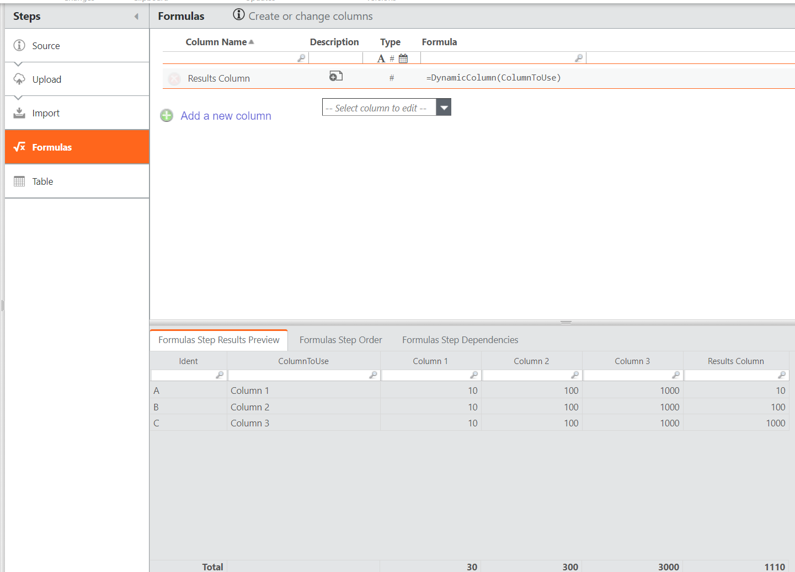

# DynamicColumn( ) función

**Se aplica a** : TBM Studio 12.10.9 y posteriores

Se introduce una nueva función DynamicColumn( ) para sustituir a la función Eval(). Queremos eliminar el uso de Eval() para permitir las mejoras de rendimiento de Precision Calc que llegarán a Server 12.10.10 en julio de 2023.

La función DynamicColumn( ) permite pasar un nombre de columna y devolver dinámicamente los valores de otras columnas en las que coincida ese nombre. Con Columna dinámica, puede hacer que su configuración sea más programática y reducir la dependencia de anidar funciones if para devolver datos en la misma tabla.

Para sustituir toda la flexibilidad de la función Eval(), puede ser necesario dividir la nueva fórmula en distintas llamadas a la función DynamicColumn( ) para devolver los resultados concatenados deseados. Véase la captura de pantalla de un ejemplo básico de fórmula utilizando DynamicColumn( ).

Para maximizar las mejoras en el rendimiento de calc de la nueva función "cálculos de precisión", la funcionalidad de la función Eval() se sustituye por DynamicColumn( ) u otros cambios en el código. Los clientes que aún tengan Eval() en la configuración de su proyecto, pueden realizar los cambios necesarios utilizando el documento de [código de sustitución de OOTB Eval(](../updated-eval-formulas.htm "(se abre en una pestaña o una ventana nueva)") ) que contiene información de todos los informes y cambios métricos.

**AVISO** : Si ha modificado los informes OOTB, Eval() no se eliminará de los informes de plantillas anteriores (por ejemplo, v104, v105, v106. v107 ).

## Dónde utilizarlo

Esta función puede utilizarse en:

- Tablas

## Sintaxis

`DynamicColumn()`

## Argumentos

*Columna*

El nombre de una columna de la que obtener el valor

*defaultValue*

El valor que existe en la columna basado en el valor Columna (nombre)

## Tipo de retorno

Serie

## Ejemplo

Para ver un ejemplo de esta función, consulte [Columnas dinámicas](https://community.apptio.com/viewdocument/apptio-quick-tips-dynamic-columns?CommunityKey=3ff74a27-8291-48d0-ba5a-403be94d07b8&tab=librarydocuments "(se abre en una pestaña o una ventana nueva)")
