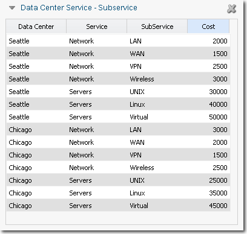
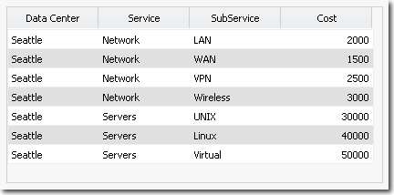
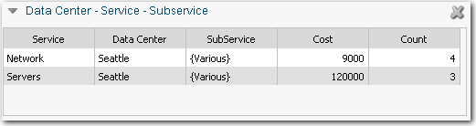
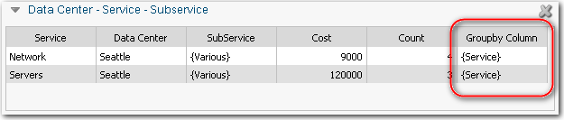

# GetGroupbyColumn función

**Se aplica a** : TBM Studio 12.0 y posteriores

La función GetGroupbyColumn se utiliza con tablas con una o varias columnas filtradas y una columna agrupada. Devuelve el nombre de la columna utilizada para agrupar. Si ha agrupado la tabla por más de una columna, la función devuelve los nombres de todas las columnas agrupadas.

## Dónde utilizarlo

Esta función puede utilizarse en:

- Columnas de fórmulas en tablas de informes
- Texto dinámico

## Sintaxis

`GetGroupbyColumn()`

## Argumentos

No hay argumentos para esta función.

## Tipo de retorno

Serie

## Ejemplo

Suponga que tiene la tabla que se muestra en la siguiente imagen:

Filtre la tabla por "Seattle" en la columna **Centro de datos**. El resultado se muestra en la siguiente imagen:

A continuación, se agrupa la tabla por la columna **Servicio**. El resultado se muestra en la siguiente imagen:

Ahora, añade una columna con la fórmula: =GetGroupbyColumn( ). El resultado se muestra en la siguiente imagen:

