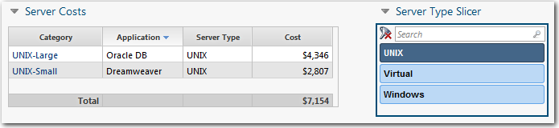
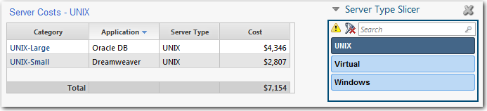

# GetLastFilterValue función

**Se aplica a** : TBM Studio 12.0 y posteriores

Devuelve el último valor aplicado a un filtro.

## Dónde utilizarlo

Esta función puede utilizarse en:

- Columnas de fórmulas en tablas de informes
- Texto dinámico

## Sintaxis

`GetLastFilterValue(column)`

## Argumentos

*columna*

La columna de la que recuperar el último valor de filtro aplicado.

## Tipo de retorno

Serie

## Ejemplo A

Lo siguiente devolvería el valor "Ventas"

`!Filter[Business Unit=Sales]`

## Ejemplo B

Suponga que tiene el informe que se muestra en la siguiente imagen:



Desea que el nombre de la tabla cambie en función de la selección de la cortadora. Por ejemplo, en la imagen anterior, se ha seleccionado UNIX en el cortador y se desea que el nombre de la tabla sea Costes del servidor - UNIX, como se muestra en la imagen siguiente:



Para crear el nombre de la tabla dinámica:

1. Para ocultar la cabecera predeterminada de la tabla, abra el cuadro de diálogo **Propiedades de** la tabla, seleccione la pestaña **General** y desactive la opción **Mostrar cabecera**.
2. Añada un cuadro de texto HTML al informe con el siguiente código HTML:

   ```
   <font face="Arial"><p
                 style="color:#3366CD;text-align:left;font-size:10pt">Server Costs -
                 <%=getLastFilterValue()%></p></font>
   ```
3. Coloque el cuadro HTML encima de la tabla para que sirva como nombre de la tabla.
4. Seleccione el cuadro de texto HTML.
5. En el cuadro de diálogo **Configuración HTML**, añada el campo Tipo de servidor al área **Filas**.
6. Para ocultar el encabezado predeterminado del cuadro de texto HTML, abra el cuadro de diálogo **Propiedades de** la tabla, seleccione la ficha **General** y desactive la opción **Mostrar encabezado**.

**Véase también** : [GetLastFilterColumn](getlastfiltercolumn.htm "(se abre en una pestaña o una ventana nueva)")
