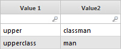
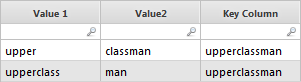
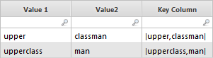
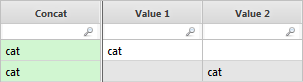
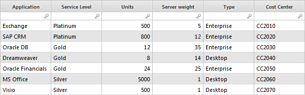
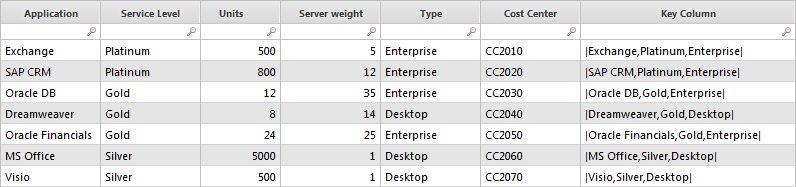
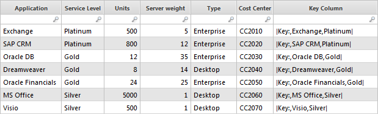

# Función clave

**Se aplica a** : TBM Studio 12.0 y posteriores

El propósito de la función Clave es crear una columna con valores únicos para cada fila de una tabla. La función define una nueva columna en un conjunto de datos como la combinación de dos o más columnas y/o una cadena de texto o una fórmula. Normalmente, la columna se utilizaría como identificador de unidad de un objeto en un modelo o para establecer una relación en el mapa de inferencia.

La función Clave es el método preferido para crear una columna clave para una tabla cuando se tiene un conjunto de datos con más de 1 millón de filas. Resuelve la situación en la que las columnas concatenadas en una tabla no producen un valor único para cada fila. Por ejemplo, suponga que tiene la siguiente tabla:



Si utiliza la concatenación para crear una tercera columna (= {Value 1} & {Value2} ), obtendrá el resultado que se muestra a continuación. Tenga en cuenta que los valores de la columna Clave no son únicos.



Si utiliza la función Clave para crear una tercera columna (=Clave(Valor 1,Value2 ), obtendrá el resultado que se muestra a continuación. Los valores de la columna Clave ahora son únicos.



Si utilizara la concatenación &&, produciría valores únicos en el ejemplo anterior, pero no daría valores únicos si tuviera la siguiente tabla en la que una celda de cada columna es nula. Cuando se combinan las columnas Valor 1 y Valor 2, se obtiene la columna Concat.



Además, la función Clave ofrece un rendimiento del sistema más rápido que la concatenación.

## Dónde utilizarlo

Esta función puede utilizarse en:

- Conjuntos de datos

## Sintaxis

`Key(value1,value2,...)`

## Argumentos

*valor*

Un valor puede ser el nombre de una columna, una cadena de texto entre comillas o una fórmula.

## Tipo de retorno

|value1,value2,...|

Observe que las barras al principio y al final del valor de retorno indican que el valor es una combinación de los elementos. No se trata de una nueva cadena de texto como la que se obtendría al concatenar dos o más columnas.

**Notas** :

- Un valor realizado con la función Clave() sólo es equivalente a otros valores realizados con la función Clave(). El resultado de una función clave sólo estará vinculado por inferencia a valores generados por otras funciones Key(). También la función de rastreo en los modelos funcionará ahora con los valores de la función Key().
- Si está trabajando con un conjunto de datos que tiene menos de 1 millón de filas, debe utilizar la concatenación para crear la Columna Clave. Para más información sobre la concatenación, véase [Concatenación de cadenas](../string-concatenation.htm "(se abre en una pestaña o una ventana nueva)").

## Ejemplos

Suponga que tiene la siguiente tabla:



Para añadir la columna clave que se muestra a continuación, introduzca lo siguiente en el campo **Valor** de la columna:

```
=key(Application,Service
      Level,Type)
```



Para añadir la columna clave que se muestra a continuación, introduzca lo siguiente en el campo **Valor** de la columna:

```
=key("Key:",Application,Service
      Level)
```


