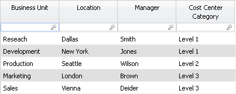
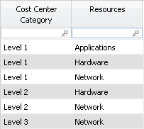
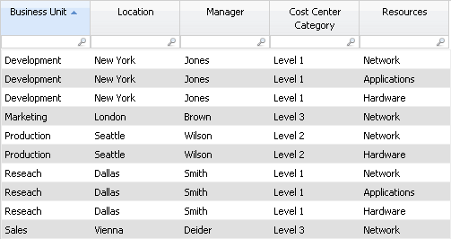

# LookupEx función

Realiza una búsqueda en las tablas y devuelve todos los valores coincidentes, creando nuevas filas para cada coincidencia. Esta función permite establecer una relación de uno a muchos uniendo cada fila coincidente de la tabla de búsqueda en la tabla transformada.

## Sintaxis

```
LookupEx(source_column, lookup_table, matching_column, lookup_value_column, leave_original_value, replace_nulls, ignore_case)
```

## Parámetros

- *columna\_fuente* : La columna del conjunto de datos actual cuyos valores se utilizan para encontrar coincidencias en la tabla de búsqueda. Nota: Este parámetro acepta una expresión, lo que significa que puede proporcionar un valor literal, una referencia de columna o el resultado de otra función. Obligatorio
- *tabla\_de\_busqueda* : El nombre de la tabla que contiene los valores a devolver. Debe referirse a una tabla existente en el conjunto de datos. Obligatorio
- *columna\_coincidente* : La columna de la tabla\_de\_consulta en la que buscar una coincidencia con los valores de la columna\_de\_origen. Obligatorio
- *columna\_valor\_consulta* : La columna de la tabla de consulta que proporciona los valores de retorno para las filas coincidentes. Obligatorio
- *leave\_original\_value* : Si es true, devuelve el valor original de la columna\_fuente cuando no se encuentra ninguna coincidencia; en caso contrario, devuelve NULL. Por defecto es false. Opcional (por defecto: false)
- *replace\_nulls* : Si es true, reemplaza los valores NULL o vacíos de la columna\_fuente comparándolos con los NULL de la columna\_coincidente. Por defecto es false. Opcional (por defecto: false)
- *ignorar\_casos* : Si es true, realiza la coincidencia sin distinguir mayúsculas de minúsculas entre la columna\_fuente y la columna\_coincidente. Por defecto es false. Opcional (por defecto: false)

## Comportamiento

- Realiza una búsqueda de uno a muchos y añade una nueva fila por cada coincidencia adicional encontrada en la tabla de búsqueda.
- Si no hay coincidencias, se conserva la fila original con un valor NULL en la columna de búsqueda.
- Si hay varias coincidencias, la fila original se duplica para cada coincidencia, y cada copia recibe uno de los valores coincidentes.
- Los parámetros opcionales deben utilizarse en secuencia si se especifican otros posteriores.

## Tipo de retorno

Tipo de la columna especificada en lookup\_value\_column

## Ejemplos

`LookupEx(Cost Center Category, Cost Category Resources, Cost Center Category,
Resources)`

En la tabla Centros de Coste de la BU, añade una nueva columna llamada Recursos que recupera todos los valores coincidentes de la tabla Recursos de la Categoría de Coste basándose en la Categoría del Centro de Coste. Si varios recursos coinciden con una misma categoría, se crean varias filas. Si no se encuentra ninguna coincidencia, la fila original permanece con un valor NULL en la columna Recursos.

**Tabla de centros de coste de la BU (antes):**

| Unidad de negocio | Ubicación | Director | Categoría del centro de costes |
| --- | --- | --- | --- |
| Investigación | Dallas | Smith | Nivel 1 |
| Desarrollo | Nueva York | Jones | Nivel 1 |
| Producción | Seattle | Wilson | Nivel 2 |
| Marketing | Londres | Marrón | Nivel 3 |
| Ventas | Viena | Deider | Nivel 3 |

**Categoría de costes Cuadro de recursos:**

| Categoría del centro de costes | Recursos |
| --- | --- |
| Nivel 1 | Aplicaciones |
| Nivel 1 | Hardware del sistema |
| Nivel 1 | Red |
| Nivel 2 | Hardware del sistema |
| Nivel 2 | Red |
| Nivel 3 | Red |

**Tabla de centros de coste de la BU (tras aplicar LookupEx ):**

| Unidad de negocio | Ubicación | Director | Categoría del centro de costes | Recursos |
| --- | --- | --- | --- | --- |
| Desarrollo | Nueva York | Jones | Nivel 1 | Red |
| Desarrollo | Nueva York | Jones | Nivel 1 | Aplicaciones |
| Desarrollo | Nueva York | Jones | Nivel 1 | Hardware del sistema |
| Marketing | Londres | Marrón | Nivel 3 | Red |
| Producción | Seattle | Wilson | Nivel 2 | Red |
| Producción | Seattle | Wilson | Nivel 2 | Hardware del sistema |
| Investigación | Dallas | Smith | Nivel 1 | Red |
| Investigación | Dallas | Smith | Nivel 1 | Aplicaciones |
| Investigación | Dallas | Smith | Nivel 1 | Hardware del sistema |
| Ventas | Viena | Deider | Nivel 3 | Red |

Suponga que tiene la siguiente tabla de Centros de Coste BU:



Desea emparejar cada clase de centro de coste con los recursos asignados a esa clase. Para realizar la correspondencia, ha creado la siguiente tabla de Recursos de categoría de coste que enumera los recursos de cada categoría:



Añada una nueva columna a la tabla Centros de coste de la BU llamada Recursos que utiliza la función LookupEx. A continuación se muestra la sintaxis de la función y la función tal y como aparecería en la columna Recursos.

```
LookupEx(source_column,lookup_table,matching_column,replacement_column
)
```

```
=LookupEx(Cost Center Category,Cost Category
            Resources,Cost Center
      Category,Resources)
```

El resultado se muestra en la siguiente imagen. Observe que la aplicación ha añadido filas a la tabla por cada coincidencia encontrada. Por ejemplo, hay tres filas para la unidad de negocio **de Desarrollo** que representan los tres recursos: Red, Aplicaciones y Hardware.



Nota:

- Utilice esta función con precaución en conjuntos de datos grandes, ya que puede dar lugar a grandes expansiones de filas.
- Sólo debe utilizarse una instancia de esta función por tabla para evitar resultados incorrectos.
- Esta función no es compatible con la barra de fórmulas de la cinta de opciones ni con la vista previa de la pestaña Datos.
- No utilice llaves { } para escapar de los nombres de columna en esta función.
