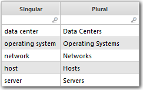

# Pluralizar la función

**Se aplica a** : TBM Studio 12.0, 12.1

Convierte los sustantivos singulares a sus formas plurales y escribe en mayúscula la primera letra de cada palabra.

Si desea convertir sustantivos singulares a sus formas plurales pero no escribir en mayúscula la primera letra de cada obra, utilice la [función Plural](plural.htm "(se abre en una pestaña o una ventana nueva)").

## Dónde utilizarlo

Esta función puede utilizarse en:

- Conjuntos de datos
- Métricas calculadas e informes con columnas de métricas
- Columnas de fórmulas en tablas de informes
- Texto dinámico

## Sintaxis

`Pluralize(noun[,count])`

## Argumentos

*sustantivo*

Forma singular de un sustantivo como "servidor" y "red" La función maneja sustantivos compuestos como "centro de datos" y "sistema operativo"

*recuento*

El sustantivo se hará plural sólo si el valor de este argumento es mayor que uno. El argumento puede extraerse de cualquier columna numérica.

## Tipo de retorno

Serie

## Ejemplo

