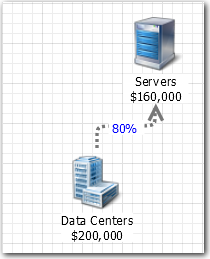

# Función de ratio

**Se aplica a** : TBM Studio 12.0 y posteriores

Utilícelo en las fórmulas avanzadas de asignación para manejar situaciones en las que los valores de la columna de ponderación sean cero. La función devuelve el valor 1.

## Dónde utilizarlo

Esta función puede utilizarse en:

- Fórmulas de origen de la asignación
- En una fórmula de asignación **avanzada** en un modelo

## Sintaxis

`Ratio({column},~{column})`

## Argumentos

*columna*

Nombre de la columna del objeto de destino que se utilizará para ponderar la asignación.

El "~" es un operador de aplicación que indica a la aplicación que sume los valores de la columna.

## Tipo de retorno

El número 1.

## Ejemplo

En este ejemplo, los costes de todos los centros de datos se asignan a los servidores en función de la correspondencia entre los nombres de los centros de datos del objeto Centros de datos y los nombres de los centros de datos del objeto Servidores. La asignación se pondera según el tamaño de los servidores de cada centro de datos basándose en una fórmula avanzada. Los centros de datos sin coincidencia en el objeto Servidores no se asignan.

## Fórmula

La fórmula avanzada utilizada es:

`=SOURCE*({Server.Size)/Sum(Size){Servers.Size},~{Servers.Size})`

SOURCE representa el valor del objeto Centros de Datos. Se "filtra" por la opción Referencia basada en datos seleccionada en la sección **Para** del cuadro de diálogo **Propiedades**. Servers.Size representa el valor de la columna Tamaño de la tabla de unidades de objeto Servidores. El "~" es un operador que indica a la aplicación que sume los valores de la columna Tamaño.

## Cálculo de datos

Los cuadros siguientes muestran cómo se calcula la asignación. La asignación se basa en la correspondencia de los nombres de los centros de datos de la tabla Centros de datos con los nombres de los centros de datos de la tabla Servidores. Las asignaciones se reparten entre los servidores de un centro de datos en función del tamaño relativo de los mismos. Por ejemplo, 1/5 de los 100.000 dólares asociados al centro de datos de Boston se asignan a Server1 y 4/5 a Server2. Los costes del centro de datos de Seattle no se imputan porque no hay servidores en dicho centro.

## Tabla de centros de datos

| Servidor | Centro de datos | Tamaño | Asignación |
| --- | --- | --- | --- |
| Server1 | Boston | 1 | 100 000 $ x 1/5 = 20 000 $ |
| Server2 | Boston | 4 | 100 000 $ x 4/5 = 80 000 $ |
| Server3 | Dallas | 1 | 50 000 $ x 1/3 = 16 667 $ |
| Server4 | Dallas | 2 | 50 000 $ x 2/3 = 33 333 $ |
| Server5 | Chicago | 8 | 10 000 $ x 8/8 = 10 000 $ |
| 5 servidores |  | 16 | 160 000 dólares |

## Tabla de servidores

| Centro de datos | Arrendamiento | Capacidad |
| --- | --- | --- |
| Boston | 100 000 dólares | 10 |
| Dallas | 50 000 dólares | 10 |
| Chicago | 10 000 dólares | 10 |
| Seattle | 40 000 dólares | 10 |
| Total | 200 000 dólares | 40 |

## Tratamiento de los valores cero

Si hay al menos un valor en la columna de ponderación que no sea cero, la aplicación calculará los valores correctamente. Si todos los valores de la columna de ponderación son cero, la aplicación no podrá calcular los valores. En estos casos, puede utilizar la función Ratio para establecer los valores calculados en 1. El resultado es que el valor asignado se repartirá uniformemente entre las unidades objetivo.

En el ejemplo anterior, si los valores de Tamaño fueran todos cero, se utilizaría la siguiente fórmula avanzada:

`=SOURCE*Ratio({Servers.Size},~{Servers.Size})`

Tenga en cuenta que las columnas se introducen como argumentos para la función, no como cociente. Los argumentos van separados por una coma.
