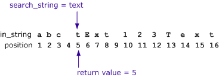
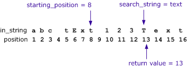

# Función de búsqueda

Busca una cadena especificada (*cadena\_buscada* ) dentro de otra cadena (*cadena\_entrada* ) y devuelve un valor que representa la posición en la *cadena\_entrada*, contando de izquierda a derecha, del primer carácter de la *cadena\_buscada*.

Opcionalmente, puede especificar una *posición\_inicial* para la búsqueda. La *posición\_inicial* es un valor entero que representa la posición en la *cadena\_de\_entrada*, contando de izquierda a derecha, para iniciar la búsqueda. La búsqueda se realiza de izquierda a derecha.

La búsqueda devuelve un valor si encuentra la *cadena\_buscada* incrustada dentro de la *cadena\_de\_entrada*. Por ejemplo, encontrará pastel en los espías. Si no se encuentra ninguna coincidencia, devuelve 0.

La búsqueda no admite caracteres comodín.

La búsqueda no distingue entre mayúsculas y minúsculas.

## Sintaxis

`Search(search_string, in_string, starting_position)`

## Argumentos

*cadena\_buscada* : La subcadena a buscar. Nota: Este parámetro acepta una expresión, lo que significa que puede proporcionar un valor literal, una referencia de columna o el resultado de otra función. Obligatorio

*cadena\_in* : La cadena en la que buscar. También puede indicar el nombre de una columna. Nota: Este parámetro acepta una expresión, lo que significa que puede proporcionar un valor literal, una referencia de columna o el resultado de otra función. Obligatorio

*posición\_inicial* : La posición desde la que empezar a buscar (índice basado en 1). Nota: Este parámetro acepta una expresión, lo que significa que puede proporcionar un valor literal, una referencia de columna o el resultado de otra función. Opcional (por defecto: 1)

## Tipo de retorno

Número

## Ejemplos

- El siguiente ejemplo devuelve 7, que es la posición de la letra "F" en la primera instancia de la *cadena\_buscada*.`=Search("Functional", "58762 Functional
  Actuals")`
- El siguiente ejemplo devuelve 19, que es la posición de la letra "c" en la primera instancia de la *cadena\_buscada* después de tomar el desplazamiento de 12 caracteres.`=Search("c", "58762 Functional Actuals",
  12)`
- El siguiente ejemplo devuelve 0, porque la *cadena\_de\_búsqueda* "99" no se encuentra en la *cadena\_de\_entrada*.`=Search("99", "58762 Functional
  Actuals")`
- El siguiente ejemplo utiliza funciones de Búsqueda anidadas dentro de una función IZQUIERDA para capturar los dos primeros octetos de una dirección IP.`=LEFT(IP, Search(."",IP,Search(."",IP)+1))`Dado que los octetos IP pueden contener de 1 a 3 dígitos, el argumento count de la función IZQUIERDA debe ser un par de funciones de Búsqueda anidadas que encuentren el segundo punto (. ) de cada dirección IP.

Primero se realiza la búsqueda interior. Encuentra la ubicación del primer punto, y con 1 añadido da un argumento *starting\_position* para la búsqueda externa que hace que comience en el carácter después del primer punto. La búsqueda exterior devuelve la posición del segundo punto, lo que proporciona a la función IZQUIERDA un argumento de *recuento* preciso para capturar los dos primeros octetos de la dirección.

Por ejemplo, si la columna IP contiene un valor de 10.10.1.113, la búsqueda interna devuelve un valor de 3, al que se añade 1, devolviendo 4. El valor de retorno 4 es la *posición\_inicial* para la búsqueda externa, que devuelve 6. El valor de retorno 6 es el *recuento* de la función IZQUIERDA, que devuelve 10.10.

Este ejemplo es una buena forma de encontrar una parte de una dirección IP, pero cuando busque direcciones IP completas, utilice la función [IPLOOKUP](iplookup.htm "(se abre en una pestaña o una ventana nueva)").

Nota: La función de búsqueda no distingue entre mayúsculas y minúsculas. Si necesita una búsqueda que distinga entre mayúsculas y minúsculas, utilice en su lugar la función Buscar. Todos los parámetros aceptan expresiones (por ejemplo, literales, columnas o funciones anidadas).
