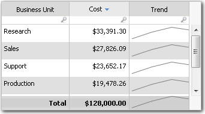

# Función Sparkline

**Se aplica a** : TBM Studio 12.0 y posteriores

La función Sparkline crea pequeños gráficos de tendencias en las celdas de las tablas de los informes.

A veces, resulta útil mostrar pequeños gráficos de tendencias para las filas de una tabla. Para ello se utiliza la función Sparkline. A continuación se muestra un ejemplo:

## Dónde utilizarlo

Esta función puede utilizarse en:

- Columnas de fórmulas en tablas de informes
- Texto dinámico
- Métricas calculadas e informes con columnas de métricas

## Sintaxis

`Sparkline(past,future,column)`

## Argumentos

*pasados*

El número de periodos a retroceder en el tiempo. Es un número positivo.

*Futuro*

El número de periodos de tendencia en el tiempo. Es un número positivo.

*columna*

La columna a la tendencia.

## Tipo de retorno

Gráfico

## Ejemplo

Las sparklines de la Figura A se crearon utilizando esta fórmula: Sparkline( 4,4,Cost ).

Véase también: [Añadir sparklines a una tabla](../../reports/tables/add-sparkline-column-to-tables.htm "(se abre en una pestaña o una ventana nueva)").
