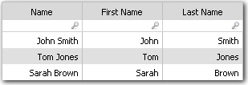

# Función de división

**Se aplica a** : TBM Studio 12.0 y posteriores

Devuelve un elemento de una cadena delimitada.

## Sintaxis

`Split(string,n[,delimiters])`

## Parámetros

- cadena: La cadena de la que dividir y extraer un elemento. Normalmente se trata de una referencia de columna. Nota: Este parámetro acepta una expresión, lo que significa que puede proporcionar un valor literal, una referencia de columna o el resultado de otra función. Obligatorio
- n: Un número entero que indica qué elemento devolver. Un número positivo cuenta desde la izquierda; un número negativo cuenta desde la derecha. Obligatorio
- delimitadores: Opcional. Una cadena de caracteres delimitadores para dividir la cadena. Se permiten varios caracteres (por ejemplo, ";>/" utiliza punto y coma, mayor que y barra oblicua). Utilice un punto (.) para representar un espacio. Por defecto "/-". Opcional (por defecto: /-)
- ignoreAdjacentDelimiters: Opcional. Un booleano (verdadero o falso) que indica si los delimitadores adyacentes deben tratarse como uno solo. Por defecto es true. Opcional (por defecto: true)

## Tipo de retorno

Serie

## Ejemplos

Suponga que tiene una columna en una tabla que contiene los nombres y apellidos de los empleados. Por ejemplo: John Smith, Tom Jones, Sarah Brown. Desea separar el nombre del apellido para producir la siguiente tabla:

Para ello, introduzca las siguientes ecuaciones en el campo **Anulación de valor** para las columnas Nombre y Apellidos. El delimitador " " representa el espacio en blanco entre el nombre y el apellido.

| Columna | Fórmula de anulación de valores |
| --- | --- |
| Nombre | =Split( Name,1," ") |
| Apellido | =Split( Name,2," ") |

A continuación se muestran otros ejemplos de la función Dividir.

| Ejemplo Función | Valor de retorno |
| --- | --- |
| =Dividir("a/b/c/d",3,"/") | c |
| =Dividir("a,b,c,d",7,",") | Nulo |
| =Dividir("a&b&c&d",4,"&") | d |
| =Dividir("foo",1) | foo (la cadena completa) |
| =Dividir("foo",2) | Nulo |
| =Dividir("a/b/c/d",-3) | b |

- `Split("Seattle, Tacoma, Spokane", 2, ",")`: Devuelve " Tacoma" - el segundo elemento de la lista separada por comas.
- `Split("Region/US-East", -1)`: Devuelve "Este" - el último elemento dividido por los delimitadores por defecto "/-".
- `Split({City List}, 3, ",;")`: Divide los valores de la columna {City List} utilizando coma o punto y coma y devuelve el tercer elemento.

Nota: Utilice valores negativos para n para contar elementos desde la derecha. Si deben ignorarse los delimitadores adyacentes (por ejemplo, para evitar elementos en blanco), establezca ignoreAdjacentDelimiters en true.
