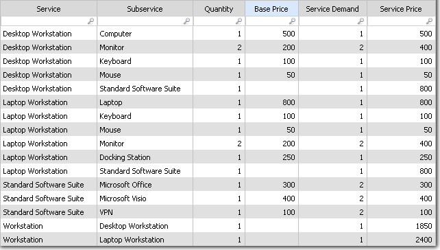

# SumIfHierarchy

**Se aplica a** : TBM Studio 12.0, 12.1

La función SumIfHierarchy permite calcular el coste de un servicio a partir del coste de sus subservicios. La función se utiliza para calcular el valor de una columna añadida a una tabla de transformación de costes de servicio. La función requiere un conjunto, jerarquía conocida que no contenga referencias circulares. La jerarquía puede tener un número ilimitado de niveles.

## Dónde utilizarlo

Esta función puede utilizarse en:

- Fechas

## Sintaxis

Para la demanda, utilice la sintaxis siguiente:

`SumIfHierarchy(Service,Consumes,Quantity)`

Para el precio, utilice la sintaxis siguiente:

`SumIfHierarchy(Consumes,Service,Quantity,BasePrice)`

## Argumentos

*Servicio*

El nombre de la columna que contiene el nombre del servicio.

*Consume*

Nombre de la columna que contiene el nombre del subservicio.

*Cantidad*

Nombre de la columna que contiene el número de subservicios consumidos por el servicio.

*BasePrice*

El nombre de la columna que contiene el precio asignado a los sub-servicios.

## Tipo de retorno

Número

## Ejemplo

La siguiente tabla ilustra el uso de la función SumIfHierarchy para calcular la demanda de servicio y el precio del servicio para las estaciones de trabajo. Los precios base se introducen para cada sub-servicio, por ejemplo, monitor, teclado y ratón. Observe que no se ha introducido un precio base para el subservicio Standard Software Suite porque está compuesto por otros subservicios, concretamente Microsoft Office, Microsoft Visio y VPN. El coste total de los puestos de trabajo de sobremesa y portátiles figura en las dos últimas filas del cuadro:



La ecuación de la columna Demanda de servicios es:

`=SumIfHierarchy(Service,Subservice,Quantity)`

La ecuación de la columna Precio del servicio es:

```
=SumIfHierarchy(Subservice,Service,Quantity,Base
          Price)
```
