# ApEx Mejora de la interfaz de usuario

**Se aplica a** : 12.11.0 y posteriores

## Introducción

Los cambios en ApEx son el primer paso para modernizar el aspecto de TBM
Studio y la plataforma CT. Se centra en actualizar el aspecto de TBM
Studio adoptando el estilo y los colores de ApEx. La configuración de ApEx UI se activará por defecto para todos los nuevos proyectos creados por clientes nuevos o existentes.

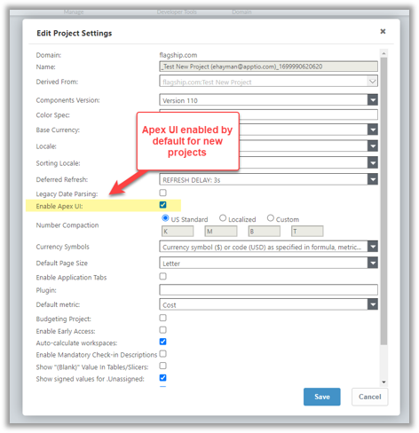

Los cambios se aplican a la sección del informe y, a continuación, se aplican automáticamente a las colecciones, tablas y tablas editables del informe. Se ha actualizado el aspecto de los siguientes componentes de la interfaz de usuario:

Nota: Si se prefiere la interfaz de usuario antigua para mantener la coherencia con otros proyectos existentes, desactive el nuevo diseño de ApEx accediendo a la pestaña **Proyecto** > **Configuración del proyecto** > y desmarque la opción **Activar interfaz de usuario Apex**.

## Proyectos de referencia abiertos

**Se aplica a** : 12.11.2 y posteriores. Las aplicaciones de referencia Apptio como Vendor Insights, Costing Standard, Billing, etc también están habilitadas con Apex UI. Los administradores y los usuarios finales pueden ver los informes en la nueva y moderna interfaz de usuario.

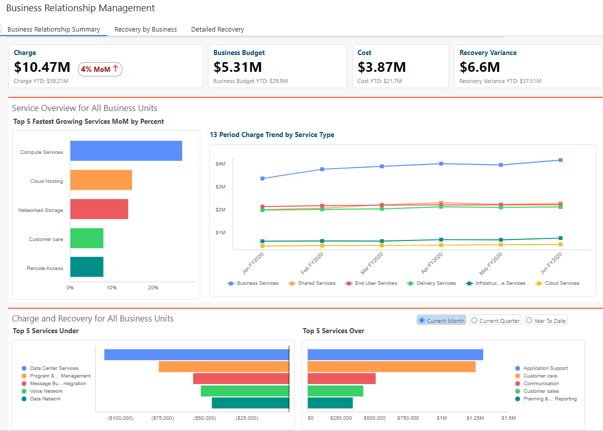

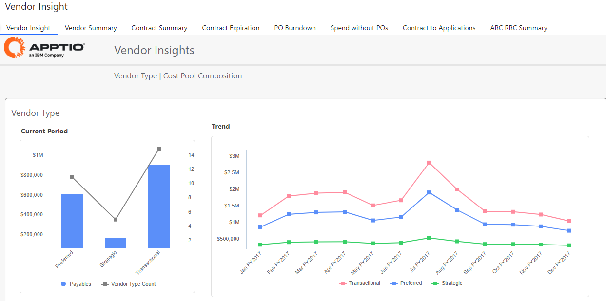

## Componentes afectados

El nuevo diseño afecta a los siguientes componentes del informe:

- Colores de todos los gráficos y fuentes
- Fronteras en todos los componentes
- Iconos, Menú contextual, Tamaño de fuente
- KPI
- Tabuladores
- Tablas
- Carga de tablas editables
- Cortadoras
- Cuadro de diálogo
- Selector de columnas
- Tabla editable
- Pivote
- Notificaciones (No aplicable a la vista CT)

## antes y después de activar la interfaz de usuario Apex

**Panel de control**

**KPI**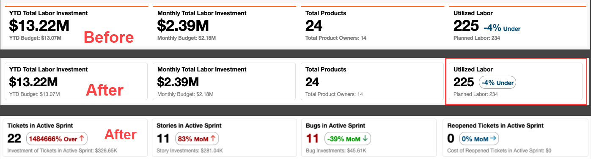

## Tabuladores

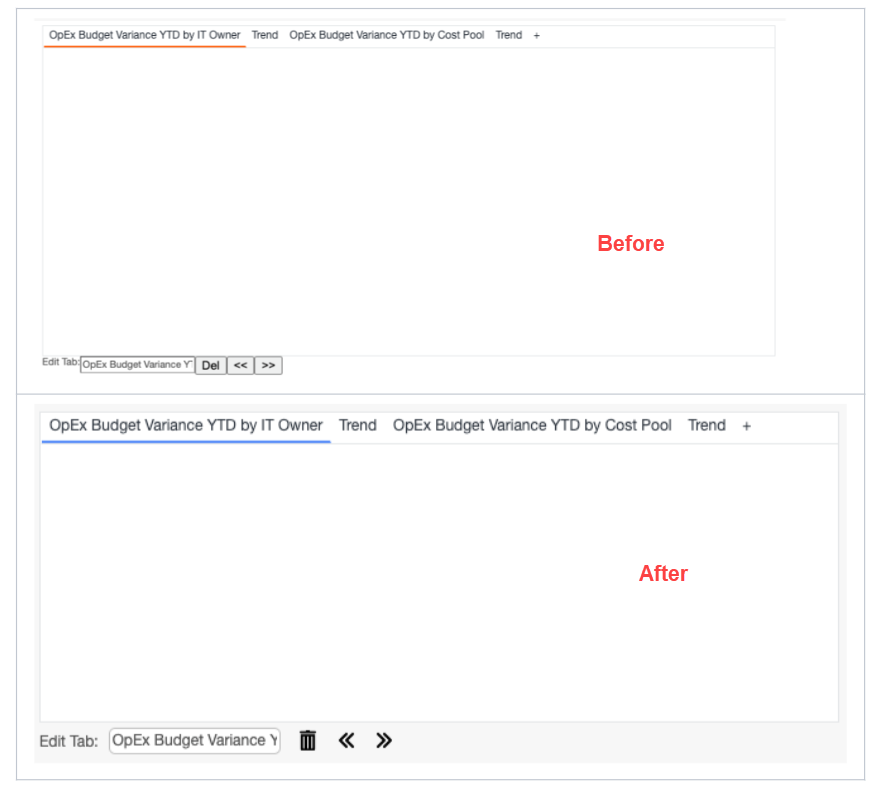

## Cortadoras

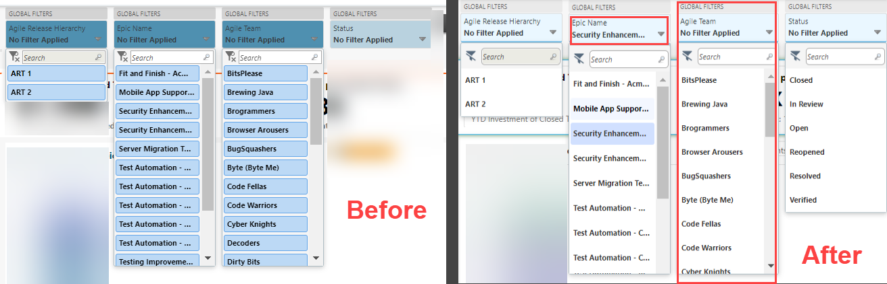

## Gráficos

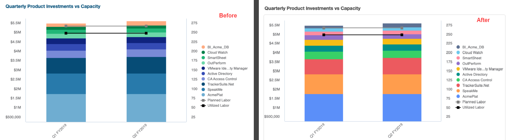

## Cuadro de diálogo

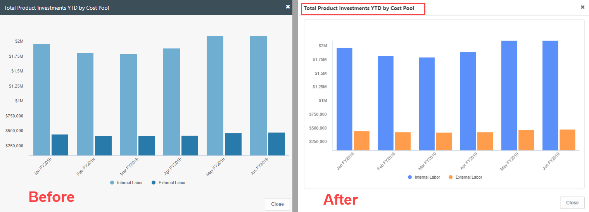

## Menú de contexto

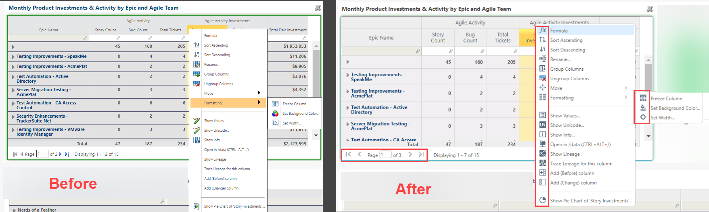

## Tablas, Tablas de árbol, Tablas editables

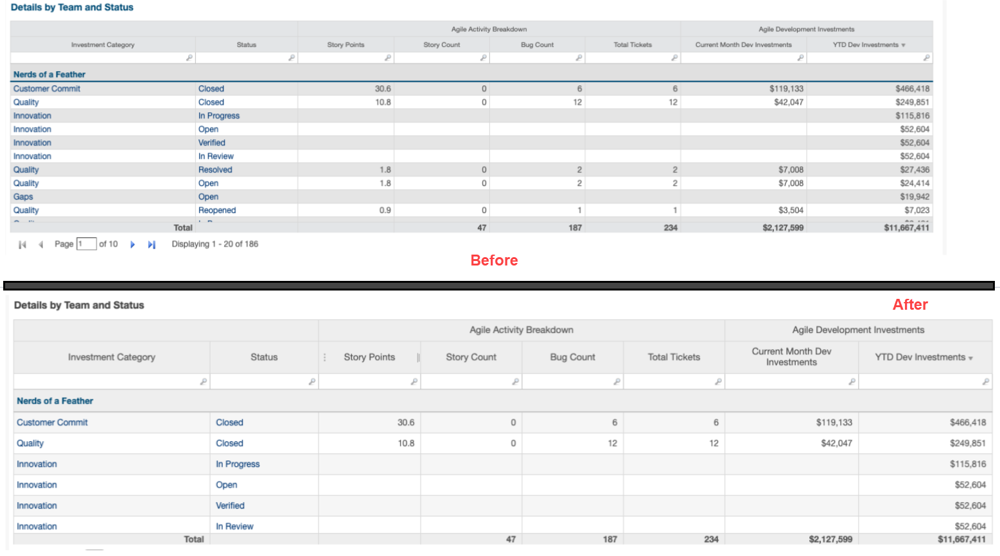

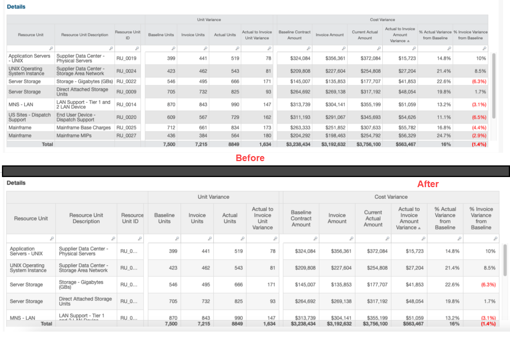

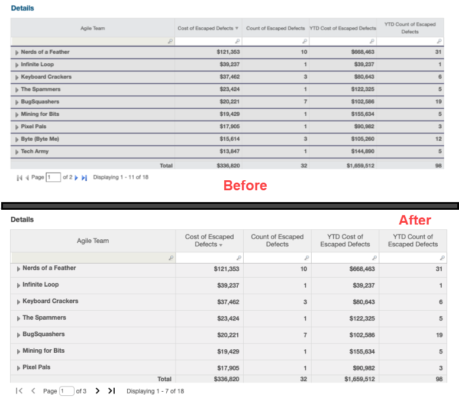

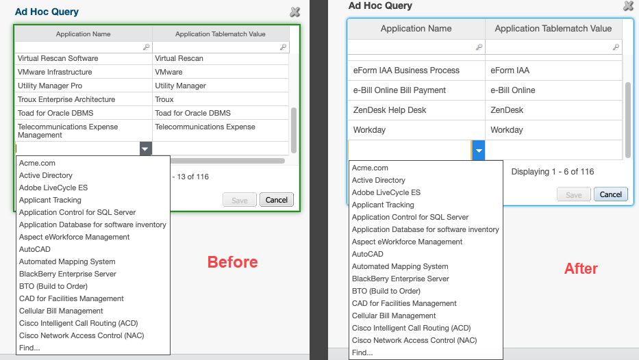

## Carga de tablas editables

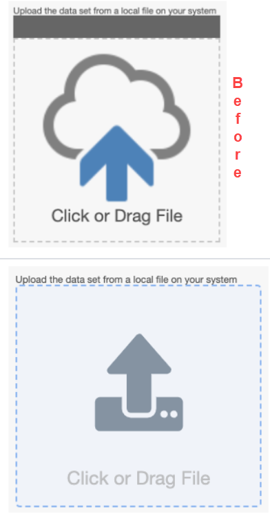

## Botones de tabla editables

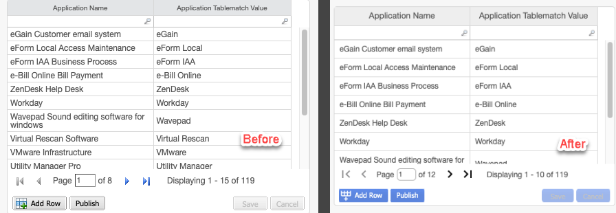

## Pivote rápido

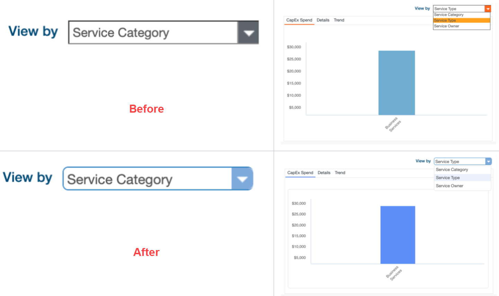

## Selector de columnas

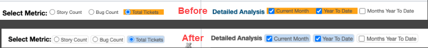

## Notificación

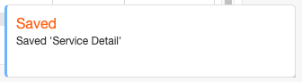

## Cuadro de mando

**AVISO** : Esta función está disponible para la IU antigua y la nueva, y no requiere que esté activada la opción ApEx Uplift.

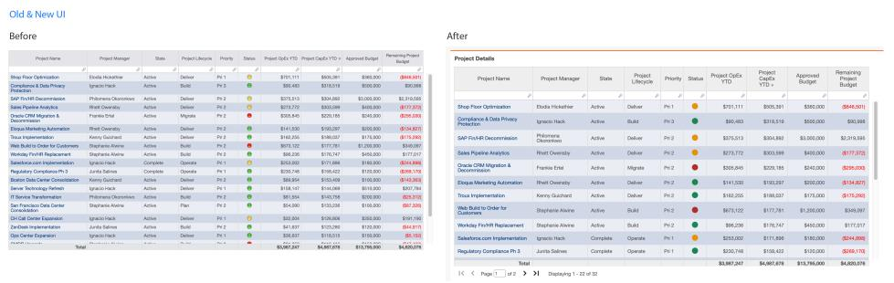

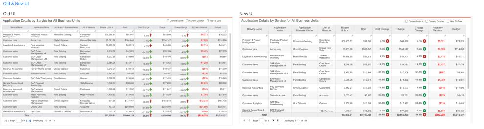

## Acercar

Esta función está disponible para la antigua y la nueva interfaz de usuario, y no requiere que esté activada la opción ApEx Uplift. Para ver un vídeo de demostración, haga clic [aquí](https://community.apptio.com/viewdocument/demo-visualization-zoom-feature-re?CommunityKey=3ff74a27-8291-48d0-ba5a-403be94d07b8 "(se abre en una pestaña o una ventana nueva)").

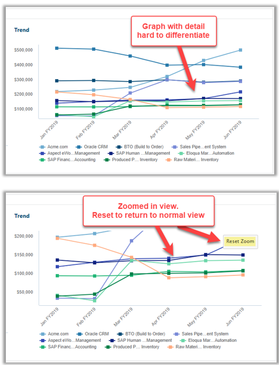

## Menú flotante

Se ha actualizado el menú desplegable (Moneda, Exportar, Restablecer y Actualizar) en la vista CT.

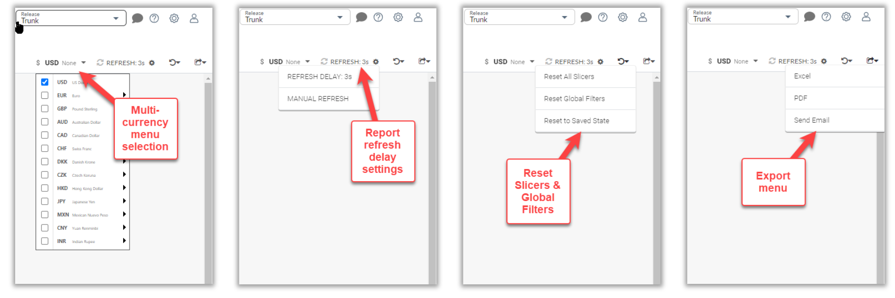

**Estudio Explícito**

- Cambio de color de la selección de componentes (de amarillo y verde a azul) (editado)
- Sección de tabla y sección de tabla editable
- Alternar entre la antigua y la nueva interfaz de usuario
