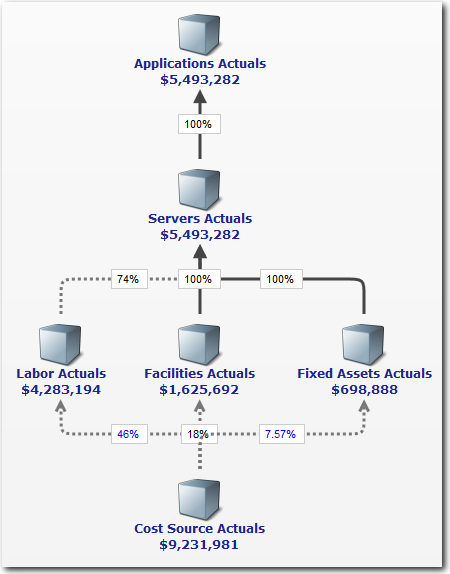
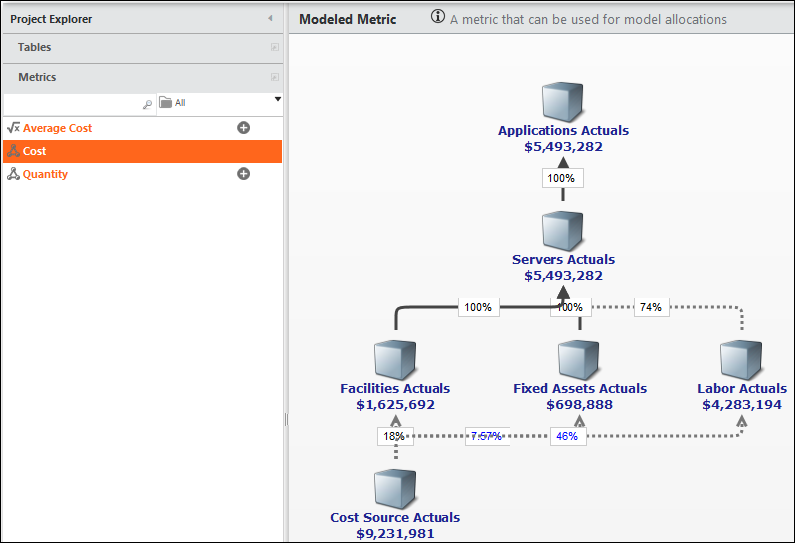
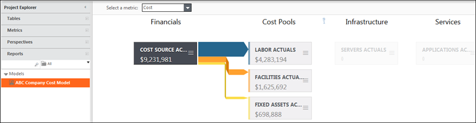
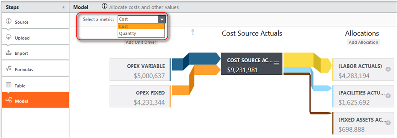

# Acerca de los modelos

**Se aplica a** : TBM Studio 12.0 y posteriores

Un modelo de datos es una representación lógica y gráfica del flujo de datos relevantes para el coste, el presupuesto, la utilización, los niveles de servicio, el consumo u otras métricas de sus servicios de TI. En la siguiente imagen se muestra un modelo de ejemplo.

En TBM Studio, a un modelo se le suelen asignar varias métricas, donde una métrica es un valor. Las métricas muestran cómo una amplia gama de datos financieros u operativos se relacionan con el coste y el rendimiento de los productos y servicios que TI proporciona a la empresa.

Por ejemplo:

- Un modelo podría representar los costes mensuales totales de TI, con otras métricas que representen varios centros de costes dentro de la organización de TI, como hardware, licencias de software y mano de obra. La imagen anterior representa la métrica Coste.
- Una métrica de disponibilidad podría contener datos y relaciones relevantes que representen el tiempo de actividad de los servicios o de la infraestructura subyacente que los soporta.
- Una métrica de utilización podría representar la utilización de CPU, red, E/S o disco en una granja de servidores o conjunto de centros de datos.
- Una métrica de volumen o consumo podría representar el uso de diversos servicios informáticos o infraestructuras subyacentes por parte de servicios o unidades de negocio.

## Pasos para construir un modelo

Antes de construir un modelo, debe cargar tablas de datos en la aplicación. Para más información sobre la carga de datos, véase [Adquisición y transformación de datos](../data%20studio/about-data-transforms.htm "(se abre en una pestaña o una ventana nueva)").

Una vez cargados los datos, hay cuatro pasos clave para construir un modelo.

1. Añada un paso Modelo a la cadena de transformación de cada tabla que formará parte del modelo.
2. Añade controladores a las tablas de origen en la parte inferior del modelo.
3. Asignar valor de las tablas de origen a las tablas de destino situadas más arriba en el modelo.
4. Construir informes modelo para ayudar a analizar los datos.

## Vistas de modelos

Hay tres formas de ver un modelo:

- Cuando construya un modelo, trabajará con una tabla individual y sus controladores y asignaciones. La vista utiliza un diagrama de Sankey como el que se muestra en la siguiente imagen. Para visualizar el modelo, haga clic en el paso del modelo en una cadena de transformación de tablas.

  
- Cuando desee trazar el flujo de una métrica a través de un modelo, puede utilizar la vista **Métrica modelada** como la que se muestra en la siguiente imagen:

  
- Cuando desee ver un conjunto seleccionado de tablas mostradas en niveles, puede utilizar un informe modelo como el que se muestra en la siguiente imagen. En el ejemplo siguiente, los niveles son Finanzas, Grupos de costes, Infraestructura y Servicios.

  

## Diagrama de Sankey

Las vistas individual y por niveles del modelo utilizan un diagrama de Sankey. En el diagrama, el valor fluye de izquierda a derecha. La anchura de las líneas de asignación es proporcional al valor. El diagrama Sankey garantiza un diseño coherente para todos los modelos.

Vea este vídeo de demostración de Apptio Education Services: [Estudio de maquetas: Sankey Layout](https://community.apptio.com/videos/1484 "(se abre en una pestaña o una ventana nueva)"). O consulte [todos los vídeos de Apptio](https://community.apptio.com/docs/DOC-7714 "(se abre en una pestaña o una ventana nueva)").

## Tablas y asignaciones: componentes de un modelo

Las tablas incluyen datos sobre operaciones, finanzas o entidades organizativas de una organización. Las tablas pueden añadirse a un modelo añadiendo un paso Modelo a la transformación de la tabla. Las tablas habituales incluyen datos de servidores, redes, aplicaciones, libro mayor, instalaciones, centros de datos, correo electrónico y unidades de negocio.

Las asignaciones determinan el flujo de valor entre tablas. En los modelos, las asignaciones se representan mediante líneas trazadas entre los cuadros. En la imagen anterior, hay asignaciones desde la tabla de Fuente de Costes Reales a las tablas de Mano de Obra Real, Instalaciones Reales y Activos Fijos Reales.

## Un modelo, múltiples métricas

Hay un modelo por proyecto, pero un modelo puede tener más de una métrica de modelo. Las métricas son cálculos que definen un aspecto como el coste, el presupuesto o la cantidad. Al visualizar un modelo, puede cambiar la métrica mostrada utilizando el campo situado en la parte superior del panel del modelo, como se muestra en la siguiente imagen. Para más información sobre la definición de métricas, véase [Métricas](introduction-to-metrics.htm "(se abre en una pestaña o una ventana nueva)").

