# Acerca de la ponderación y los números negativos

◆ Se aplica a: TBM Studio 11.8.3.1 y posteriores; TBM Studio 12.0 y posteriores. El objetivo de una ponderación es asignar el número de origen en el que la **suma** es la misma en el destino.

La ponderación por números negativos puede dar lugar a resultados inesperados. En Apptio TBM Studio, versión 12, Apptio establece por defecto que no se asigne cuando se utilicen ponderaciones negativas. Las razones para establecer este valor por defecto se describen en este artículo, junto con ejemplos de escenarios en los que podría ser legítimo ponderar por valores negativos, los riesgos inherentes a la activación de esta capacidad y las formas de abordar estas asignaciones de forma segura.

## Por qué la ponderación negativa no está activada por defecto

Cuando se crea una asignación que intenta ponderar por un conjunto de valores, que incluye números negativos, pueden producirse varios problemas. Aquí tratamos algunos de los problemas más comunes y hacemos hincapié en la importancia de comprender los riesgos.

Para su referencia, la hoja de cálculo utilizada para apoyar estos ejemplos se adjunta al final de este artículo en la sección **ANEXOS**.

## Ejemplo

En primer lugar, para acentuar de forma muy visual cómo pueden ir mal las cosas, supongamos que tenemos una asignación que pondera por números positivos y negativos, pero en la que uno de los valores de ponderación es pequeño en relación con los demás. En este ejemplo, se asignan 100 dólares a tres filas del objetivo, pero con una ponderación positiva grande, una negativa grande y una positiva pequeña. Observe los resultados extremos en las filas receptoras de la siguiente tabla.

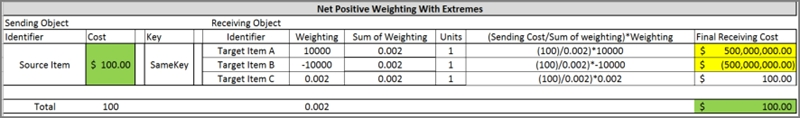

Dado que la división por cero es una imposibilidad lógica, (Standard for Floating-Point Arithmetic) define límites para la representación de los ceros, que son efectivamente pequeños números positivos o negativos. Apptio como cualquier software, se adhiere a este principio, y por lo tanto, el pequeño número positivo en este ejemplo está ahí incluso cuando Apptio 's UI podría mostrar un valor de 0. Así, con las ponderaciones negativas activadas, es posible ver una explosión repentina de valores en los objetos aguas abajo a los que se asignan.

## Ejemplos más comunes

En las siguientes tablas de ponderación, vemos tres ejemplos: un ejemplo positivo neto, un ejemplo cero neto y un ejemplo negativo neto. En cada ejemplo, observe que los valores del objetivo, aunque suman el valor original, crean la inflación o deflación del valor en las filas individuales del objetivo.

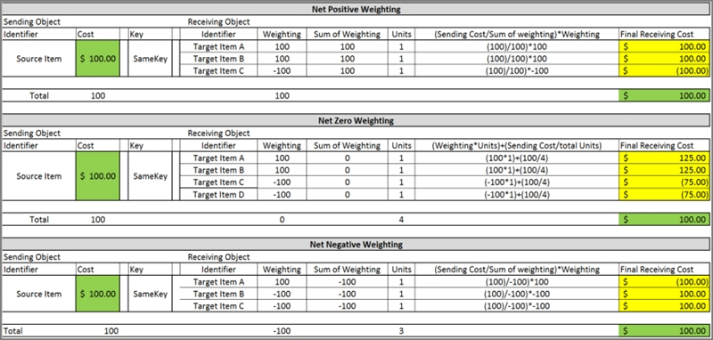

## Un ejemplo insidioso

La siguiente tabla de ponderación es otro ejemplo positivo neto, pero sutil y, por tanto, podría pasar desapercibido. En este ejemplo, el valor neto de las filas objetivo no es muy diferente que en un conjunto mayor de asignaciones en las que no se podría fallar. En este caso, los valores de los objetos descendentes podrían estar sutilmente sesgados de forma que arrojen cifras inexactas.

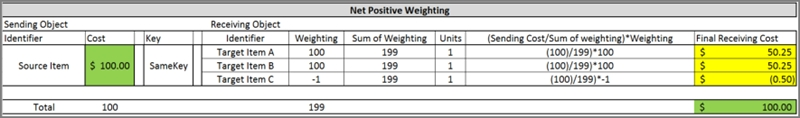

## Situaciones que pueden requerir ponderaciones negativas

Escenarios de débito/crédito
:   Una situación común es cuando hay cargos y abonos en un libro mayor o en una factura. Por ejemplo, la factura de un proveedor puede incluir tanto abonos como cargos en una cuenta, como en las facturas de servicios en la nube. Cuando esto ocurre, es posible que desee ponderar por números negativos (créditos).

Reclasificación de las horas de trabajo
:   Otra situación en la que son apropiados los coeficientes correctores negativos es la reclasificación de las horas de trabajo. Por ejemplo, en un mes, alguien presenta tiempo contra el Proyecto A y, más tarde, se da cuenta de que pretendía presentar tiempo contra el Proyecto B en su lugar. Así, el mes que viene, "acreditan" horas al Proyecto A presentando una cifra negativa.

## Opciones de coeficientes correctores negativos

Utilizar los coeficientes correctores negativos de forma selectiva con una fórmula
:   La siguiente fórmula puede utilizarse como parte de una asignación por fórmula avanzada para habilitar selectivamente ponderaciones negativas. Tenga en cuenta que esto no evita la posibilidad de problemas como los descritos anteriormente en este artículo, simplemente limita su exposición a ellos. El uso de una fórmula es preferible a permitir asignaciones negativas para todo el entorno porque mitiga el riesgo de que se produzcan resultados inesperados cuando no prevemos que necesitemos ponderaciones negativas.

    ```
    =SOURCE *
            ({Table.Weighting}/~{Table.Weighting})
    ```

    Donde lo siguiente se aplica al conjunto de filas que están asociadas por medio de una Relación de Datos ( v12 ) o clave ( r11 ).

    - **SOURCE** es el valor de origen que se está asignando a través de la relación.
    - **~** es el operador de rollup que suma los valores de la columna de ponderación para la relación dada.
    - El **Table.Column** (o métrica) debe ser siempre idéntico en el numerador y el denominador de la fórmula. De lo contrario, no estará creando una relación válida.

El principal valor de utilizar esta fórmula es permitirle habilitar selectivamente ponderaciones negativas para una asignación específica. Esto le ayuda a protegerse de los riesgos descritos al principio de este artículo.

## Segregar los valores fuente negativos y ponderarlos por valores absolutos

Otra estrategia para tratar los valores negativos es segregarlos en la fuente y utilizar el valor absoluto para ponderarlos. En el siguiente ejemplo de una factura con abonos, el total (incluidos los abonos) se instala en el Libro Mayor como una única partida con la suma de 100 $. A continuación, se asigna al objeto Proveedores (para permitir la elaboración de informes listos para usar) ponderando por los valores de la factura. Como la factura incluye créditos, obtenemos cifras incorrectas en el objetivo.

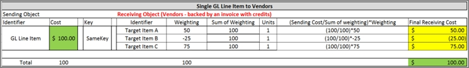

Si en lugar de ello segregamos los créditos en el Libro Mayor/fuente de costes y nos aseguramos de que la relación/clave de datos conserva la segregación, podemos utilizar el valor absoluto de la factura incluidos los créditos:

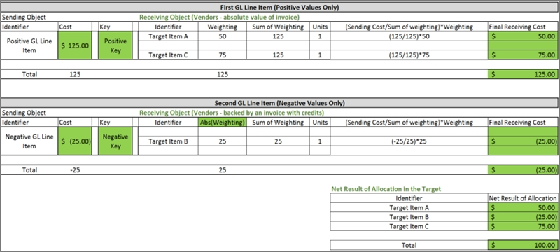

Así se obtienen cifras exactas en el objetivo.

## Ejemplo 1: Un problema de datos

En esta sección, presentamos un caso real sencillo en el que una ponderación negativa impide una asignación. Este es también un ejemplo de una situación en la que la ponderación negativa no fue intencionada. En este caso, una fórmula basada en los datos que entraban en el sistema se equivocó y creó un par de valores negativos sin querer.

Aquí, vemos una asignación de la Fuente de Costos al Libro de Activos Fijos que no está funcionando, y el usuario es consciente de ello.

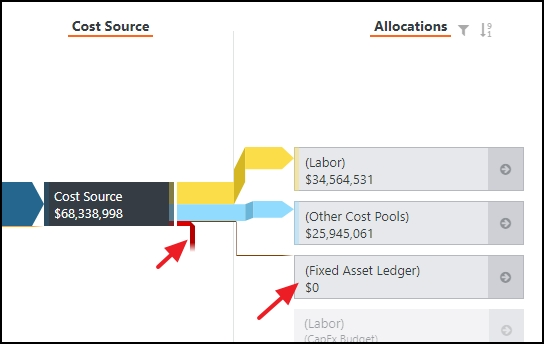

Cuando se examina la asignación más de cerca, el problema no es obvio.

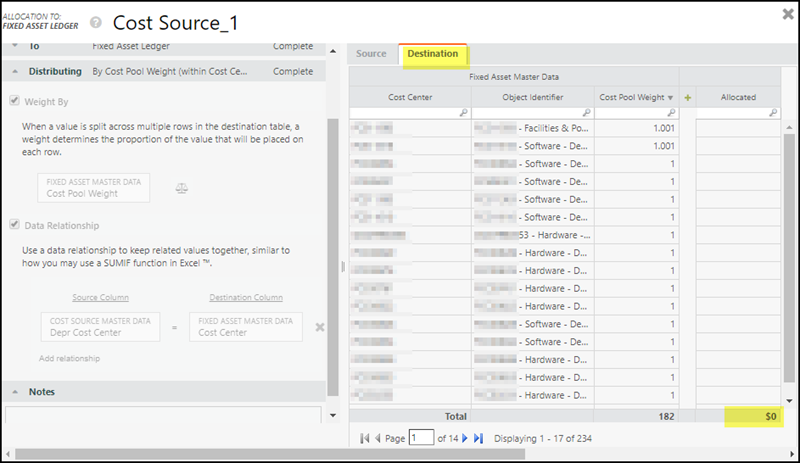

Sin embargo, cuando ordenamos Cost Pool Weight en orden ascendente, vemos dos pequeños valores negativos:

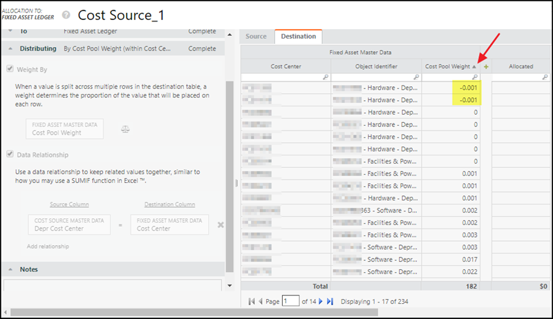

Nota: Como no siempre es obvio, se recomienda comprobar las columnas de ponderación ordenándolas en orden ascendente si encuentra una asignación que parece estar correctamente configurada.

En este caso, la ponderación del pool de costes se ha calculado mediante una fórmula (véase a continuación). La mezcla de positivos y negativos procedía de dos fuentes de datos anexas diferentes como parte de la automatización de la asignación. Sin embargo, no se previó una mezcla de positivos y negativos, por lo que el problema no apareció hasta que las cargas incluyeron valores de depreciación negativos. En este caso, la solución fue fijar los datos.

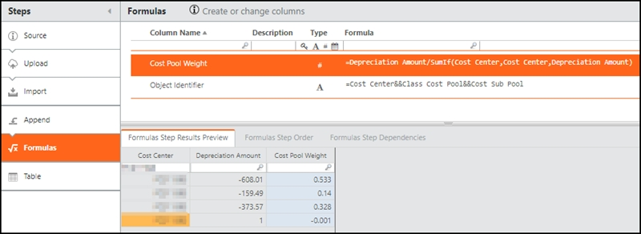

## **Ejemplo 2: Utilizar la fórmula de ponderación en una asignación para representar créditos**

A veces, una empresa tiene asientos en el libro mayor que contienen abonos de facturas que desea mostrar en los informes. El lugar en el que deseen mostrar los créditos puede variar, pero en este ejemplo, mostramos los créditos en un objeto de destino al que asigna la fuente del libro mayor. Los datos brutos corresponden a tres centros de coste: CC1, CC2, y CC3. CC1 sólo tiene débitos, pero CC2 y CC3 tienen una mezcla de débitos y créditos.

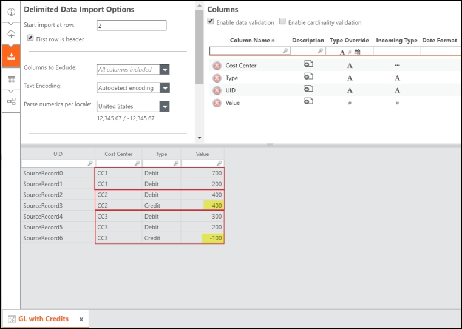

El libro mayor con la tabla Créditos tiene un controlador basado en la columna Valor, y el identificador de objeto para la tabla es Centro de coste. El resultado son unos valores netos para CC1, CC2 y CC3 de 900, 0 y 400 dólares respectivamente.

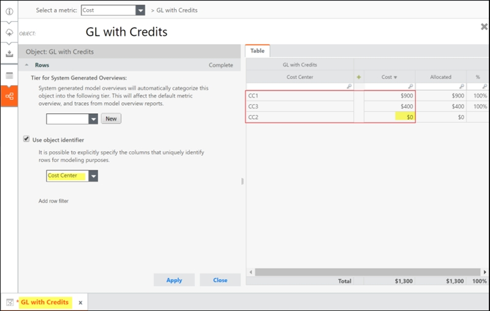

No se asignan dólares:

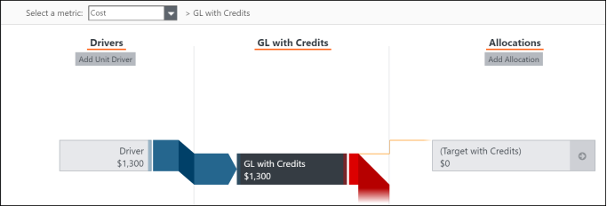

En este ejemplo, los datos brutos de nuestro objeto de destino son idénticos a los de nuestro origen y utilizan el UID como identificador del objeto. Esto no es inusual en situaciones reales en las que una empresa tiene partidas del libro mayor (CG) que sabe que suman los valores de una factura, o bien añade el detalle de la factura al CG, sustituyendo las partidas originales del CG. Aplicamos la fórmula de ponderación. CC1 y CC3 reciben los valores esperados, pero como CC2 era cero neto en GL con Créditos, no obtenemos nada en esas filas:

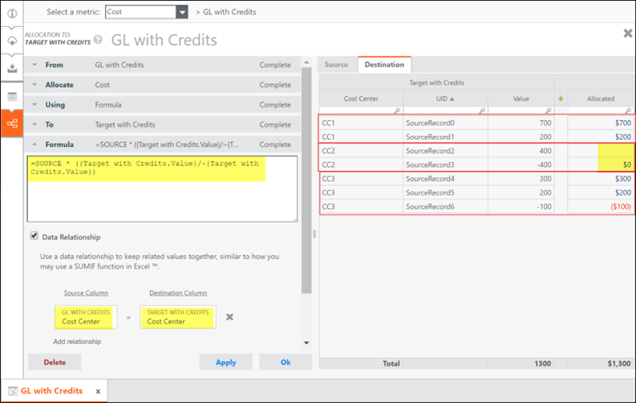

La fórmula funcionó: se activaron las ponderaciones negativas y, cuando los números no llegaron a cero, obtuvimos los resultados esperados. Sin embargo, en el caso de que un débito y un crédito sumaran cero en la fuente, el sistema no asignaba. Así que no conseguimos ningún valor en el objetivo.

En el siguiente ejemplo, abordamos tanto la ponderación negativa como el cero neto en la fuente.

## Ejemplo 3: Utilización de la segregación de positivos y negativos en una asignación para representar créditos

En este ejemplo, nuestro objetivo es el mismo que en el anterior. Estamos utilizando los mismos datos brutos para el GL. Sin embargo, en lugar de utilizar la fórmula de ponderación, segregamos los valores negativos y positivos en el origen y el destino, de forma que podamos utilizar el valor absoluto de la columna Valor para ponderar, y así obtener exactamente lo que queremos en el destino. Además, los datos de respaldo de nuestro objeto de destino no incluyen la granularidad de origen, por lo que deben modificarse para admitir la visualización de créditos y segregar negativos y positivos.

Una vez más, los datos brutos corresponden a tres centros de coste: CC1, CC2, y CC3. CC1 sólo tiene débitos, pero CC2 y CC3 tienen una mezcla de débitos y créditos.

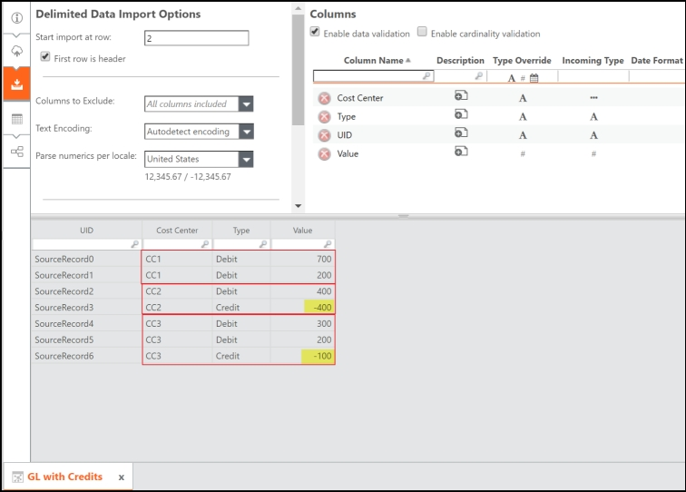

Como en nuestro último ejemplo, el identificador de objeto para la tabla era Centro de costes, y la relación de datos se basa en Centro de costes. Por lo tanto, queremos añadir granularidad allí donde existan negativas. Podríamos utilizar la columna UID dentro de los datos brutos, pero eso aumentaría innecesariamente la granularidad de nuestro modelo. Esto podría tener repercusiones negativas en el rendimiento de un proyecto de gran envergadura. Así que en su lugar, añadimos una columna de fórmula llamada CC Créditos y Débitos como se muestra a continuación. También añadimos una columna de fórmulas llamada CC Negativos.

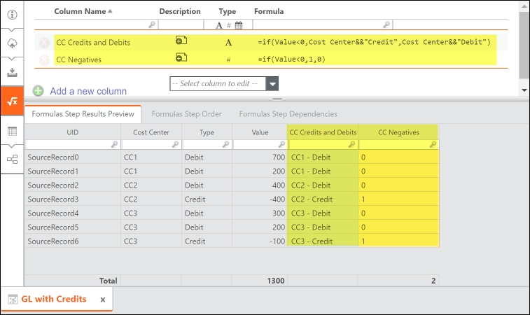

Modificamos el identificador del objeto para utilizar la nueva columna de fórmulas:

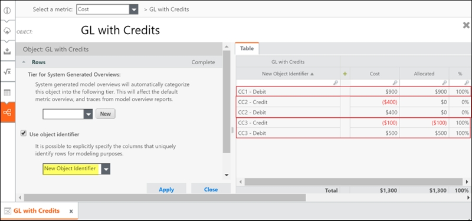

A continuación, examinamos nuestra tabla de objetivos:

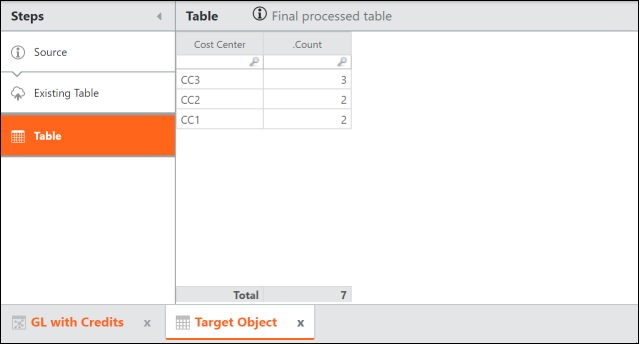

Para mantener segregados los valores negativos y positivos y obtener los números correctos en el objetivo, debemos añadir granularidad a esta tabla. Para ello, añadimos las siguientes columnas de fórmulas:

- CC Negativos - Suma los CC Negativos en el objeto origen basándose en el Centro de Coste en el destino.
- Ayuda de Tipo - Si CC Negativos indica que hay créditos en un Centro de Coste, entonces el valor es Debe,Haber. Si no, es Débito.
- Tipo - Divide las filas en función del valor del Ayudante de tipo.
- CC Créditos y Débitos - Fusiona los datos de Centro de Coste y Tipo para formar el nuevo identificador de objeto y la columna de relación de datos.
- Ponderación - Suma los valores de la fuente en función de los Créditos y Débitos CC y toma el valor absoluto.

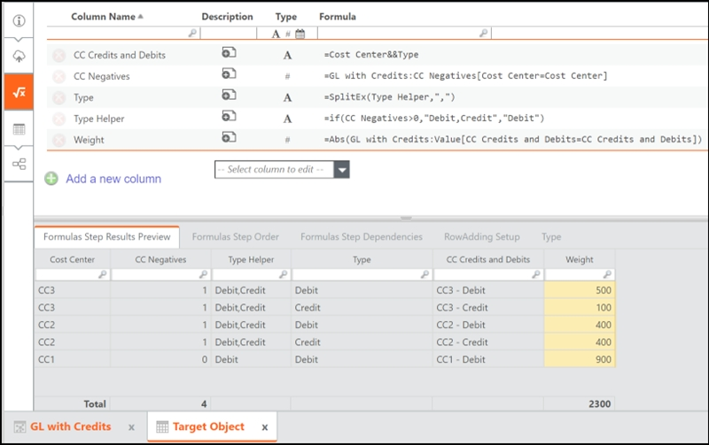

A continuación, configuramos el identificador del objeto:

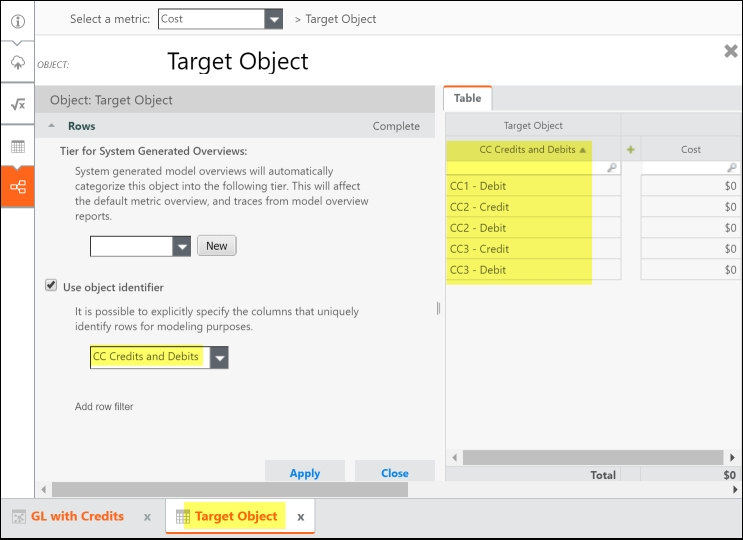

Por último, configuramos la asignación:

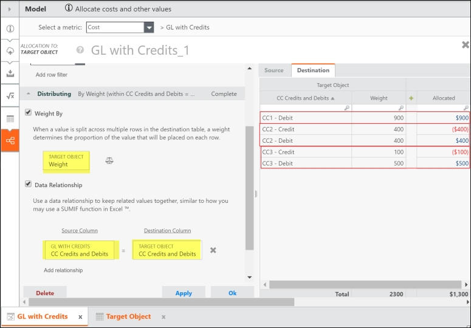

Esto nos permite mostrar los créditos con precisión en los informes basados en el objeto de destino con el menor aumento posible de la granularidad de nuestro modelo.
