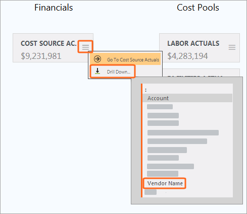
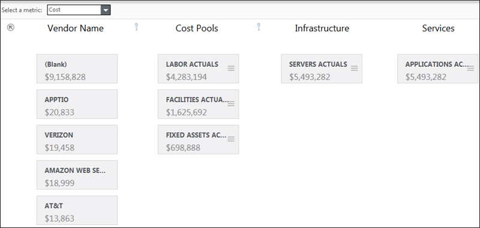
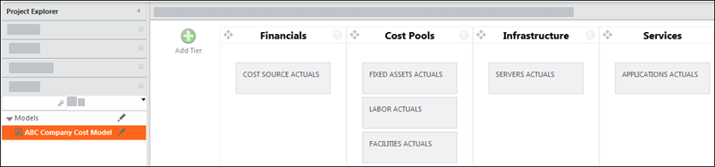
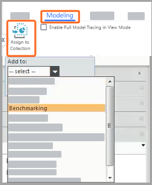

# Crear un modelo de informe

**Se aplica a** : TBM Studio 12.0 y posteriores

Cuando desee ver un conjunto seleccionado de las tablas de un modelo y sus controladores y asignaciones, cree un informe de modelo. En la siguiente imagen se muestra un ejemplo de modelo de informe. Los niveles del informe pueden contener una sola columna de una tabla, o una o varias tablas. Utilice una sola columna cuando desee que el informe modelo se centre en un elemento específico, como los grupos de costes. Utilice una tabla cuando desee que el usuario pueda personalizar el modelo de informe seleccionando una columna de la tabla. Por ejemplo, puede incluir la tabla **Fuente de costes**, que incluye **grupos de costes** pero también otras columnas como **centros de costes**, **torres de referencia** y **nombres de proyectos**.

Vea este vídeo de demostración de Apptio Education Services: [Utilización de informes modelo](https://community.ibm.com/community/user/viewdocument/using-model-reports?CommunityKey=44bcb0d2-5ce6-4504-89eb-019253d3b5d8&tab=librarydocuments "(se abre en una pestaña o una ventana nueva)"). O consulte [todos los vídeos de Apptio](https://community.ibm.com/community/user/groups/community-home/librarydocuments?LibraryKey=195da3d0-0c39-402e-a1a5-019253d461a2 "(se abre en una pestaña o una ventana nueva)").

## Ver controladores y asignaciones

Para ver los controladores y las asignaciones de una tabla, haga clic en la tabla del informe. En la imagen anterior, se ha seleccionado la tabla **Cost Source Actuals**. Se muestran las asignaciones a las tablas de pool de costes.

Si desea ver más detalles sobre los elementos de una tabla, haga clic en el menú y en **Desglosar**, como se muestra en la siguiente imagen. A continuación, puede seleccionar una columna de la tabla. En el siguiente ejemplo, si selecciona **Nombre del proveedor**, el modelo de informe tendrá el aspecto de la siguiente imagen:

Puede hacer clic en un **nombre de proveedor** para ver las asignaciones a los grupos de costes.

Para volver a la vista de tabla, haga clic en el icono  .

## Utilice niveles para controlar el diseño

Una capa puede contener una sola columna de una tabla, o una o varias tablas. No puede contener a la vez una columna y una tabla. Puede crear varios niveles utilizando columnas de la misma tabla.

En un informe modelo, los niveles controlan la disposición de las tablas. En la primera imagen, hay cuatro niveles:

- Finanzas
- Recursos
- Infraestructura
- Servicios

Para crear un informe, defina los niveles y arrastre las tablas desde el **Explorador de** proyectos a los niveles. Los niveles se definen mediante el **editor de niveles** que se muestra en la siguiente imagen:

Para mostrar el **Editor de niveles**, haga clic en el menú **Ver** en la pestaña **Inicio** y haga clic en **Mostrar editor de niveles**. Para editar la grada, consulta el informe del modelo. Estas son las tareas habituales que se realizan en el **Editor de niveles** :

- **Añadir un** nivel - Haga clic en el icono Añadir nivel .
- **Eliminar un nivel** - Haga clic en el icono Eliminar nivel .
- **Cambie** el orden de las filas - Haga clic en el icono Reorganizar  en la cabecera de la fila y arrastre la fila a una nueva ubicación.
- **Añadir una tabla a una jerarquía** - Haga clic en la tabla en el **Explorador de proyectos** y arrástrela a la jerarquía. Sólo puede añadir tablas modeladas. Puede añadir más de una tabla a una fila, pero si ha añadido una tabla a una fila, no puede añadir una columna.
- **Añadir una columna de una tabla** - Expanda la tabla en el **Explorador de proyectos** y arrastre una columna a la grada. Si añade una columna a una fila, no podrá añadir ningún otro elemento a la fila.
- **Cambie el orden de las tablas en una fila** - Haga clic en la tabla y arrástrela a la nueva posición en la fila.
- **Asigne** un nombre a la jerarquía: haga clic en el campo **Nombre** situado en la parte superior de la jerarquía e introduzca un nombre.
- **Volver a ver el informe** - Haga clic en el menú **Ver** de la pestaña **Inicio** y haga clic en **Mostrar documento**.

## Asignar un modelo de informe a una colección

A partir de v12.2.2, puede asignar un modelo de informe a una colección de informes. Cuando un usuario abre la colección de informes, el informe se mostrará junto con los demás informes de la colección. Añadir un modelo de informe a una colección de informes facilita a los usuarios el acceso al informe.

Para asignar un modelo de informe a una colección de informes:

1. Haga clic en la pestaña **Modelado**.
2. Haga clic en **Asignar a colección**.
3. Abra la lista desplegable y haga clic en el nombre de la colección de informes.
4. Guarda el informe.

   
