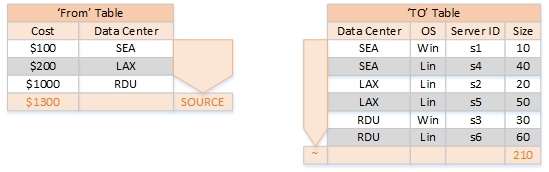
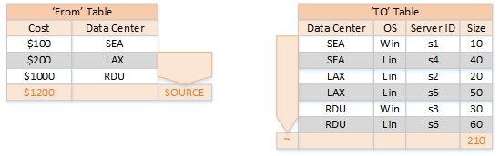
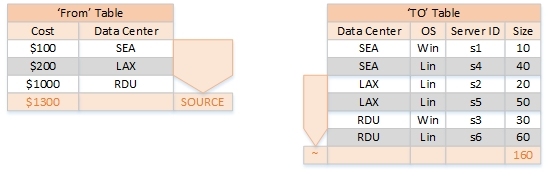
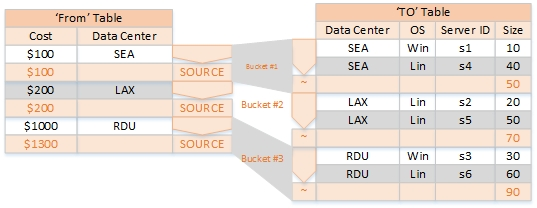

# Asignaciones basadas en fórmulas

**Se aplica a** : TBM Studio 12.0 y posteriores

Utilice la opción Fórmula para introducir una fórmula personalizada para controlar la asignación. Esta fórmula se ejecutará en la mesa que reciba dinero de la asignación. La fórmula tiene dos conceptos especiales que no utilizan otras fórmulas dentro de Apptio : estos conceptos son la palabra clave SOURCE y la operación ~.

La palabra clave FUENTE representa la cantidad de dinero que se está asignando desde el objeto fuente. La función de una fórmula de asignación avanzada es tomar el importe de moneda SOURCE y determinar cuánto debe ir a cada línea coincidente para el objeto de destino. Por lo tanto, la fórmula debe incluir la palabra clave FUENTE para obtener un resultado útil.

La operación ~ permite modificar una referencia de columna para obtener su valor total frente a las filas coincidentes, en lugar del valor de la fila actual. Cuando su fórmula se evalúa contra la fila receptora de la tabla de destino, puede hacer referencia a cualquier columna de esa tabla para obtener el valor de esa columna para su fila actual. Sin embargo, el dinero de SOURCE suele repartirse entre varias filas. El operador ~, combinado con un nombre de columna, le da el total de una columna para todas las demás filas que coinciden con el mismo dinero SOURCE que se está distribuyendo a su fila.

Para una asignación simple sin relación de datos y sin filtros, es igual al total de la columna. A medida que se añaden filtros, se filtran las filas del conjunto incluido en el operador ~. Del mismo modo, si tiene definida una relación de datos, las únicas filas incluidas en la operación ~ serán las filas con los mismos valores en las columnas utilizadas para la relación de datos que la fila actual. Este símbolo de operador tiene un significado similar al de las funciones Suma o SumIF.

## Ejemplo

Imagina que no tienes filtros, ni relación de datos, y la siguiente fórmula:

> `=SOURCE*({Servers.Size}/~{Servers.Size})`

Como no hay filtros ni relación de datos, SOURCE representa todo el dinero del objeto fuente. Del mismo modo, el operador ~ es equivalente al operador SUMA. Así pues, en este caso simplificado, la fórmula anterior equivale a:

> `=SOURCE*({Servers.Size}/SUM({Servers.Size}))`

Esta fórmula calcula el porcentaje de una columna que existe en la fila de destino. A continuación se asigna este porcentaje del valor FUENTE.

Nota: Al añadir filtros y relaciones de datos, el operador ~ y la función SUMA proporcionan resultados diferentes.

Para algunas tablas ficticias, podemos calcular FUENTE y ~Tamaño de la siguiente manera:

En este caso, cada fila de la tabla A calculará su coste como $1300/210 \* Tamaño. Este ejemplo será más interesante en secciones posteriores.

Esto es similar a cómo se comporta la ponderación en Apptio cuando se utiliza la opción Distribución de la ponderación. Si aprovecha la función Ratio, obtendrá el mismo comportamiento. La función Ratio garantiza que cuando la columna Servers.Size es **0** para todas las filas, éstas reciben una distribución uniforme. Esto da la siguiente fórmula:

> `=SOURCE*Ratio({Servers.Size},~{Servers.Size})`

Las fórmulas avanzadas de asignación pueden combinarse con filtros en la tabla De. Cuando defina un filtro en la tabla De dentro de su asignación, el valor FUENTE en su asignación avanzada simplemente filtrará un conjunto de filas, y no incluirá los costes de esas filas en el valor de la palabra clave FUENTE.

## Ejemplo

Imaginemos que tomamos nuestra fórmula anterior:

> `=SOURCE*({Servers.Size}/~{Servers.Size})`

y ponerlo en una línea de asignación con un filtro From de Data Center!= SEA. Cambiamos nuestro VALOR FUENTE de la siguiente manera:

Observe que el comportamiento de las asignaciones modifica sólo el valor FUENTE, y ahora asigna $1200 dólares en lugar de $1300.

Las fórmulas avanzadas de asignación pueden combinarse con filtros en la tabla A. Cuando defina un filtro en la tabla A dentro de su asignación, su fórmula simplemente no se ejecutará en las filas que no coincidan con el filtro. Esas filas recibirán 0 $ de la asignación. Estas filas tampoco se incluirán al calcular el valor ~ de una columna.

## Ejemplo

Imagina que tomamos nuestra fórmula anterior de:

> `=SOURCE*({Servers.Size}/~{Servers.Size})`

y ponerlo en una línea de asignación con un filtro To de Data Center!= SEA. Cambiamos el valor de ~Tamaño de la siguiente manera:

Observe que el comportamiento de las asignaciones modifica sólo los valores ~, y ahora tiene un valor ~Size de 160 en lugar de 210.

## Relación de datos

Usted podría crear una asignación con un filtro Desde SEA un filtro Hasta SEA y asignar dinero sólo desde el Centro de Datos SEA a sólo servidores en ese centro de datos. Sin embargo, no recomendamos hacerlo. Crea una línea de asignación por centro de datos, y cada vez que añada un centro de datos, tendría que añadir una nueva línea de asignación. La opción **Relación de datos** permite crear una única línea de asignación que imita este conjunto de líneas de asignación de forma mantenible. La opción Relación de datos permite restringir las filas utilizadas por las palabras clave SOURCE y ~ para que representen subconjuntos de las tablas De y A. Estos subconjuntos limitados de coste calculan sus asignaciones independientemente unos de otros, exactamente como si fueran las asignaciones independientes anteriores.

Cada valor único en su columna de relación de datos dará lugar a un valor SOURCE separado, y a un conjunto de filas To. Las filas To con ese valor en su columna de relación de datos recibirán el valor total de otras filas que tengan el mismo valor. De este modo, la asignación se divide en cubos para cada valor único de la columna. Cada cubo tiene un valor fuente y un valor ~.

Cuando la fórmula se ejecuta en una fila, utiliza los valores SOURCE y ~ que corresponden al cubo de esa fila.

Puede especificar más de una relación. Si especifica más de una relación, todas las relaciones deben coincidir para que se asigne el valor.

## Fórmulas avanzadas de asignación

Esta sección proporciona fórmulas de asignación avanzadas que imitan los métodos de distribución estándar que están disponibles sin fórmulas de asignación avanzadas. A veces pueden ser útiles como referencia a la hora de crear una nueva fórmula de asignación avanzada.

## Asignaciones de valor ponderado

> `=SOURCE*Ratio({Servers.Size},~{Servers.Size})`

**VER TAMBIÉN**

- [Asignaciones de valor ponderado](weighted-value-allocations.html "Se aplica a: TBM Studio 12.0 y posteriores")
- [Acerca de la ponderación y los números negativos](about-weighting-and-negative-numbers.html "◆ Se aplica a: TBM Studio 11.8.3.1 y posteriores; TBM Studio 12.0 y posteriores. El objetivo de una ponderación es asignar el número de origen en el que la suma es la misma en el destino.")

## Asignaciones de valor estándar

> `=Servers.Size`

Esta asignación no hace referencia a la moneda de origen, sino que se limita a asignar un valor de una columna del objeto receptor.

Véase también [Asignaciones de valor estándar.](standard-value-allocations.html "Se aplica a: TBM Studio 12.0 y posteriores")

## Asignaciones no estándar

Los siguientes métodos de distribución no pueden reproducirse utilizando una fórmula de asignación avanzada:

- Consumo
- Asignaciones recursivas
