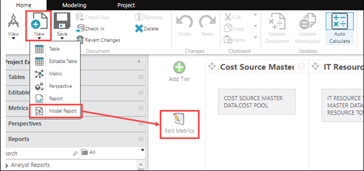
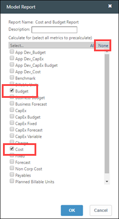

# Crear y gestionar métricas

**Se aplica a** : TBM Studio 12.0 y posteriores

Las métricas son cálculos que definen las medidas de los informes. Las métricas definidas para cada proyecto están disponibles para todos los informes del proyecto en todos los periodos de tiempo. Las métricas figuran en la sección **Métricas** del **Explorador de proyectos**. Para definir una nueva métrica, abra el menú **Nuevo** de la pestaña **Inicio** y haga clic en **Métrica**.

## Tipos de métricas

Existen dos tipos de métricas:

- **Métricas modeladas**. Un modelo es en sí mismo una métrica. Un modelo calcula un valor numérico como el coste, la cantidad o el presupuesto. Un modelo puede tener varias métricas. Los modelos también se denominan métricas modelizadas.
- **Métricas calculadas**. Una métrica calculada utiliza una fórmula para obtener un valor numérico. Por ejemplo, puede crear una métrica calculada denominada **Varianza\_presupuesto** definida como la métrica modelada por presupuesto menos la métrica modelada por coste.

Los valores calculados por las métricas suelen mostrarse en los informes mediante gráficos. Las métricas, una vez definidas, están disponibles para todos los informes de un proyecto y en todos los periodos de tiempo.

Existen varias diferencias clave entre las métricas modeladas y las calculadas:

- Al agrupar, las métricas del modelo suman números. Las métricas calculadas se recalculan.
- Las métricas calculadas pueden calcularse a lo largo del tiempo. Las métricas modelizadas no pueden.

A continuación se ofrecen varias directrices que pueden ayudarle a determinar el tipo de métrica que debe crear:

- Si tiene un atributo que se aplicará en varias áreas diferentes, cree una métrica **modelada**. Un buen ejemplo es el Coste, que es la métrica por defecto del modelo en la aplicación. Un modelo de costes puede utilizarse para revisar los costes de muchas áreas en distintos niveles de su organización.
- Si desea asignar un valor numérico de un elemento de su organización a otro, cree una métrica **modelada**. Por ejemplo, si desea asignar el coste de los servidores a las aplicaciones, lo mejor es hacerlo con una métrica modelada.
- Si tiene un atributo que sólo se utilizará para un cálculo, cree una métrica **calculada**. Un ejemplo podría ser el número de servidores o el número de incidencias.

## Crear una métrica

Para crear una métrica:

1. En la pestaña **Inicio**, en el grupo **Documento**, haga clic en **Nuevo** y, a continuación, en **Métrica**.
2. Introduzca un nombre para la métrica y haga clic en **Aceptar**.
3. Rellene los campos del panel **Propiedades**. Consulte las siguientes descripciones detalladas a nivel de campo en **Propiedades de las métricas**.
4. Pulse **Guardar**.

## Eliminar una métrica

Para eliminar una métrica:

1. En **el Explorador de proyectos,** haga clic en **Métricas**.
2. Haga clic en la métrica que desea eliminar.
3. Compruebe la métrica si aún no lo ha hecho.
4. En la pestaña **Inicio**, en el grupo **Documento**, haga clic en **Eliminar** y, a continuación, en **Guardar**.
5. Comprueba la métrica.

## Seleccionar métricas para mejorar el rendimiento

Puede utilizar el botón **Editar métricas** del Editor de niveles para especificar qué métricas desea aplicar a un informe modelo. Las métricas seleccionadas se guardan al registrarse, lo que acelera los cálculos en los entornos de Puesta en Escena y Producción. Si selecciona menos métricas, los cálculos serán más rápidos.

Para seleccionar (editar) métricas de modelo para un nuevo informe:

1. En TBM Studio, haga clic en **Nuevo > Informe modelo**.
2. Haga clic en **Editar métricas** para abrir el cuadro de diálogo **Informe modelo**.

   
3. (Opcional) Haga clic en **Ninguno** para borrar la lista de comprobación.
4. Seleccione las métricas que desea aplicar a su nuevo modelo de informe.

   
5. (Opcional) Añada una **descripción**.
6. Pulse **Aceptar**.
7. Haga clic en **Ver > Mostrar documento**.Tenga en cuenta que las opciones disponibles en el selector **Seleccionar una métrica** se limitan ahora a las métricas que seleccionó en el cuadro de diálogo **Informe modelo**.

Para limitar las métricas calculadas para un informe modelo existente:

1. Abra el informe y haga clic en **Ver > Mostrar documento > Editar métricas**.
2. Seleccione sólo las métricas que desee aplicar al informe y, a continuación, haga clic en **Aceptar**.No es posible modificar el nombre del informe.

## Propiedades métricas

Las propiedades de las métricas controlan el comportamiento de una métrica en el proyecto. Mediante las propiedades de las métricas, puede seleccionar el nombre de la métrica, el tipo, el formato y si la métrica aparece en las tablas de unidades. A continuación se describen las propiedades métricas. Las propiedades que sólo se aplican a las métricas calculadas están marcadas con un asterisco (\*).

- **Vista por defecto** - Si la métrica se muestra en un informe como un enlace, al hacer clic en el enlace se mostrará el informe introducido en este campo.
- **Tipo de** modelo - Al crear una métrica, seleccione el tipo de modelo.
  - **Modelo** - Crea un nuevo modelo en el modelador.
  - **Calculado** - Muestra el campo **Cálculo del valor**, en el que se introduce una fórmula o función para definir cómo se obtiene la métrica. Una vez creada la métrica, este campo pasa a ser de sólo lectura.
- **Ignorar para filtrado interno\*** - Cuando se marca, las métricas calculadas se excluyen en la evaluación para filtrar las filas que tienen todos ceros. Esta evaluación se realiza incluso si las métricas están ocultas. Las filas con ceros en todas las columnas pueden incluirse desactivando la opción.
- **Puede Sumar\*** - Si es válido sumar los valores de este cómputo en lugar de volver a computar la fórmula al calcular, marque la casilla.
- **Incluir en modelos virtuales\*** - Si desea que la métrica se incluya en modelos filtrados y recursivos, marque la casilla.
- **Tipo de métrica** : si los valores de la métrica son monetarios y proceden de una fuente con costes completos, como un libro mayor, seleccione **Cálculo de costes**. Si selecciona **Cálculo de costes**, también deberá establecer el formato de la tabla en **Moneda**.
  - Si la métrica está asociada a un modelo de precio x cantidad, seleccione **Precios**.
  - Si los valores métricos están en cualquier otro formato, seleccione **Numérico**.
- **Oculto** - Oculta la métrica en las tablas de unidades de los objetos modelo.
- **Cálculo del valor\*** - Introduzca una fórmula que defina el valor de la métrica calculada (véase [Fórmulas y funciones](../formulas-and-functions/introduction-to-formulas-and-functions.html "Se aplica a: TBM Studio 12.0 y posteriores") ).
  - Para referirse a una columna de una tabla, utilice el formato **table.column nombre**.
  - Para hacer referencia a una columna de una tabla de otro proyecto, utilice el formato **proyecto:tabla:nombre de columna**.
  - Para recuperar la suma de todos los valores de una columna de la tabla, utilice el formato **tabla:nombre de columna**.
  - Para recuperar la suma de valores de una columna en la que una segunda columna es igual a un valor específico, utilice el formato **tabla:columna[ column2= "valor"]**.
  - Para recuperar la suma de los valores de una columna en la que una segunda columna es igual al valor de la fila actual table.column valor, utilice el formato **tabla:columna[ column2=table.column nombre]**.
  - Puede hacer referencia a la métrica actual utilizando **$\_** en lugar de tener que escribir el nombre completo de la métrica. Esto es útil si desea utilizar la misma fórmula en varias métricas. Puede copiar y pegar la fórmula sin tener que sustituir cada vez el nombre de la métrica.
- **Formato de tabla** - Especifica el formato para el valor de la métrica cuando se muestra en tablas de informes. Puede especificar los formatos en HTML o utilizar la función [NumberFormat](../formulas-and-functions/functions/numberformat.html "Da formato a un valor numérico en una etiqueta (cadena) utilizando patrones personalizados para números positivos y negativos, duraciones o formato de tamaño de datos. Esta función está diseñada para su uso en columnas de tipo Etiqueta.") función
  - Para mostrar los valores como dólares en los modelos, introduzca: =Moneda($\_).
  - Para especificar formatos utilizando un cuadro de diálogo en lugar de código, haga clic en el icono **Formato de tabla** .
  - Si selecciona Avanzado, deberá introducir una fórmula manualmente, al igual que en el campo **Formato de tabla** del panel **Propiedades**. Si selecciona otro formato, el cuadro de diálogo muestra las opciones de formato adecuadas. Para los formatos Número y Moneda, puede optar por incluir separadores de "miles" (coma, punto, etc.) seleccionando la opción **Utilizar separador de agrupación**.
- **Plantillas aplicables** - Este campo sólo lo utiliza el grupo Apptio Applications y está relacionado con el **templates.apptio.com** proyecto. NO edite este campo.
- **Comportamiento temporal** : especifica el funcionamiento cuando la métrica se visualiza en un período de tiempo agregado, como un trimestre.
  - **Suma** - Calcula cada periodo por separado y luego los suma.
  - **Media** - Calcula cada periodo por separado, suma los periodos y divide el resultado por el número de periodos.
  - **Recalcular** : calcula los valores agregados en todas las columnas a las que hace referencia la métrica calculada y, a continuación, vuelve a ejecutar la fórmula de la métrica.
- **Formato de Gráfico** - Introduzca un patrón para utilizar en el formato de los números en el eje del gráfico. La sintaxis es la misma que para los patrones y patrones negativos utilizados por la función **NumberFormat** pero sin el nombre de la función ni las comillas. Por ejemplo, para que los números aparezcan en un formato como $5.000.000, deberá introducir **$#,###**. En este campo no se pueden utilizar fórmulas.
  - Si desea formatear los números como moneda de modo que el símbolo de moneda refleje la configuración regional seleccionada para el proyecto, anteponga a la declaración de formato el símbolo Unicode de moneda universal (¤). La forma más sencilla de hacerlo es copiar el símbolo de la frase anterior y pegarlo en el campo.
  - Para más información sobre el formateo de números, consulte la función.
- **Prefijo del gráfico** - Prefijo que se añade a la métrica cuando se muestra en los gráficos. Por ejemplo, un signo $.
- **Sufijo de gráfico** : sufijo que se añade a la métrica cuando se muestra en gráficos.
- **Intervalo de tiempo\*** - **Ninguno**, **Trimestral** o **Anual**. Si selecciona **Trimestral** o **Anual**, la métrica se extraerá del primer periodo del intervalo de tiempo en lugar de calcularse. Por ejemplo, si selecciona **Anualmente**, la métrica retrocederá y buscará los valores de enero en lugar de recalcular basándose en el periodo de tiempo actual.
