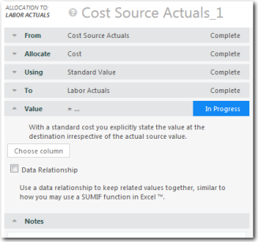

# Asignaciones de valor estándar

**Se aplica a** : TBM Studio 12.0 y posteriores

Una asignación de **valor estándar** distribuye un valor igual al de la tabla de destino. Por ejemplo, si la tabla de destino tiene un valor de 10.000 $ gastados en un servicio, se asignarán 10.000 $ a la tabla de destino. Si la tabla de origen tiene un valor de 15.000 $, sobrarán 5.000 $ en la tabla de origen. Si la tabla de origen tiene un valor de 5.000 $, la asignación se sobreasignará al 200% para igualar los 10.000 $.

## Opciones de distribución

Hay tres opciones de distribución:

- Incluso
- Peso por
- Relación de datos

## Incluso

La opción **Par** es la opción por defecto y tiene efecto cuando las opciones **Ponderar por** y **Relación de datos** no están seleccionadas.

Distribuye la asignación uniformemente entre todas las unidades identificadas en la tabla de destino por la propiedad **A.** Por ejemplo, si hay una tabla de **destino de solicitudes** con cinco solicitudes y se están asignando 100.000 dólares, se asignarán 20.000 dólares a cada solicitud.

## Peso por

La opción **Ponderar por** distribuye la asignación en función de la proporción (tamaño relativo) de los valores de una columna seleccionada.

Por ejemplo, supongamos que hay cinco aplicaciones con distintos números de usuarios, como se muestra en la tabla siguiente, y que se asignan 100.000 dólares. Desea ponderar la distribución por el número de usuarios. Los 100.000 $ se distribuirían como se indica en la siguiente columna **Asignación** :

Nota: Si intenta ponderar una asignación por una columna numérica que contiene al menos un valor no numérico, la ponderación será ignorada. Para corregir el problema, elimine los valores no numéricos de la columna.

## Relación de datos

La opción **Relación de datos** distribuye la asignación uniformemente entre las unidades que hacen coincidir los valores de una columna de la tabla de origen con los valores de una columna de la tabla de destino. Por ejemplo, supongamos que la tabla de origen incluye información sobre las aplicaciones. Tanto la tabla de origen como la de destino incluyen una columna de **Categoría de aplicación**. Una de las categorías se identifica como **Bases de Datos**, pero hay dos aplicaciones de bases de datos: Oracle y SAP. El valor de las entradas de la base de datos de la tabla de origen se agregaría y se asignaría uniformemente a las entradas de la base de datos de la tabla de destino. Si se asignaran 20.000 dólares, se dividirían en 10.000 para Oracle y 10.000 para SAP.

Puede especificar más de una relación. Si especifica más de una relación, todas las relaciones deben coincidir para que se asigne el valor.
