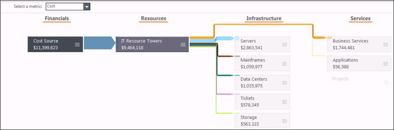
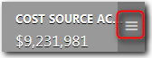
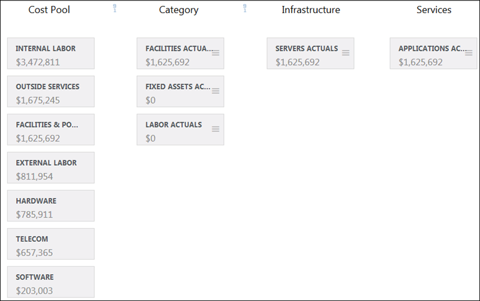
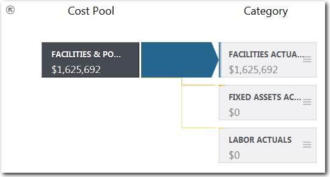

# Ver un modelo de informe

**Se aplica a** : TBM Studio 12.0 y posteriores

Un proyecto suele tener un único modelo. Para ver un informe modelo, en la sección **Informes** del **Explorador de proyectos**, haga clic en **Modelos** y en el nombre del informe. En la siguiente imagen se muestra un modelo de informe:

Puede ver un modelo en la pantalla de informe de modelos que se muestra en la imagen anterior, pero no puede editar el modelo desde esa pantalla. En la pantalla de informe del modelo, puede:

- Haga clic en un elemento de la tabla en el modelo para ver los controladores y las asignaciones. En la imagen anterior, se ha seleccionado la tabla **Cost Source Actuals**.
- Siga haciendo clic en los elementos de la tabla para trazar el flujo de valor a través del modelo (nuevo en v12.1, v12.2+ ).
- Abra el menú en una tabla y haga clic en **Desglose** para ver las columnas de la tabla. Puede seleccionar una columna para centrar el informe en esa columna en lugar de en toda la tabla.

Nota: A partir de v12.2.2, se pueden añadir informes modelo a las colecciones de informes. En el ejemplo siguiente, el informe **saTestModel** se ha añadido a la colección de informes **de Finanzas TI**.

Vea este vídeo de demostración de Apptio Education Services: [Utilización de informes modelo](https://community.apptio.com/videos/1583 "(se abre en una pestaña o una ventana nueva)"). O consulte [todos los vídeos de Apptio](https://community.apptio.com/docs/DOC-7714 "(se abre en una pestaña o una ventana nueva)").

## Perforar una columna

Por defecto, un informe modelo muestra tablas. Si desea ver más detalles, puede acceder a una columna concreta haciendo clic en el menú situado a la derecha de la tabla.

Por ejemplo, suponga que tiene el modelo de informe que se muestra en la primera imagen. Desea ver la asignación de la tabla **Fuente de costes reales** dividida por pool de costes. Puede hacer clic en el menú y seleccionar **Pool de costes**. El modelo de informe tiene ahora el aspecto de la imagen siguiente:

Para ver qué parte del valor de un pool de costes específico se asigna a las categorías, haga clic en el pool de costes. En la siguiente imagen, se ha seleccionado el pool de costes **Instalaciones y Energía** :

Para volver a la vista de tabla, haga clic en el icono de flecha de retorno  situado en la esquina superior izquierda de la grada.

## Valor de traza dentro de un nivel

A partir de v12.2.2, los valores asignados entre las tablas de un mismo nivel se muestran como se indica a continuación. Antes de v12.2.2, las tablas de **almacenamiento** y **servidores** se alineaban verticalmente con una línea de asignación que iba de **almacenamiento** a **servidores**.

