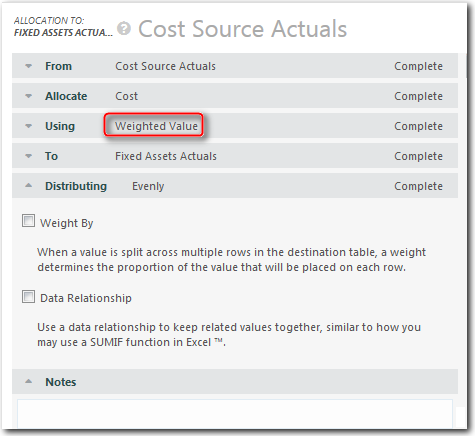
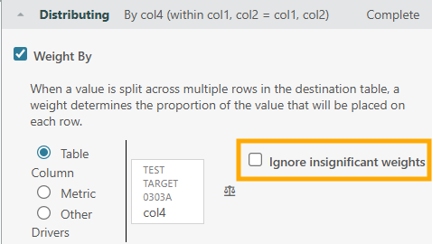

# Asignaciones de valor ponderado

**Se aplica a** : TBM Studio 12.0 y posteriores

Una asignación de **valor ponderado** distribuye el valor en función de la proporción (tamaño relativo) de los valores de una columna que usted selecciona en la tabla de destino. Este es uno de los tipos más comunes de asignaciones ([Más información](allocate-value-in-model.html "Se aplica a: TBM Studio 12.0 y posteriores") ). Por ejemplo, puede distribuir la asignación en función del número de empleados de una unidad de negocio, el número de usuarios de una aplicación, el número de servidores de un centro de datos o el número de metros cuadrados de un centro de datos.

A continuación se muestra un ejemplo de valor ponderado por asignación:

## Opciones de distribución

Hay tres opciones de distribución:

- Incluso
- Peso por
- Relación de datos

## Distribución uniforme

La opción Distribución **par** es la opción por defecto y está en vigor cuando las opciones **Ponderar por** y **Relación de datos** no están seleccionadas.

Esta opción distribuye la asignación uniformemente entre todas las unidades identificadas en la tabla de destino por la propiedad **A.** Por ejemplo, si hay una tabla de **destino de solicitudes** con cinco solicitudes y se están asignando 100.000 dólares, se asignarán 20.000 dólares a cada solicitud.

## Peso Por distribución

Al añadir una ponderación a una asignación se impone una distribución desigual de la moneda haciendo referencia a un campo o métrica que captura la distribución deseada entre los registros del objeto de destino de la asignación. Los coeficientes correctores se utilizan en dos situaciones distintas:

- Cuando existe una columna en un conjunto de datos que capta con mayor precisión cómo deben distribuirse las unidades (normalmente dólares) entre los registros de un conjunto de datos. Un ejemplo de esto es el uso de dólares de depreciación del libro de activos fijos para ponderar las asignaciones en Activos Fijos.
- Cuando se carece de datos pertinentes para realizar una asignación precisa. En este caso, los coeficientes correctores se utilizan para que las asignaciones sean más precisas de lo que serían de otro modo utilizando relaciones de datos.

## Ejemplo

Supongamos que hay cinco aplicaciones con varios números de usuarios, como se muestra en la tabla siguiente, y 100.000 dólares para asignar. Si no se utiliza ninguna ponderación y los dólares se distribuyen uniformemente, entonces cada solicitud recibe una parte equitativa de los 100.000 dólares.

En el siguiente caso, sin embargo, se desea ponderar la distribución por el número de usuarios. Entonces, los 100.000 $ se distribuirían como se indica a continuación en la columna **Asignación** :

Nota: Hay dos problemas comunes a la hora de ponderar las asignaciones:

- **Ponderar por no numérico** : Si intenta ponderar una asignación por una columna numérica que contiene al menos un valor no numérico, la ponderación será ignorada. Para corregir el problema, elimine los valores no numéricos de la columna.
- **Ponderar por negativo** : Si se intenta ponderar una asignación por un valor negativo, la asignación fallará debido a una barrera de protección establecida para evitar problemas de cálculo derivados de la ponderación por valores negativos. Para más información, consulte [Acerca de la ponderación y los números negativos](about-weighting-and-negative-numbers.html "◆ Se aplica a: TBM Studio 11.8.3.1 y posteriores; TBM Studio 12.0 y posteriores. El objetivo de una ponderación es asignar el número de origen en el que la suma es la misma en el destino.").

Existen tres opciones para ponderar las asignaciones:

| Opción de ponderación | Resumen | Ejemplo |
| --- | --- | --- |
| Tabla | Distribuye la asignación basándose en la relación de los valores de una columna del conjunto de datos que respalda el objeto de destino en la asignación. | Podría utilizar la columna Depreciación de su Libro de Activos Fijos para ponderar su asignación de Costes de la Fuente de Costes a los Activos Fijos. |
| Métrica | Distribuye la asignación basándose en la relación de los valores del mismo objeto de destino, pero para una métrica diferente.  **NOTA** : Esta opción sólo está disponible en TBM Studio 12.5 y posteriores. | Puede utilizar la distribución de la imputación de costes para ponderar una imputación presupuestaria. |
| Otro conductor | Distribuye la asignación en función de la relación de los valores de un controlador o conjunto de controladores específicos en el objeto de destino.  **NOTA** : Esta opción sólo está disponible en TBM Studio 12.5 y posteriores. | Podría utilizar la asignación de mano de obra en las torres de recursos de TI para ponderar la asignación de proyectos en las torres de recursos de TI |

**Ignora los pesos insignificantes**

Para ponderar columnas en una asignación, si las ponderaciones pequeñas quedan fuera de un rango configurable, trátelas como cero.

Para desactivar: -Ddisable.allocation.weighing.range =true

Para establecer el rango: -Dallocation.weighing.range=1000000000

Esto significa que los pesos que son mil millones de veces menores que el peso más grande, por cada clave de asignación, se consideran nulos.

## Relación de datos

La opción **Relación de datos** distribuye la asignación uniformemente entre las unidades que hacen coincidir los valores de una columna de la tabla de origen con los valores de una columna de la tabla de destino. Por ejemplo, supongamos que la tabla de origen incluye información sobre las aplicaciones. Tanto la tabla de origen como la de destino incluyen una columna de **Categoría de aplicación**. Una de las categorías se identifica como **Bases de Datos**, pero hay dos aplicaciones de bases de datos: Oracle y SAP. El valor de las entradas de la base de datos de la tabla de origen se agregaría y se asignaría uniformemente a las entradas de la base de datos de la tabla de destino. Si se asignaran 20.000 dólares, se dividirían en 10.000 para Oracle y 10.000 para SAP.

Por último, puede especificar más de una relación. Si especifica más de una relación, todas las relaciones deben coincidir para que se asigne el valor.
