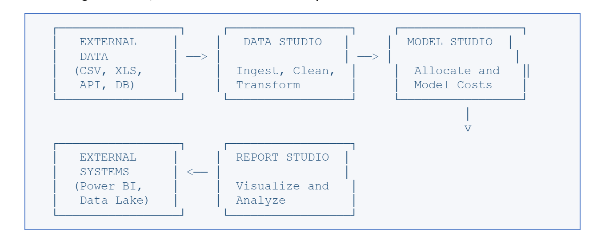

# Resumen del flujo de datos

TBM Studio procesa los datos mediante un flujo de trabajo de tres etapas. Cada etapa se corresponde con uno de los componentes principales de la plataforma, y los datos se transmiten a través de ellas siguiendo una secuencia bien definida.

## El proceso de tres etapas

A grandes rasgos, el flujo de datos sigue este recorrido:

- **Data Studio** es donde los datos se introducen en la plataforma. Puedes subir archivos, conectarte a bases de datos externas o introducir datos manualmente. Data Studio además, limpia, transforma y prepara tus datos para el modelado.
- **Model Studio** es donde se lleva a cabo la asignación de costes. Se basa en las tablas preparadas de Data Studio y aplica reglas de negocio para asignar los costes desde las fuentes (como los asientos del libro mayor) a destinos relevantes desde el punto de vista empresarial (como aplicaciones o unidades de negocio).
- **Report Studio** es donde se visualizan y analizan los resultados. Los informes se basan en los resultados de los modelos y presentan la información mediante tablas, gráficos y paneles de control. Los datos también pueden salir de la plataforma a través de tablas publicadas y API.

## Puntos clave de la transformación

Los datos se transforman en varios puntos críticos a medida que avanzan por el proceso:

|  |  |  |
| --- | --- | --- |
| **Punto de transformación** | **¿Qué pasa?** | **Dónde ocurre** |
| Ingesta de datos | Se analizan los archivos externos, se detectan los tipos de columna y se importan los datos a TBM Studio | Data Studio |
| Canal de transformación | Los datos se limpian, se unen, se filtran, se asignan y se enriquecen mediante una serie de pasos configurables | Data Studio |
| División de fechas | Los datos de varios meses se desglosan en periodos de tiempo individuales para realizar un análisis centrado en cada mes | Data Studio |
| Asignación de conjuntos de datos maestros | Las fuentes heterogéneas (GL, Presupuesto, Previsión) se asignan a un esquema canónico unificado | Data Studio |
| Asignación de costes | Los datos procesados se asignan desde las fuentes de costes a los destinos mediante reglas basadas en factores determinantes | Estudio de modelos |
| Cálculo del informe | Los resultados del modelo se agregan, se filtran y se formatean para su presentación | Report Studio |

## Datos almacenados frente a datos calculados

Una distinción arquitectónica importante en TBM Studio es la que existe entre los datos que se almacenan de forma permanente y los datos que se calculan bajo demanda.

- **Datos almacenados** : Las tablas sin procesar y transformadas de Data Studio contienen datos almacenados. Una vez que subas un archivo o guardes una transformación, esos datos se conservarán en la base de datos del proyecto. Las entradas de las tablas editables también son datos almacenados.
- **Datos calculados** : Las asignaciones de modelos y los resultados de los informes se calculan durante las operaciones de compilación (cálculos en el entorno de prueba o en producción). Estos resultados reflejan el estado actual de tus transformaciones, reglas de modelo y ajustes de intervalo de tiempo.

Nota:

**Implicaciones prácticas**

Dado que los resultados del modelo se calculan en lugar de almacenarse de forma estática, los cambios en los datos de origen (como la carga de un nuevo archivo de contabilidad general) no se reflejan inmediatamente en los informes. Debes ejecutar una compilación para volver a calcular el modelo con los datos actualizados.
