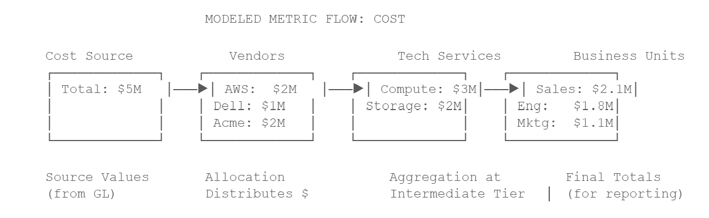

# Métricas: modeladas frente a calculadas

Las métricas son las medidas numéricas que se procesan en tu modelo y aparecen en tus informes. TBM Studio admite dos tipos de métricas fundamentalmente diferentes, y comprender la diferencia es fundamental para crear modelos de costes eficaces.

## Métricas modelizadas

Una métrica modelada es un valor numérico fundamental que interviene directamente en el motor de asignación. Cuando se imputan los costes de un objeto a otro, las métricas modeladas son los valores que se distribuyen.

**Las métricas estándar incluyen:**

- **Coste:** gasto real — el indicador más habitual y el predeterminado en todos los proyectos
- **Presupuesto:** gastos previstos para compararlos con los reales
- **Previsión:** gasto previsto para el futuro
- **Métricas personalizadas:** cualquier valor asignable adicional que definas, como el número de empleados de un CapEx,, o la utilización

**Cómo fluyen las métricas modeladas**

Cuando TBM Studio calcula un modelo, cada métrica modelada recorre toda la cadena de asignación de forma independiente. Esto significa que la métrica de «Coste» se distribuye en función de sus factores determinantes; la métrica de «Presupuesto» se distribuye en función de sus factores determinantes (que pueden ser los mismos o diferentes), y así sucesivamente.

**Comportamientos clave de las métricas modeladas:**

- Cada objeto de modelo almacena su propio conjunto de valores métricos modelados por periodo de tiempo
- Las métricas se generan a partir de tablas de transformación ( Data Studio ) y se propagan a través de las asignaciones
- Al agrupar datos en los informes, las métricas modeladas suman sus valores
- Las métricas modelizadas no pueden realizar cálculos entre distintos periodos; representan valores correspondientes a un solo periodo
- Hay un modelo por proyecto, pero ese modelo puede incluir varias métricas modeladas

## Métricas calculadas

Una métrica calculada se deriva de una fórmula que hace referencia a métricas modeladas, columnas de tabla u otras métricas calculadas. Las métricas calculadas no intervienen en el motor de asignación; se calculan en el momento de generar los informes.

**Patrones habituales de métricas calculadas:**

|  |  |  |
| --- | --- | --- |
| **Patrón** | **Ejemplo de fórmula** | **Finalidad** |
| Varianza | = Presupuesto - Coste | Mostrar la diferencia entre el gasto previsto y el gasto real |
| % de varianza | = (Presupuesto - Coste) / Presupuesto | Mostrar el porcentaje de gasto superior o inferior al previsto |
| Coste unitario | = Coste / ServerCount | Normalizar los costes para poder compararlos entre entidades de distintos tamaños |
| En lo que va de año | = YearToDate(CapEx) | Agregar una métrica modelada desde el inicio del ejercicio fiscal hasta el período actual |
| Reparto de los costes | = Coste / SUMA(Coste) | Indica qué porcentaje del coste total representa cada entidad |

**Características principales de las métricas calculadas:**

- Definido en «Métricas» en el Explorador de proyectos y disponible para todos los informes del proyecto
- Las fórmulas se evalúan durante los cálculos de los informes, no durante los cálculos del modelo
- Al agrupar datos, las métricas calculadas se vuelven a calcular (no se suman) a menos que se hayan marcado explícitamente como sumables
- Permite realizar cálculos entre distintos periodos de tiempo utilizando funciones de análisis temporal, como YearToDate, MonthToDate
- Para modificar una fórmula, es necesario extraer la métrica y volver a incorporarla
- No se puede convertir a métricas modeladas ni viceversa

## Guía para la elección de medidas métricas

Utiliza esta guía para determinar qué tipo de métrica se adapta mejor a tus necesidades:

|  |  |  |
| --- | --- | --- |
| **Necesitas...** | **Tipo de métrica** | **Por qué** |
| Datos de costes brutos que se incorporan a las asignaciones | Métrica modelada | Solo las métricas modeladas participan en el motor de asignación |
| Una combinación matemática de otros indicadores | Métrica calculada | Las fórmulas hacen referencia a métricas modeladas y calculan valores derivados |
| Datos acumulados a lo largo del tiempo (desde el inicio del año, en los últimos doce meses) | Métrica calculada | Las funciones de inteligencia temporal solo funcionan en métricas calculadas |
| Un valor que se aplica en muchos ámbitos y a distintos niveles | Métrica modelada | Las métricas modeladas se aplican a toda la jerarquía del modelo |
| Un cálculo de informes con un único objetivo | Métrica calculada | Mantén la lógica de presentación separada de la lógica del modelo |
| Datos categóricos (etiquetas, nombres, códigos) | Dimensión/Columna | Los atributos no numéricos deben figurar como columnas de la tabla, no como métricas |

Nota:

**Idea errónea muy extendida**

Las métricas calculadas no modifican los flujos del modelo. Si creas una métrica calculada que divide el coste entre el presupuesto, ese cálculo solo aparecerá en los informes. No tiene ninguna repercusión en la forma en que se distribuyen los costes. Si necesitas un valor para participar en las asignaciones, debe tratarse de una métrica modelada.
